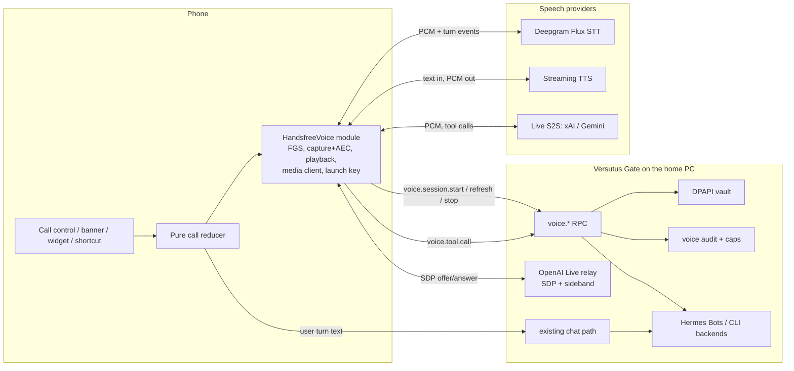

# Hands-free Voice for Versutus — Audited Implementation Plan

> **For agentic workers:** REQUIRED SUB-SKILL: Use superpowers:subagent-driven-development (recommended) or superpowers:executing-plans to implement this plan task-by-task. Steps use checkbox (`- [ ]`) syntax for tracking.

**Goal:** Ship a hands-free call that is reliably offered and actually works on Ethan's Samsung phone within one to two days (Phase 0). Then grow it into a realtime voice conversation that feels like ChatGPT Voice or Gemini Live, while still talking *as* the operator's Bot (Milestones 1–6).

**Architecture:** Phase 0 repairs the existing local Expo module (`modules/handsfree-voice`) and the pure call reducer; no Gate changes. The enterprise path keeps one phone call surface and adds a Gate-issued *voice session*:
- **Credentials:** the Gate holds the provider keys, mints short-lived provider credentials, and records audit and cost.
- **Audio:** flows phone ↔ provider directly (not through the home PC).
- **Bot turns:** travel through the existing text chat path, so the Bot's soul, memory, tools, approvals and model pin stay authoritative.

A per-Bot opt-in "Live" engine uses a speech-to-speech model with the Bot's tools proxied through the Gate. A fallback ladder ends at today's on-device path and, below that, hold-to-talk.

**Tech Stack:** Expo SDK 57 / React Native 0.86.2 (`package.json:13,40`), Expo Modules API (Kotlin, Swift), Android `SpeechRecognizer` / `TextToSpeech` / `AudioRecord` / microphone foreground service, Jest, JUnit 4, Gate `node:test`. Enterprise path: Deepgram Flux streaming STT, streaming TTS (Deepgram Aura-2, xAI TTS or Cartesia), xAI Grok Voice / OpenAI Realtime / Gemini Live as optional Live engines.

**Where this sits:** branch `sprint/features-functions-ui` (worktree `C:\Users\ethan\.codex\worktrees\bee6\Versutus`, HEAD `8a83907`), the build installed on Ethan's phone. Plans live in `docs/plans/` on this branch, following its own convention (the older `docs/superpowers/plans/` location belongs to `master`).

**Provenance:** Grok 4.6 wrote the diagnosis and first plan (`docs/plans/2026-09-12-realtime-voice-grok-draft.md`, brief `PLAN-BRIEF-realtime-voice-grok.md`). Claude audited it against the source and current vendor docs, corrected it, and rewrote Phase 0 as executable TDD tasks. Grok's draft stays in the tree as the evidence record.

---

## 0. Audit of the Grok draft

### 0.1 Verified against the source (all hold)

| # | Finding | Evidence |
|---|---|---|
| V1 | **The first Start call throws.** JS passes an object, both native sides take a bare `String`, so Expo's converter raises `DynamicCastException` and the promise rejects. | JS `src/context/handsfree-voice-provider.tsx:507` `module.startSession({ title: target.label })`; TS contract `modules/handsfree-voice/src/HandsfreeVoiceModule.ts:18` `startSession(options: { title: string })`; Kotlin `modules/handsfree-voice/android/src/main/java/com/versutus/handsfreevoice/HandsfreeVoiceModule.kt:96` `AsyncFunction("startSession") { title: String, promise: Promise ->`; Swift `modules/handsfree-voice/ios/HandsfreeVoiceModule.swift:89` `{ (title: String, promise: Promise) in` |
| V2 | **A call that ended can never be restarted.** `ended` swallows every event including `start`, and both the Call control and `start()` require `idle`. | `src/lib/voice/handsfree-session.ts:167`; `handsfree-voice-provider.tsx:477`, `:537-538`; pinned by `__tests__/handsfree-session-test.ts:275-288` |
| V3 | **A thrown start strands the reducer in `starting`.** `dispatch({ type: 'start' })` runs before the await, and only `start-refused` resets. | `handsfree-voice-provider.tsx:506-517`; `handsfree-session.ts:199-201` |
| V4 | **The sheet deadlocks.** `handleStartCall` has no `try/finally`, and Cancel is disabled while busy. | `src/components/chat/chat-screen.tsx:1043-1067`; `src/components/chat/handsfree-call-sheet.tsx:68` |
| V5 | **The Call control hides for the whole reply stream**, the opposite of the rule the hold-to-talk mic is built on. | `handsfree-voice-provider.tsx:544-546`; `src/lib/voice/mic-state.ts:77-80` ("a reply arriving must not be the thing that takes the mic away") |
| V6 | **`startSession` resolves before the service exists**, `startListening` then answers `false`, and JS drops the boolean. | `HandsfreeVoiceModule.kt:158-165`; `HandsfreeCallService.kt:91-95`; `HandsfreeVoiceModule.kt:125-127`; `handsfree-voice-provider.tsx:363` |
| V7 | **A cold TTS engine hides the Call control.** The availability probe gives it a hard 1.5 s timeout, and the probe runs only when `status` changes. | `HandsfreeVoiceModule.kt:59-93`; `handsfree-voice-provider.tsx:428-444` |
| V8 | **The module is in the APK;** autolinking is not the bug. | Grok's merged-manifest and `classes4.dex` evidence, §1 of the draft |

### 0.2 Defects Grok missed

| # | Finding | Evidence |
|---|---|---|
| M1 | **Early native events are lost.** Listeners attach only *after* `startSession` resolves, so a `fatalError` or `interruption` emitted during start is dropped. | `handsfree-voice-provider.tsx:507` then `:515` `subscribe(module)` |
| M2 | **A denied notification permission refuses the whole call.** It shouldn't: Android says *"Apps don't need to request the POST_NOTIFICATIONS permission in order to launch a foreground service"*; the notice still shows in Task Manager. | `HandsfreeVoiceModule.kt:106-121` treats it as required; [notification permission](https://developer.android.com/develop/ui/views/notifications/notification-permission) |
| M3 | **`startForeground` is not guarded.** On Android 14+ a microphone foreground service created without eligibility throws; uncaught in `onStartCommand`, that crashes the app process. | `HandsfreeCallService.kt:141-152`; [FGS types: microphone](https://developer.android.com/develop/background-work/services/fgs/service-types) |
| M4 | **`versutus://call?...&autoStart=1` would let any app or web page start the microphone.** Grok's entry-point contract (draft §5.4) has no origin check. Security defect in the design, fixed in §4.4 below. | draft §5.4 |
| M5 | **All audio would relay through the home PC.** The draft's media path is phone → Tailscale → home PC → provider → PC → phone. That doubles WAN hops, makes the PC's uplink, sleep state and Gate restarts part of every syllable, and conflicts with the latency targets the same draft sets. Replaced in §4. | draft §5.2 "Media WebSocket (app ↔ Gate)" |

### 0.3 Corrections to the draft

| # | Draft claim | Correction |
|---|---|---|
| C1 | "Success path never `shutdown()`s the probe engine (leak)". | False. The delayed runnable calls `engine.shutdown()` unconditionally after 1.5 s (`HandsfreeVoiceModule.kt:79-90`). The defect is the timeout (V7), not a leak. |
| C2 | Gemini Live has "no first-party ephemeral-token story". | False. `POST https://generativelanguage.googleapis.com/v1beta/auth_tokens`; `expire_time` defaults to 30 min and `new_session_expire_time` to 1 min; tokens can be locked with `live_connect_constraints`; v1beta only ([Gemini ephemeral tokens](https://ai.google.dev/gemini-api/docs/live-api/ephemeral-tokens)). |
| C3 | Task 0.5: report `synthesis=true` when `TextToSpeech.getMaxSpeechInputLength() > 0`. | That is a static constant, not an availability signal. Query installed engines with `packageManager.queryIntentServices(Intent(TextToSpeech.Engine.INTENT_ACTION_TTS_SERVICE), 0)`. The merged manifest already declares that `<queries>` intent (`android/app/build/intermediates/merged_manifests/release/processReleaseManifest/AndroidManifest.xml:53`), so package visibility is satisfied. |
| C4 | Task 0.5: hard-code `com.google.android.voicesearch.serviceapi.GoogleRecognitionService`. | Brittle across Google app versions and OEMs. Discover recognition services with `queryIntentServices(Intent(RecognitionService.SERVICE_INTERFACE), 0)` (query already declared, merged manifest `:62-66`). Prefer `SpeechRecognizer.createOnDeviceSpeechRecognizer` on API 31+ when `isOnDeviceRecognitionAvailable`; otherwise the default. Log which one bound. |
| C5 | Task 0.6: raise the `handsfree-call` channel to `IMPORTANCE_DEFAULT`. | Android never lets an app raise the importance of an existing channel, and every phone that ran the build already has `handsfree-call` at LOW (`HandsfreeCallService.kt:174-185`). Create `handsfree-call-v2` and delete the old id. |
| C6 | OpenAI Live: mint an ephemeral key and attach a server sideband. | Developers reported from 2026-09-09 that calls created with ephemeral keys return `call_id_not_found` on the sideband; the reports are unconfirmed by OpenAI staff. The working flow is the unified interface: the Gate posts multipart `sdp` + `session` to `POST /v1/realtime/calls` with its API key, reads `call_id` from `Location`, and attaches `wss://api.openai.com/v1/realtime?call_id=…` ([thread](https://community.openai.com/t/realtime-webrtc-with-a-server-side-sideband-websocket-should-the-call-be-created-with-the-api-key-unified-interface-instead-of-an-ephemeral-key-ephemeral-key-calls-returned-404-call-id-not-found-on-the-sideband-2026-09-09/1396002)). The device never holds an OpenAI credential of any kind. |
| C7 | OpenAI cost "UNCONFIRMED". | `gpt-realtime-2.1`: audio input $32 / 1M tokens, audio output $64 / 1M, text $4 in / $24 out, 128K context ([model page](https://developers.openai.com/api/docs/models/gpt-realtime-2.1)). |
| C8 | Deepgram Flux $0.0077/min. | Regular price $0.0077/min; current price $0.0065/min. Aura-2 TTS is $0.030 / 1K characters ([pricing](https://deepgram.com/pricing)). |
| C9 | Phase 0 tasks as prose sketches. | Rewritten below as bite-sized TDD steps with the code, per the writing-plans standard. |

### 0.4 Kept from the draft

Kept: the gate table (draft §1.a), the root-cause ranking, the recommendation (cascade by default for Bot fidelity, Live as a per-Bot opt-in), the `versutus://call` vocabulary, the fallback ladder, the device matrix and logcat recipe, the error taxonomy, and the decisions list.

---

## 1. Root causes, final ranking

| Rank | Cause | Certainty | Fixed by |
|---|---|---|---|
| 1 | `startSession` object vs `String` (V1), stranding `starting` (V3) and deadlocking the sheet (V4) | Certain from source | Tasks 0.1, 0.3, 0.4 |
| 2 | `ended` is permanent and hides Call for the rest of the process (V2) | Certain from source | Task 0.2 |
| 3 | Call hidden while a reply streams, a command runs, or an approval waits (V5) | Certain from source | Task 0.5 |
| 4 | Early native events lost (M1); FGS start not guarded (M3); started-before-ready race (V6) | Certain from source; device confirms impact | Tasks 0.3, 0.7 |
| 5 | TTS probe timeout hides Call (V7) | High on Samsung cold start | Task 0.6 |
| 6 | Notification permission refusal ends the call (M2) | Certain from source | Task 0.7 |
| 7 | Recognizer errors (network, server) treated as fatal; TTS spoken before init; progressive speech abandons chunks; silent low-importance channel | High / medium, UNVERIFIED on device | Task 0.8 |
| 8 | `MODE_IN_COMMUNICATION` while listening on Samsung's recognizer | Medium, UNVERIFIED | Task 0.8 (device flag) |

---

## 2. File structure

### Phase 0 (no new files except one Kotlin helper and its test)

- Modify `modules/handsfree-voice/android/src/main/java/com/versutus/handsfreevoice/HandsfreeVoiceModule.kt`: options-map `startSession`, engine-free availability, start handshake, optional notification permission.
- Modify `modules/handsfree-voice/android/src/main/java/com/versutus/handsfreevoice/HandsfreeCallService.kt`: guarded foreground start with ready callback, recognizer discovery, TTS queue-until-ready, append-only progressive speech, `handsfree-call-v2` channel, focus policy.
- Create `modules/handsfree-voice/android/src/main/java/com/versutus/handsfreevoice/HandsfreeRecognizerErrors.kt`: pure error classification.
- Create `modules/handsfree-voice/android/src/test/java/com/versutus/handsfreevoice/HandsfreeRecognizerErrorsTest.kt`.
- Modify `modules/handsfree-voice/ios/HandsfreeVoiceModule.swift`: options-dictionary `startSession`.
- Modify `src/lib/voice/handsfree-session.ts`: `stopped` returns to `idle` and keeps `lastEndReason`.
- Modify `src/context/handsfree-voice-provider.tsx`: subscribe before start, guarded start, listen retry, visibility decoupled from busy, re-probe.
- Create `src/lib/voice/handsfree-start-policy.ts`: pure "why can't I start right now" decision and copy.
- Modify `src/lib/voice/handsfree-call-copy.ts`: terminal-reason and refusal copy.
- Modify `src/components/chat/handsfree-call-sheet.tsx` and `src/components/chat/chat-screen.tsx`: Cancel always live, `try/finally`, refusal copy.
- Tests: `__tests__/handsfree-session-test.ts`, `__tests__/handsfree-native-contract-test.ts`, `__tests__/handsfree-provider-contract-test.ts`, `__tests__/handsfree-call-ui-contract-test.ts`, new `__tests__/handsfree-start-policy-test.ts`.

### Enterprise path (Milestones 1–6)

- Gate: `gate/core/capabilities/realtime-voice/kind.mjs`, `gate/core/voice-rpc.mjs`, `gate/core/voice-credentials.mjs`, `gate/core/voice-live-openai.mjs`, `gate/core/voice-live-xai.mjs`, `gate/core/voice-audit.mjs`, plus tests under `gate/__tests__/`.
- App: `src/lib/voice/voice-session-protocol.ts`, `src/lib/voice/voice-engine-ladder.ts`, `src/lib/voice/launch-signature.ts`, additions to `src/lib/gateway/deep-link.ts`, `src/app/_layout.tsx`, and `src/context/handsfree-voice-provider.tsx`.
- Native: a Deepgram media client and PCM playback in `modules/handsfree-voice/android/…/HandsfreeMediaClient.kt`, and a launch-signature key store in `modules/handsfree-voice/android/…/HandsfreeLaunchKey.kt`.

---

## 3. Phase 0 — the existing call works on Samsung

Rules for every Phase 0 task:
- Run `npm run verify` before each commit; it must exit 0.
- After any Kotlin change, compile it: `cd android; .\gradlew :handsfree-voice:compileReleaseKotlin`. `android/` is generated by prebuild and git-ignored; build from the existing tree.
- No Gate change.
- Leave B1 hold-to-talk and B2/B3 read-aloud untouched.
- Commit messages state how the world now behaves.

### Task 0.1: Start call opens a session instead of throwing on the options object

**Files:**
- Modify: `modules/handsfree-voice/android/src/main/java/com/versutus/handsfreevoice/HandsfreeVoiceModule.kt:96-97`
- Modify: `modules/handsfree-voice/ios/HandsfreeVoiceModule.swift:89`
- Test: `__tests__/handsfree-native-contract-test.ts`

- [ ] **Step 1: Write the failing test.** Append inside `describe('hands-free native contract', …)`:

```ts
  it('takes startSession options as a map on both platforms, matching the TS contract', () => {
    expect(tsModule).toContain('startSession(options: { title: string })');
    expect(kotlin).toMatch(/AsyncFunction\("startSession"\)\s*\{\s*options: Map<String, Any\?>, promise: Promise ->/);
    expect(kotlin).not.toMatch(/AsyncFunction\("startSession"\)\s*\{\s*title: String/);
    expect(swift).toMatch(/AsyncFunction\("startSession"\)\s*\{\s*\(options: \[String: Any\?\], promise: Promise\) in/);
    expect(swift).not.toMatch(/AsyncFunction\("startSession"\)\s*\{\s*\(title: String/);
  });
```

- [ ] **Step 2: Run it to confirm it fails.**
Run: `npx jest __tests__/handsfree-native-contract-test.ts -t "startSession options"`
Expected: FAIL. The Kotlin source still declares `title: String`.

- [ ] **Step 3: Change the Kotlin signature.** Replace line 96 and read the title from the map:

```kotlin
    AsyncFunction("startSession") { options: Map<String, Any?>, promise: Promise ->
      val title = (options["title"] as? String)?.trim().orEmpty()
```

The rest of the body is unchanged in this task; Task 0.7 rewrites it.

- [ ] **Step 4: Change the Swift signature.** Replace line 89. iOS has no ongoing notification, so the title is read but not used yet:

```swift
    AsyncFunction("startSession") { (options: [String: Any?], promise: Promise) in
      _ = options["title"] as? String
```

- [ ] **Step 5: Run the test and the Kotlin compile.**
Run: `npx jest __tests__/handsfree-native-contract-test.ts`
Expected: PASS, all cases.
Run: `cd android; .\gradlew :handsfree-voice:compileReleaseKotlin`
Expected: `BUILD SUCCESSFUL`.

- [ ] **Step 6: Commit.**

```bash
git add modules/handsfree-voice/android/src/main/java/com/versutus/handsfreevoice/HandsfreeVoiceModule.kt modules/handsfree-voice/ios/HandsfreeVoiceModule.swift __tests__/handsfree-native-contract-test.ts
git commit -m "fix(voice): tapping Start call opens a session instead of throwing on its options"
```

### Task 0.2: A finished call returns to idle, remembers why it ended, and can start again

**Files:**
- Modify: `src/lib/voice/handsfree-session.ts` (state type `:88-100`, reducer head `:163-190`)
- Modify: `src/context/handsfree-voice-provider.tsx` (context type `:63-80`, value `:548-560`)
- Test: `__tests__/handsfree-session-test.ts` (replace `:275-288`, `:422`, `:425-431`)
- Test: `__tests__/handsfree-provider-contract-test.ts:36-48`

- [ ] **Step 1: Write the failing tests.** In `__tests__/handsfree-session-test.ts`, replace the test named `every event is inert once ended` (`:275-288`) with:

```ts
  test('a finished call returns to idle, remembers why it ended, and can start again', () => {
    const over = reduce(listening(), [{ type: 'end' }, { type: 'stopped' }]).state;
    expect(over.phase).toBe('idle');
    expect(over.lastEndReason).toBe('user');
    const again = step(over, { type: 'start' });
    expect(again.state.phase).toBe('starting');
    expect(again.state.lastEndReason).toBeUndefined();
  });

  test('late native events after a call finished change nothing', () => {
    const over = reduce(listening(), [{ type: 'fatalError', reason: 'recognition-failed' }, { type: 'stopped' }]).state;
    expect(over.lastEndReason).toBe('recognition-failed');
    for (const event of [
      { type: 'partial', text: 'x' } as const,
      { type: 'reply-appeared' } as const,
      { type: 'endRequested' } as const,
      { type: 'speechFinished' } as const,
      { type: 'disconnect' } as const,
    ]) {
      const out = step(over, event);
      expect(out.state).toBe(over);
      expect(out.effects).toEqual([]);
    }
  });
```

Change `:422` to `expect(step(ending.state, { type: 'stopped' }).state.phase).toBe('idle');`. Replace the test at `:425-431` with:

```ts
  test('the notification End finishes the call exactly as the UI End does', () => {
    const viaUi = reduce(listening(), [{ type: 'end' }, { type: 'stopped' }]);
    const viaNotification = reduce(listening(), [{ type: 'endRequested' }, { type: 'stopped' }]);
    expect(viaNotification.state).toEqual(viaUi.state);
    expect(viaNotification.state.phase).toBe('idle');
    expect(viaNotification.state.lastEndReason).toBe('user');
  });
```

In `__tests__/handsfree-provider-contract-test.ts:36-48`, add `'lastEndReason',` to the key list.

- [ ] **Step 2: Run to confirm they fail.**
Run: `npx jest __tests__/handsfree-session-test.ts __tests__/handsfree-provider-contract-test.ts`
Expected: FAIL. `lastEndReason` is undefined, and the phase is `ended`.

- [ ] **Step 3: Implement.** In `handsfree-session.ts`, add to `HandsfreeSessionState`:

```ts
  /** Why the previous call ended, kept after it returns to idle so the screen can say so. */
  lastEndReason?: HandsfreeTerminalReason;
```

Replace the start of `reduceHandsfreeSession` (from `const { phase } = state;` through the `ending` block), and delete the `case 'idle':` block from the `switch`:

```ts
  const { phase } = state;

  // Idle answers only a Start. A late End, fatal error or transcript from a call
  // that already finished must not open a second teardown.
  if (phase === 'idle') {
    if (event.type === 'start') {
      return { state: { ...state, phase: 'starting', lastEndReason: undefined }, effects: [] };
    }
    return stay(state);
  }

  // `ended` is no longer produced: a stopped call returns to idle. A state held
  // over from an older build still consumes everything.
  if (phase === 'ended') return stay(state);
  if (phase === 'ending') {
    if (event.type === 'stopped') {
      return { state: { ...INITIAL_HANDSFREE_SESSION, lastEndReason: state.reason }, effects: [] };
    }
    return stay(state);
  }
```

In `handsfree-voice-provider.tsx`:
- Add `type HandsfreeTerminalReason` to the import from `@/lib/voice/handsfree-session`.
- Add `lastEndReason?: HandsfreeTerminalReason;` to `HandsfreeVoiceContextValue`.
- Add `lastEndReason: session.lastEndReason,` to `value`.

- [ ] **Step 4: Run to confirm they pass.**
Run: `npx jest __tests__/handsfree-session-test.ts __tests__/handsfree-provider-contract-test.ts`
Expected: PASS.

- [ ] **Step 5: Commit.**

```bash
git add src/lib/voice/handsfree-session.ts src/context/handsfree-voice-provider.tsx __tests__/handsfree-session-test.ts __tests__/handsfree-provider-contract-test.ts
git commit -m "fix(voice): a call that ends leaves Call offered again and remembers why it ended"
```

### Task 0.3: Listeners attach before start, a throwing start is refused, and a listen that did not start is retried

**Files:**
- Modify: `src/context/handsfree-voice-provider.tsx` (`start` `:475-521`, `runEffect` `:359-395`)
- Test: `__tests__/handsfree-provider-contract-test.ts`

- [ ] **Step 1: Write the failing tests.** Append to `__tests__/handsfree-provider-contract-test.ts`:

```ts
describe('starting a call cannot strand the provider', () => {
  const start = between(provider, 'const start = useCallback(', 'const mute = useCallback(');

  test('listeners attach before the native session starts, so early events land', () => {
    const subscribeAt = start.indexOf('subscribe(module)');
    const startAt = start.indexOf('module.startSession(');
    expect(subscribeAt).toBeGreaterThan(-1);
    expect(startAt).toBeGreaterThan(subscribeAt);
  });

  test('a native start that throws is refused, never left in starting', () => {
    expect(start).toMatch(/try\s*\{\s*outcome = await module\.startSession\(\{ title: target\.label \}\);\s*\}\s*catch/);
    expect(start).toContain("dispatch({ type: 'start-refused' })");
    expect(start).toContain('unsubscribe()');
  });

  test('a session that a fatal event already ended is not reported as started', () => {
    expect(start).toContain("sessionRef.current.phase !== 'starting'");
  });
});

describe('a listen that could not start is retried, then named', () => {
  test('the start-listening effect awaits the boolean and fails the call only after retries', () => {
    const listen = between(provider, 'const startListeningWithRetry = useCallback(', '}, [dispatch]);');
    expect(listen).toContain('await module.startListening()');
    expect(listen).toContain('HANDSFREE_LISTEN_RETRY_LIMIT');
    expect(listen).toContain("dispatch({ type: 'fatalError', reason: 'recognition-failed' })");
  });
});
```

Existing pin to update in the same change: `'every reducer effect has a native destination'` expects `runEffect` to contain `'startListening()'`. Change that line to `expect(runEffect).toContain('startListeningWithRetry()');`.

- [ ] **Step 2: Run to confirm they fail.**
Run: `npx jest __tests__/handsfree-provider-contract-test.ts`
Expected: FAIL on the four new cases.

- [ ] **Step 3: Implement.** Near the other constants at the top of the provider:

```ts
/** How many times a listen that did not start is asked again before the call ends. */
const HANDSFREE_LISTEN_RETRY_LIMIT = 8;
const HANDSFREE_LISTEN_RETRY_MS = 150;
```

Add above `runEffect`:

```ts
  // The native service may still be starting when the reducer first asks it to
  // listen; a `false` is "not yet", not silence to ignore. Only a listen that
  // never starts ends the call, with a reason the screen can name.
  const startListeningWithRetry = useCallback(async () => {
    for (let attempt = 0; attempt < HANDSFREE_LISTEN_RETRY_LIMIT; attempt += 1) {
      const module = moduleRef.current;
      const phase = sessionRef.current.phase;
      if (!module || (phase !== 'listening' && phase !== 'confirming')) return;
      if (await module.startListening()) return;
      await new Promise((resolve) => setTimeout(resolve, HANDSFREE_LISTEN_RETRY_MS));
    }
    dispatch({ type: 'fatalError', reason: 'recognition-failed' });
  }, [dispatch]);
```

In `runEffect`, replace the `'start-listening'` case:

```ts
      case 'start-listening':
        void startListeningWithRetry();
        return;
```

Replace everything in `start` from `moduleRef.current = module;` to the end of the callback:

```ts
      moduleRef.current = module;
      availabilityRef.current = read;
      setAvailability(read);
      targetRef.current = target;
      threadRef.current = callDraftThread(target);
      setLabel(target.label);
      endingRef.current = false;

      // Listen first: a fatalError or interruption the native side emits while
      // the session is opening must reach the reducer, not vanish.
      subscribe(module);
      dispatch({ type: 'start' });
      let outcome: HandsfreeStartOutcome;
      try {
        outcome = await module.startSession({ title: target.label });
      } catch {
        outcome = 'unavailable';
      }
      if (outcome !== 'started') {
        unsubscribe();
        moduleRef.current = null;
        targetRef.current = null;
        threadRef.current = undefined;
        dispatch({ type: 'start-refused' });
        return outcome;
      }
      if (sessionRef.current.phase !== 'starting') {
        // A fatal event arrived while the session was opening and has already
        // torn it down; reporting "started" would contradict the screen.
        return 'unavailable';
      }
      beginHandsfreeCall();
      dispatch({ type: 'started' });
      return 'started';
    },
    [dispatch, subscribe, unsubscribe],
  );
```

If the file does not already import `HandsfreeStartOutcome`, import it as a type from `../../modules/handsfree-voice`, the same place `HandsfreeAvailability` comes from.

- [ ] **Step 4: Run to confirm they pass.**
Run: `npx jest __tests__/handsfree-provider-contract-test.ts __tests__/handsfree-session-test.ts`
Expected: PASS.

- [ ] **Step 5: Commit.**

```bash
git add src/context/handsfree-voice-provider.tsx __tests__/handsfree-provider-contract-test.ts
git commit -m "fix(voice): a call that cannot open says so, and a listen that did not start is retried before the call ends"
```

### Task 0.4: The call sheet can always be cancelled, and a failed start never leaves it busy

**Files:**
- Modify: `src/components/chat/handsfree-call-sheet.tsx:61-70`
- Modify: `src/components/chat/chat-screen.tsx:1043-1068`
- Test: `__tests__/handsfree-call-ui-contract-test.ts`

- [ ] **Step 1: Write the failing tests.** Append to `__tests__/handsfree-call-ui-contract-test.ts`, which already defines `sheet` and `screen`:

```ts
describe('the call sheet can always be dismissed', () => {
  test('Cancel is never disabled by a start in flight', () => {
    const cancel = sheet.slice(sheet.indexOf('label="Cancel"'), sheet.indexOf('label="Start call"'));
    expect(cancel).not.toContain('disabled={busy}');
  });

  test('a start that throws still clears busy', () => {
    const at = screen.indexOf('const handleStartCall = useCallback(');
    const handler = screen.slice(at, screen.indexOf('}, [activeGateway, botVoice', at));
    expect(handler).toMatch(/try\s*\{[\s\S]*await handsfree\.start\(/);
    expect(handler).toMatch(/finally\s*\{\s*setCallBusy\(false\);\s*\}/);
  });
});
```

- [ ] **Step 2: Run to confirm they fail.**
Run: `npx jest __tests__/handsfree-call-ui-contract-test.ts -t "always be dismissed"`
Expected: FAIL.

- [ ] **Step 3: Implement.** In `handsfree-call-sheet.tsx`, delete `disabled={busy}` from the Cancel `Button` (line 68). In `chat-screen.tsx`, replace `handleStartCall`:

```ts
  const handleStartCall = useCallback(async () => {
    if (!activeGateway || !draftThread) return;
    if (surface.kind !== 'configurable' && surface.kind !== 'bot') return;
    setCallBusy(true);
    setCallError(undefined);
    try {
      const result = await handsfree.start({
        gatewayId: activeGateway.id,
        sessionId: draftThread.sessionId,
        surfaceKind: surface.kind,
        botId: surface.kind === 'bot' ? surface.botId : undefined,
        label: callTargetLabel,
        voice: botVoice ?? {},
      });
      if (result === 'started') {
        setCallSheetVisible(false);
        return;
      }
      setCallError(
        result === 'permission-denied'
          ? 'Microphone or speech recognition permission was denied. Allow it in Settings and try again.'
          : result === 'unavailable'
            ? 'This device cannot start a hands-free call.'
            : 'A hands-free call cannot start right now. Reconnect the chat and try again.',
      );
    } catch {
      setCallError('This device cannot start a hands-free call.');
    } finally {
      setCallBusy(false);
    }
  }, [activeGateway, botVoice, callTargetLabel, draftThread, handsfree, surface]);
```

Task 0.9 replaces these strings with reason-specific copy.

- [ ] **Step 4: Run to confirm they pass.**
Run: `npx jest __tests__/handsfree-call-ui-contract-test.ts`
Expected: PASS, including the existing `label="Cancel"` pin.

- [ ] **Step 5: Commit.**

```bash
git add src/components/chat/handsfree-call-sheet.tsx src/components/chat/chat-screen.tsx __tests__/handsfree-call-ui-contract-test.ts
git commit -m "fix(voice): the call sheet can always be cancelled, and a failed start never leaves it spinning"
```

### Task 0.5: Call stays offered while a reply streams, and a blocked start says why

**Files:**
- Create: `src/lib/voice/handsfree-start-policy.ts`
- Create: `__tests__/handsfree-start-policy-test.ts`
- Modify: `src/context/handsfree-voice-provider.tsx` (`canStart` `:537-546`; context type and value)
- Modify: `src/components/chat/chat-screen.tsx` (`handleStartCall`)
- Test: `__tests__/handsfree-provider-contract-test.ts`

- [ ] **Step 1: Write the failing tests.** Create `__tests__/handsfree-start-policy-test.ts`:

```ts
import { handsfreeStartBlocker, handsfreeStartBlockerCopy } from '@/lib/voice/handsfree-start-policy';

const clear = { status: 'connected', isSending: false, isCommandRunning: false, pendingApproval: false };

describe('handsfreeStartBlocker', () => {
  test('nothing blocks a connected, idle thread', () => {
    expect(handsfreeStartBlocker(clear)).toBeNull();
  });

  test('names the one thing in the way, disconnection first', () => {
    expect(handsfreeStartBlocker({ ...clear, status: 'reconnecting', isSending: true })).toBe('disconnected');
    expect(handsfreeStartBlocker({ ...clear, pendingApproval: true, isSending: true })).toBe('approval');
    expect(handsfreeStartBlocker({ ...clear, isCommandRunning: true })).toBe('command');
    expect(handsfreeStartBlocker({ ...clear, isSending: true })).toBe('streaming');
  });

  test('every blocker has its own sentence', () => {
    const copy = (['disconnected', 'approval', 'command', 'streaming'] as const).map(handsfreeStartBlockerCopy);
    expect(new Set(copy).size).toBe(4);
    expect(handsfreeStartBlockerCopy('streaming')).toBe('Wait for this reply to finish, or stop it, then start the call.');
  });
});
```

Append to `__tests__/handsfree-provider-contract-test.ts`:

```ts
describe('the Call control is not hidden by ordinary chat activity', () => {
  test('canStart no longer depends on a stream, a command or an approval', () => {
    const canStart = between(provider, 'const canStart =', ';');
    expect(canStart).not.toContain('isSending');
    expect(canStart).not.toContain('isCommandRunning');
    expect(canStart).not.toContain('pendingRunApproval');
  });

  test('the provider reports what blocks a start instead', () => {
    expect(provider).toContain('startBlocker: handsfreeStartBlocker(');
  });
});
```

- [ ] **Step 2: Run to confirm they fail.**
Run: `npx jest __tests__/handsfree-start-policy-test.ts __tests__/handsfree-provider-contract-test.ts`
Expected: FAIL. The module does not exist, and `canStart` still reads `isSending`.

- [ ] **Step 3: Implement the pure policy.** Create `src/lib/voice/handsfree-start-policy.ts`:

```ts
// ─── What stands between the operator and a hands-free call ──────────────
// The Call control used to vanish whenever a reply streamed, a command ran or
// an approval waited — the opposite of the hold-to-talk mic, which stays put so
// a reply arriving is never what takes voice away (mic-state.ts). The control
// now stays offered; a start that cannot proceed yet names the reason.

export type HandsfreeStartBlocker = 'disconnected' | 'approval' | 'command' | 'streaming';

export type HandsfreeStartInputs = {
  status: string;
  isSending: boolean;
  isCommandRunning: boolean;
  pendingApproval: boolean;
};

/** The single most important reason a call cannot start now, or null. */
export function handsfreeStartBlocker(inputs: HandsfreeStartInputs): HandsfreeStartBlocker | null {
  if (inputs.status !== 'connected') return 'disconnected';
  if (inputs.pendingApproval) return 'approval';
  if (inputs.isCommandRunning) return 'command';
  if (inputs.isSending) return 'streaming';
  return null;
}

const COPY: Record<HandsfreeStartBlocker, string> = {
  disconnected: 'Versutus is not connected to the gateway yet. The call can start once it reconnects.',
  approval: 'A run is waiting for your approval. Decide it first, then start the call.',
  command: 'A command is still running. Start the call when it finishes.',
  streaming: 'Wait for this reply to finish, or stop it, then start the call.',
};

export function handsfreeStartBlockerCopy(blocker: HandsfreeStartBlocker): string {
  return COPY[blocker];
}
```

- [ ] **Step 4: Wire the provider.**
- Import `handsfreeStartBlocker` and `type HandsfreeStartBlocker` from `@/lib/voice/handsfree-start-policy`.
- Replace `canStart` (`:537-546`):

```ts
  // Offered whenever a call could run on this device; what blocks it *right now*
  // is reported separately so the control never flickers with chat activity.
  const canStart =
    session.phase === 'idle' &&
    status === 'connected' &&
    Boolean(activeGateway) &&
    Boolean(availability?.recognition) &&
    Boolean(availability?.synthesis) &&
    (availability?.maxSpeechInputLength ?? 0) > 0;
  const startBlocker = handsfreeStartBlocker({
    status,
    isSending,
    isCommandRunning,
    pendingApproval: Boolean(pendingRunApproval),
  });
```

- Add `startBlocker: HandsfreeStartBlocker | null;` to `HandsfreeVoiceContextValue`, and `startBlocker,` to `value`.
- `start()` keeps its refusal at `:482-484` unchanged; it is the last line of defence.

- [ ] **Step 5: Name the blocker on tap.** In `chat-screen.tsx`, import `handsfreeStartBlockerCopy`. At the top of `handleStartCall`, after the two guard `return`s, add:

```ts
    if (handsfree.startBlocker) {
      setCallError(handsfreeStartBlockerCopy(handsfree.startBlocker));
      return;
    }
```

- [ ] **Step 6: Run the tests.**
Run: `npx jest __tests__/handsfree-start-policy-test.ts __tests__/handsfree-provider-contract-test.ts __tests__/handsfree-call-ui-contract-test.ts`
Expected: PASS.

- [ ] **Step 7: Commit.**

```bash
git add src/lib/voice/handsfree-start-policy.ts __tests__/handsfree-start-policy-test.ts src/context/handsfree-voice-provider.tsx src/components/chat/chat-screen.tsx __tests__/handsfree-provider-contract-test.ts
git commit -m "fix(voice): the Call control stays offered while a reply streams, and a start that must wait says why"
```

### Task 0.6: Call appears as soon as the device can take a call, not when a TTS engine happens to warm up in 1.5 s

**Files:**
- Modify: `modules/handsfree-voice/android/src/main/java/com/versutus/handsfreevoice/HandsfreeVoiceModule.kt` (`getAvailability` `:47-94`)
- Modify: `src/context/handsfree-voice-provider.tsx` (probe effect `:426-444`)
- Test: `__tests__/handsfree-native-contract-test.ts`, `__tests__/handsfree-provider-contract-test.ts`

- [ ] **Step 1: Write the failing tests.** In `handsfree-native-contract-test.ts`:

```ts
  it('answers availability from installed services, without constructing a TTS engine', () => {
    const availability = kotlin.slice(kotlin.indexOf('AsyncFunction("getAvailability")'), kotlin.indexOf('AsyncFunction("startSession")'));
    expect(availability).toContain('TextToSpeech.Engine.INTENT_ACTION_TTS_SERVICE');
    expect(availability).toContain('SpeechRecognizer.isRecognitionAvailable(');
    expect(availability).not.toContain('TextToSpeech(context)');
    expect(availability).not.toContain('postDelayed');
  });
```

In `handsfree-provider-contract-test.ts`:

```ts
describe('the availability probe recovers on its own', () => {
  const probe = between(provider, '// Read the device\'s call capability', '// A call is bound to the gateway');

  test('re-probes when the app returns to the foreground', () => {
    expect(probe).toContain("AppState.addEventListener('change'");
  });

  test('retries a probe that answered no recognition or threw', () => {
    expect(probe).toContain('HANDSFREE_PROBE_RETRIES');
  });
});
```

- [ ] **Step 2: Run to confirm they fail.**
Run: `npx jest __tests__/handsfree-native-contract-test.ts __tests__/handsfree-provider-contract-test.ts`
Expected: FAIL.

- [ ] **Step 3: Replace the Kotlin probe.** Replace the whole `AsyncFunction("getAvailability")` block:

```kotlin
    // What this device can do, read from installed services. Constructing a
    // TextToSpeech engine here raced a cold Samsung TTS against a 1.5 s timeout
    // and hid Call; the service creates its engine when it first speaks.
    AsyncFunction("getAvailability") {
      val context = appContext.reactContext
      if (context == null) {
        mapOf("recognition" to false, "synthesis" to false, "maxSpeechInputLength" to 0)
      } else {
        val recognition = SpeechRecognizer.isRecognitionAvailable(context)
        val ttsEngines = context.packageManager.queryIntentServices(
          Intent(TextToSpeech.Engine.INTENT_ACTION_TTS_SERVICE),
          0,
        )
        val synthesis = ttsEngines.isNotEmpty()
        mapOf(
          "recognition" to recognition,
          "synthesis" to synthesis,
          "maxSpeechInputLength" to if (synthesis) TextToSpeech.getMaxSpeechInputLength() else 0,
        )
      }
    }
```

Delete `TTS_PROBE_TIMEOUT_MS` from the companion object. The `TTS_SERVICE` `<queries>` entry this relies on is already in the merged manifest (`:53`).

- [ ] **Step 4: Replace the provider probe effect** (`:426-444`). Add `AppState` to the `react-native` import if it is not already there.

```ts
  // Read the device's call capability while connected, so the Call control is
  // only offered where a tap can actually start a session.
  useEffect(() => {
    if (status !== 'connected') return undefined;
    let cancelled = false;
    const probe = async () => {
      for (let attempt = 0; attempt < HANDSFREE_PROBE_RETRIES; attempt += 1) {
        const module = await loadHandsfreeModule();
        if (cancelled || !module) return;
        try {
          const read = await module.getAvailability();
          if (cancelled) return;
          setAvailability(read);
          if (read.recognition) return;
        } catch {
          if (!cancelled) setAvailability(null);
        }
        await new Promise((resolve) => setTimeout(resolve, HANDSFREE_PROBE_RETRY_MS));
      }
    };
    void probe();
    const subscription = AppState.addEventListener('change', (next) => {
      if (next === 'active') void probe();
    });
    return () => {
      cancelled = true;
      subscription.remove();
    };
  }, [status]);
```

With the other constants:

```ts
/** A probe that finds no recognizer is asked again; Samsung binds its recognition service lazily. */
const HANDSFREE_PROBE_RETRIES = 3;
const HANDSFREE_PROBE_RETRY_MS = 500;
```

- [ ] **Step 5: Run the tests and compile.**
Run: `npx jest __tests__/handsfree-native-contract-test.ts __tests__/handsfree-provider-contract-test.ts`
Expected: PASS.
Run: `cd android; .\gradlew :handsfree-voice:compileReleaseKotlin`
Expected: `BUILD SUCCESSFUL`.

- [ ] **Step 6: Commit.**

```bash
git add modules/handsfree-voice/android/src/main/java/com/versutus/handsfreevoice/HandsfreeVoiceModule.kt src/context/handsfree-voice-provider.tsx __tests__/handsfree-native-contract-test.ts __tests__/handsfree-provider-contract-test.ts
git commit -m "fix(voice): Call appears as soon as the phone can take a call, not when its speech engine warms up in time"
```

### Task 0.7: "Started" means the service is really up; a refused foreground start is reported, not a crash; the notification permission is asked, not required

**Files:**
- Modify: `modules/handsfree-voice/android/src/main/java/com/versutus/handsfreevoice/HandsfreeVoiceModule.kt` (`startSession` `:96-123`, `startService` `:158-168`)
- Modify: `modules/handsfree-voice/android/src/main/java/com/versutus/handsfreevoice/HandsfreeCallService.kt` (`startSession` `:131-152`, companion)
- Test: `__tests__/handsfree-native-contract-test.ts`

- [ ] **Step 1: Write the failing tests.**

```ts
  it('resolves startSession only when the service reports its foreground start, with a timeout', () => {
    expect(kotlin).toContain('HandsfreeCallService.pendingStartCallback =');
    expect(kotlin).toContain('START_TIMEOUT_MS');
    expect(kotlin).not.toMatch(/startForegroundService\(context, intent\)\s*\n\s*promise\.resolve\("started"\)/);
    expect(service).toMatch(/try\s*\{\s*startForegroundWithNotification\(title\)/);
    expect(service).toContain('deliverStart("unavailable")');
  });

  it('requires the microphone permission only; notifications are asked, not required', () => {
    const start = kotlin.slice(kotlin.indexOf('AsyncFunction("startSession")'), kotlin.indexOf('AsyncFunction("startListening")'));
    expect(start).toMatch(/val required = arrayOf\(Manifest\.permission\.RECORD_AUDIO\)/);
    expect(start).not.toMatch(/required[^\n]*POST_NOTIFICATIONS/);
  });
```

- [ ] **Step 2: Run to confirm they fail.**
Run: `npx jest __tests__/handsfree-native-contract-test.ts`
Expected: FAIL.

- [ ] **Step 3: Service side.** In `HandsfreeCallService.kt`, add `import android.util.Log`, then replace `startSession`:

```kotlin
  /** Opens the session and reports the outcome to the pending start. */
  fun startSession(title: String): Boolean {
    if (!state.start()) {
      deliverStart(if (state.isActive) "started" else "unavailable")
      return false
    }
    try {
      startForegroundWithNotification(title)
      foregroundStarted = true
    } catch (error: Exception) {
      // Android 14+ refuses a microphone service the app is not eligible for
      // (ForegroundServiceStartNotAllowedException / SecurityException). An
      // uncaught throw here would kill the process; it is reported instead.
      Log.w(TAG, "foreground start refused", error)
      state.requestEnd("start-refused")
      deliverStart("unavailable")
      stopSelf()
      return false
    }
    requestAudioFocus()
    deliverStart("started")
    return true
  }

  private fun deliverStart(outcome: String) {
    val callback = pendingStartCallback
    pendingStartCallback = null
    callback?.invoke(outcome)
  }
```

In the companion object:

```kotlin
    private const val TAG = "HandsfreeCallService"

    /** Set by the module just before it starts the service; answered exactly once. */
    @Volatile
    var pendingStartCallback: ((String) -> Unit)? = null
```

- [ ] **Step 4: Module side.** Add `import java.util.concurrent.atomic.AtomicBoolean` if missing. Replace the permission block inside `startSession` (everything after `val title = …` from Task 0.1):

```kotlin
      if (appContext.currentActivity == null) {
        promise.resolve("unavailable")
        return@AsyncFunction
      }
      val context = appContext.reactContext
      val permissions = appContext.permissions
      if (context == null || permissions == null) {
        promise.resolve("unavailable")
        return@AsyncFunction
      }
      // Only the microphone is required. Android does not need POST_NOTIFICATIONS
      // to run a foreground service; without it the call still shows in Task
      // Manager, so a refusal must not refuse the call.
      val required = arrayOf(Manifest.permission.RECORD_AUDIO)
      val asked = if (Build.VERSION.SDK_INT >= Build.VERSION_CODES.TIRAMISU) {
        required + Manifest.permission.POST_NOTIFICATIONS
      } else {
        required
      }
      if (permissions.hasGrantedPermissions(*required)) {
        startService(context, title, promise)
      } else {
        permissions.askForPermissions({ result ->
          val micGranted = result[Manifest.permission.RECORD_AUDIO]?.status == PermissionsStatus.GRANTED
          if (!micGranted) {
            promise.resolve("permission-denied")
          } else {
            // Let the activity resume from the permission dialog before the
            // while-in-use microphone service is created.
            Handler(Looper.getMainLooper()).postDelayed({ startService(context, title, promise) }, RESUME_SETTLE_MS)
          }
        }, *asked)
      }
    }
```

Replace `startService`:

```kotlin
  private fun startService(context: Context, title: String, promise: Promise) {
    val settled = AtomicBoolean(false)
    fun settle(outcome: String) {
      if (settled.compareAndSet(false, true)) promise.resolve(outcome)
    }
    HandsfreeCallService.pendingStartCallback = { outcome -> settle(outcome) }
    Handler(Looper.getMainLooper()).postDelayed({
      if (!settled.get()) {
        HandsfreeCallService.pendingStartCallback = null
        // A service that comes up after JS has been told "unavailable" would
        // hold the microphone with nobody driving it; stop it.
        context.stopService(Intent(context, HandsfreeCallService::class.java))
        settle("unavailable")
      }
    }, START_TIMEOUT_MS)
    try {
      val intent = Intent(context, HandsfreeCallService::class.java)
        .setAction(HandsfreeCallService.ACTION_START)
        .putExtra(HandsfreeCallService.EXTRA_TITLE, title)
      ContextCompat.startForegroundService(context, intent)
    } catch (_: Exception) {
      HandsfreeCallService.pendingStartCallback = null
      settle("unavailable")
    }
  }
```

Companion:

```kotlin
  companion object {
    private const val START_TIMEOUT_MS = 4000L
    private const val RESUME_SETTLE_MS = 250L
  }
```

- [ ] **Step 5: Run the tests and compile.**
Run: `npx jest __tests__/handsfree-native-contract-test.ts`
Expected: PASS.
Run: `cd android; .\gradlew :handsfree-voice:compileReleaseKotlin :handsfree-voice:testDebugUnitTest`
Expected: `BUILD SUCCESSFUL`. The existing `HandsfreeCallStateTest` still passes.

- [ ] **Step 6: Commit.**

```bash
git add modules/handsfree-voice/android/src/main/java/com/versutus/handsfreevoice/HandsfreeVoiceModule.kt modules/handsfree-voice/android/src/main/java/com/versutus/handsfreevoice/HandsfreeCallService.kt __tests__/handsfree-native-contract-test.ts
git commit -m "fix(voice): a call reports started only once its service is really up, and a refused start is named instead of crashing"
```

**UNVERIFIED until the device gate:** whether One UI treats the 250 ms post-dialog start as foreground-eligible. Settle it with `adb logcat -s HandsfreeCallService:W ActivityManager:I` while granting the microphone for the first time.

### Task 0.8: The call survives Samsung's recognizer, a slow speech engine, a notification chime and a network blip

**Files:**
- Create: `modules/handsfree-voice/android/src/main/java/com/versutus/handsfreevoice/HandsfreeRecognizerErrors.kt`
- Create: `modules/handsfree-voice/android/src/test/java/com/versutus/handsfreevoice/HandsfreeRecognizerErrorsTest.kt`
- Modify: `modules/handsfree-voice/android/src/main/java/com/versutus/handsfreevoice/HandsfreeCallService.kt` (focus listener `:83-89`; notification `:154-185`; recognizer `:242-249`, `:323-351`; TTS `:444-495`)
- Test: `__tests__/handsfree-native-contract-test.ts`

- [ ] **Step 1: Write the failing JVM test.** `HandsfreeRecognizerErrorsTest.kt`:

```kotlin
package com.versutus.handsfreevoice

import android.speech.SpeechRecognizer
import com.versutus.handsfreevoice.HandsfreeRecognizerErrors.Action
import org.junit.Assert.assertEquals
import org.junit.Test

class HandsfreeRecognizerErrorsTest {
  @Test fun silenceRestartsWithoutCountingAsAFailure() {
    assertEquals(Action.RESTART, HandsfreeRecognizerErrors.classify(SpeechRecognizer.ERROR_NO_MATCH, 99))
    assertEquals(Action.RESTART, HandsfreeRecognizerErrors.classify(SpeechRecognizer.ERROR_SPEECH_TIMEOUT, 99))
  }

  @Test fun aNetworkBlipIsRetriedThreeTimesBeforeTheCallEnds() {
    assertEquals(Action.RETRY_LATER, HandsfreeRecognizerErrors.classify(SpeechRecognizer.ERROR_NETWORK, 0))
    assertEquals(Action.RETRY_LATER, HandsfreeRecognizerErrors.classify(SpeechRecognizer.ERROR_SERVER, 2))
    assertEquals(Action.FATAL, HandsfreeRecognizerErrors.classify(SpeechRecognizer.ERROR_NETWORK_TIMEOUT, 3))
  }

  @Test fun aBusyOrCancelledRecognizerIsRetried() {
    assertEquals(Action.RETRY_LATER, HandsfreeRecognizerErrors.classify(SpeechRecognizer.ERROR_RECOGNIZER_BUSY, 5))
    assertEquals(Action.RETRY_LATER, HandsfreeRecognizerErrors.classify(SpeechRecognizer.ERROR_CLIENT, 5))
  }

  @Test fun noMicrophoneAccessOrNoLanguageEndsTheCallAtOnce() {
    assertEquals(Action.FATAL, HandsfreeRecognizerErrors.classify(SpeechRecognizer.ERROR_INSUFFICIENT_PERMISSIONS, 0))
    assertEquals(Action.FATAL, HandsfreeRecognizerErrors.classify(SpeechRecognizer.ERROR_AUDIO, 0))
    assertEquals(Action.FATAL, HandsfreeRecognizerErrors.classify(SpeechRecognizer.ERROR_LANGUAGE_UNAVAILABLE, 0))
  }
}
```

- [ ] **Step 2: Run to confirm it fails.**
Run: `cd android; .\gradlew :handsfree-voice:testDebugUnitTest --tests "*HandsfreeRecognizerErrorsTest*"`
Expected: FAIL. `HandsfreeRecognizerErrors` is unresolved.

- [ ] **Step 3: Implement the classifier.** `HandsfreeRecognizerErrors.kt` (the `SpeechRecognizer.ERROR_*` values are compile-time constants, inlined, so this runs on the JVM exactly like `HandsfreeCallState`):

```kotlin
package com.versutus.handsfreevoice

import android.speech.SpeechRecognizer

/** What a call does about one recognizer error. Pure, so it is JVM-tested. */
object HandsfreeRecognizerErrors {
  enum class Action { RESTART, RETRY_LATER, FATAL }

  const val MAX_TRANSIENT_FAILURES = 3

  fun classify(code: Int, consecutiveFailures: Int): Action = when (code) {
    SpeechRecognizer.ERROR_NO_MATCH,
    SpeechRecognizer.ERROR_SPEECH_TIMEOUT -> Action.RESTART

    SpeechRecognizer.ERROR_CLIENT,
    SpeechRecognizer.ERROR_RECOGNIZER_BUSY -> Action.RETRY_LATER

    SpeechRecognizer.ERROR_NETWORK,
    SpeechRecognizer.ERROR_NETWORK_TIMEOUT,
    SpeechRecognizer.ERROR_SERVER,
    SpeechRecognizer.ERROR_SERVER_DISCONNECTED,
    SpeechRecognizer.ERROR_TOO_MANY_REQUESTS ->
      if (consecutiveFailures < MAX_TRANSIENT_FAILURES) Action.RETRY_LATER else Action.FATAL

    SpeechRecognizer.ERROR_AUDIO,
    SpeechRecognizer.ERROR_INSUFFICIENT_PERMISSIONS,
    SpeechRecognizer.ERROR_LANGUAGE_NOT_SUPPORTED,
    SpeechRecognizer.ERROR_LANGUAGE_UNAVAILABLE -> Action.FATAL

    else -> if (consecutiveFailures < MAX_TRANSIENT_FAILURES) Action.RETRY_LATER else Action.FATAL
  }
}
```

- [ ] **Step 4: Write the failing source pins.** Append to `__tests__/handsfree-native-contract-test.ts`:

```ts
  it('retires the silent notification channel for a visible one', () => {
    expect(service).toContain('private const val CHANNEL_ID = "handsfree-call-v2"');
    expect(service).toContain('deleteNotificationChannel(LEGACY_CHANNEL_ID)');
    expect(service).toContain('NotificationManager.IMPORTANCE_DEFAULT');
  });

  it('does not end a call when another sound merely ducks it', () => {
    expect(service).toMatch(/AudioManager\.AUDIOFOCUS_LOSS_TRANSIENT_CAN_DUCK -> Unit/);
  });

  it('classifies recognizer errors through the tested helper and speaks progressively without dropping sentences', () => {
    expect(service).toContain('HandsfreeRecognizerErrors.classify(');
    expect(service).toContain('queuedSpeech.addAll(chunks)');
    expect(service).toMatch(/if \(speaking && nextChunkIndex < queuedSpeech\.size\) playChunk/);
  });
```

Run: `npx jest __tests__/handsfree-native-contract-test.ts`
Expected: FAIL on the three new cases.

- [ ] **Step 5: Change the service.** Replace the focus listener:

```kotlin
  private val focusListener = AudioManager.OnAudioFocusChangeListener { change ->
    when (change) {
      AudioManager.AUDIOFOCUS_LOSS,
      AudioManager.AUDIOFOCUS_LOSS_TRANSIENT -> handleFocusLoss()
      // A notification chime or a navigation prompt ducks the call; it is not a
      // reason to end it. A phone call still ends it (the product contract says
      // a call never resumes itself after a system call).
      AudioManager.AUDIOFOCUS_LOSS_TRANSIENT_CAN_DUCK -> Unit
    }
  }
```

Replace `createNotificationChannel()` and the priority line in `buildNotification`:

```kotlin
  private fun createNotificationChannel() {
    if (Build.VERSION.SDK_INT < Build.VERSION_CODES.O) return
    val manager = getSystemService(Context.NOTIFICATION_SERVICE) as NotificationManager
    // An app cannot raise an existing channel's importance. The LOW channel the
    // first build created lands in One UI's silent section, so it is retired.
    manager.deleteNotificationChannel(LEGACY_CHANNEL_ID)
    if (manager.getNotificationChannel(CHANNEL_ID) != null) return
    val channel = NotificationChannel(CHANNEL_ID, "Hands-free call", NotificationManager.IMPORTANCE_DEFAULT)
    channel.description = "Shown while a hands-free call is active."
    channel.setSound(null, null)
    channel.enableVibration(false)
    manager.createNotificationChannel(channel)
  }
```

In `buildNotification`, change `.setPriority(NotificationCompat.PRIORITY_LOW)` to `.setPriority(NotificationCompat.PRIORITY_DEFAULT)`.

Add fields near the recognizer fields:

```kotlin
  private var consecutiveRecognizerFailures = 0
  private var nextChunkIndex = 0
```

Replace `ensureRecognizer()` and add `destroyRecognizer()`:

```kotlin
  private fun ensureRecognizer(): SpeechRecognizer? {
    recognizer?.let { return it }
    val onDevice = PREFER_ON_DEVICE_RECOGNIZER &&
      Build.VERSION.SDK_INT >= Build.VERSION_CODES.S &&
      SpeechRecognizer.isOnDeviceRecognitionAvailable(this)
    val created = when {
      onDevice -> SpeechRecognizer.createOnDeviceSpeechRecognizer(this)
      SpeechRecognizer.isRecognitionAvailable(this) -> SpeechRecognizer.createSpeechRecognizer(this)
      else -> null
    } ?: return null
    Log.i(TAG, "recognizer bound (onDevice=$onDevice)")
    created.setRecognitionListener(recognitionListener)
    recognizer = created
    return created
  }

  private fun destroyRecognizer() {
    try {
      recognizer?.destroy()
    } catch (_: Exception) {
    }
    recognizer = null
  }
```

In `recognitionListener`, add `consecutiveRecognizerFailures = 0` as the first line of `onResults` and of `onPartialResults`, and replace `onError`:

```kotlin
    override fun onError(error: Int) {
      listening = false
      cancelTick()
      if (stopRequested) {
        stopRequested = false
        return
      }
      val action = HandsfreeRecognizerErrors.classify(error, consecutiveRecognizerFailures)
      Log.i(TAG, "recognizer error $error -> $action (failures=$consecutiveRecognizerFailures)")
      when (action) {
        HandsfreeRecognizerErrors.Action.RESTART -> {
          emit("noSpeech", mapOf("reason" to "silence"))
          restartIfActive()
        }
        HandsfreeRecognizerErrors.Action.RETRY_LATER -> {
          consecutiveRecognizerFailures += 1
          // A recognizer that lost its network is rebuilt rather than reused.
          if (error != SpeechRecognizer.ERROR_RECOGNIZER_BUSY) destroyRecognizer()
          mainHandler.postDelayed({ restartIfActive() }, BUSY_RETRY_MS * consecutiveRecognizerFailures)
        }
        HandsfreeRecognizerErrors.Action.FATAL -> {
          emit("fatalError", mapOf("reason" to "recognition-failed", "message" to "recognizer-error-$error"))
          end("recognition-failed")
        }
      }
    }
```

Replace `ensureTts()`, `speakInternal()` and the first two lines of `playChunk()`:

```kotlin
  private fun ensureTts(): TextToSpeech {
    tts?.let { return it }
    val created = TextToSpeech(this) { status ->
      mainHandler.post {
        ttsReady = status == TextToSpeech.SUCCESS
        if (!ttsReady) {
          if (speaking) {
            speaking = false
            stopBargeIn()
            emit("fatalError", mapOf("reason" to "speech-failed", "message" to "tts-init-$status"))
            end("speech-failed")
          }
          return@post
        }
        configureTts()
        val engine = tts ?: return@post
        // Sentences queued while a cold engine was still binding play now,
        // instead of failing against an unbound engine.
        if (speaking && nextChunkIndex < queuedSpeech.size) playChunk(engine, speechGeneration, nextChunkIndex)
      }
    }
    created.setOnUtteranceProgressListener(utteranceListener)
    tts = created
    return created
  }

  private fun speakInternal(chunks: List<String>, voiceIdentifier: String?, rate: Double?, pitch: Double?) {
    // Recognition must be off before speech so the reply is not heard back.
    if (listening) stopListening()
    pendingVoiceIdentifier = voiceIdentifier
    pendingRate = rate
    pendingPitch = pitch
    val engine = ensureTts()
    if (speaking) {
      // Progressive speech: later sentences of the same reply join the queue
      // rather than starting a new generation that abandons the earlier ones.
      queuedSpeech.addAll(chunks)
      return
    }
    speechGeneration += 1
    speaking = true
    queuedSpeech = chunks.toMutableList()
    nextChunkIndex = 0
    startBargeIn()
    if (ttsReady) {
      configureTts()
      playChunk(engine, speechGeneration, 0)
    }
  }

  private fun playChunk(engine: TextToSpeech, generation: Long, index: Int) {
    if (generation != speechGeneration) return
    nextChunkIndex = index
```

The remainder of `playChunk` is unchanged. In the companion object, replace `private const val CHANNEL_ID = "handsfree-call"` with:

```kotlin
    private const val CHANNEL_ID = "handsfree-call-v2"
    private const val LEGACY_CHANNEL_ID = "handsfree-call"
    /** Flip after the device matrix if Samsung's default recognizer misbehaves. */
    private const val PREFER_ON_DEVICE_RECOGNIZER = false
```

- [ ] **Step 6: Run everything.**
Run: `cd android; .\gradlew :handsfree-voice:testDebugUnitTest :handsfree-voice:compileReleaseKotlin`
Expected: `BUILD SUCCESSFUL`. `HandsfreeRecognizerErrorsTest`, `HandsfreeCallStateTest` and `HandsfreeEndpointingTest` pass.
Run: `npx jest __tests__/handsfree-native-contract-test.ts`
Expected: PASS.

- [ ] **Step 7: Commit.**

```bash
git add modules/handsfree-voice/android __tests__/handsfree-native-contract-test.ts
git commit -m "fix(voice): a call rides out a network blip, a slow speech engine and a notification chime, and its notification is visible"
```

### Task 0.9: A call that ends on its own says why, and a failed start names the real cause

**Files:**
- Modify: `src/lib/voice/handsfree-session.ts` (add `callsEnded`)
- Modify: `src/lib/voice/handsfree-call-copy.ts`
- Modify: `src/context/handsfree-voice-provider.tsx` (expose `callsEnded`)
- Modify: `src/components/chat/chat-screen.tsx`
- Test: `__tests__/handsfree-session-test.ts`, `__tests__/handsfree-call-ui-contract-test.ts`

- [ ] **Step 1: Write the failing tests.** In `__tests__/handsfree-session-test.ts`:

```ts
  test('every finished call is counted, so the screen can react to two failures in a row', () => {
    const first = reduce(listening(), [{ type: 'fatalError', reason: 'recognition-failed' }, { type: 'stopped' }]).state;
    const second = reduce(first, [{ type: 'start' }, { type: 'started' }, { type: 'fatalError', reason: 'recognition-failed' }, { type: 'stopped' }]).state;
    expect(first.callsEnded).toBe(1);
    expect(second.callsEnded).toBe(2);
    expect(step(second, { type: 'start' }).state.callsEnded).toBe(2);
  });
```

In `__tests__/handsfree-call-ui-contract-test.ts` (add `handsfreeEndReasonCopy` and `handsfreeStartResultCopy` to its import from `@/lib/voice/handsfree-call-copy`):

```ts
describe('an ended or refused call explains itself', () => {
  test('the operator ending a call is not reported as a failure', () => {
    expect(handsfreeEndReasonCopy('user')).toBeNull();
    expect(handsfreeEndReasonCopy('thread-changed')).toBeNull();
  });

  test('every failure reason and start result has its own sentence', () => {
    const reasons = ['disconnect', 'system-interruption', 'app-killed', 'recognition-failed', 'send-failed', 'speech-failed'] as const;
    const copy = reasons.map(handsfreeEndReasonCopy);
    expect(copy.every((line) => typeof line === 'string' && line.length > 0)).toBe(true);
    expect(new Set(copy).size).toBe(reasons.length);
    expect(new Set([handsfreeStartResultCopy('permission-denied'), handsfreeStartResultCopy('unavailable'), handsfreeStartResultCopy('refused')]).size).toBe(3);
  });

  test('the chat screen reopens the sheet with the reason when a call ends on its own', () => {
    expect(screen).toContain('handsfreeEndReasonCopy(handsfreeLastEndReason)');
    expect(screen).toMatch(/\[handsfreeCallsEnded, handsfreeLastEndReason\]/);
    expect(screen).toContain('setCallError(handsfreeStartResultCopy(result))');
  });
});
```

- [ ] **Step 2: Run to confirm they fail.**
Run: `npx jest __tests__/handsfree-session-test.ts __tests__/handsfree-call-ui-contract-test.ts`
Expected: FAIL.

- [ ] **Step 3: Implement the reducer count.** In `handsfree-session.ts`:
- Add `callsEnded: number;` to `HandsfreeSessionState` and `callsEnded: 0,` to `INITIAL_HANDSFREE_SESSION`.
- In the `ending` block: `return { state: { ...INITIAL_HANDSFREE_SESSION, lastEndReason: state.reason, callsEnded: state.callsEnded + 1 }, effects: [] };`
- In `starting`'s `start-refused`: `return { state: { ...INITIAL_HANDSFREE_SESSION, callsEnded: state.callsEnded }, effects: [] };`

- [ ] **Step 4: Implement the copy.** Append to `handsfree-call-copy.ts`:

```ts
import type { HandsfreeTerminalReason } from '@/lib/voice/handsfree-session';

/** Why a call the operator did not end, ended. Null when they ended it or moved on. */
export function handsfreeEndReasonCopy(reason: HandsfreeTerminalReason): string | null {
  switch (reason) {
    case 'user':
    case 'thread-changed':
      return null;
    case 'disconnect':
      return 'The call ended because the gateway connection dropped.';
    case 'system-interruption':
      return 'The call ended because another app or a phone call took the audio.';
    case 'app-killed':
      return 'The call ended when Versutus was closed.';
    case 'recognition-failed':
      return 'The call ended because speech recognition stopped working on this phone.';
    case 'send-failed':
      return 'The call ended because a turn could not be sent or no reply arrived. What you said is back in the composer.';
    case 'speech-failed':
      return 'The call ended because this phone could not speak the reply.';
  }
}

/** Why a start did not open a call. */
export function handsfreeStartResultCopy(result: 'permission-denied' | 'unavailable' | 'refused'): string {
  switch (result) {
    case 'permission-denied':
      return 'Versutus needs the microphone for a call. Allow it in Settings, then start again.';
    case 'unavailable':
      return 'This phone would not open a call session. Try again; if it keeps failing, check that a speech recognition service is installed and enabled.';
    case 'refused':
      return 'A call cannot start right now. Reconnect the chat and try again.';
  }
}
```

Merge the new `import type` line with the existing `import type { HandsfreePhase }` at the top of the file.

- [ ] **Step 5: Wire the provider and screen.**
- Provider: add `callsEnded: number;` to `HandsfreeVoiceContextValue` and `callsEnded: session.callsEnded,` to `value`.
- `chat-screen.tsx`: import both copy functions. Replace the `setCallError(result === 'permission-denied' ? … )` expression from Task 0.4 with `setCallError(handsfreeStartResultCopy(result));`, and the `catch` body with `setCallError(handsfreeStartResultCopy('unavailable'));`.
- `chat-screen.tsx`: below `handleStartCall`, add:

```ts
  const { callsEnded: handsfreeCallsEnded, lastEndReason: handsfreeLastEndReason } = handsfree;
  // A call that ended without the operator ending it reopens the sheet with the
  // reason, so a failure is never a banner that silently disappears.
  useEffect(() => {
    if (!handsfreeLastEndReason) return;
    const copy = handsfreeEndReasonCopy(handsfreeLastEndReason);
    if (!copy) return;
    setCallError(copy);
    setCallSheetVisible(true);
  }, [handsfreeCallsEnded, handsfreeLastEndReason]);
```

- [ ] **Step 6: Run the tests.**
Run: `npx jest __tests__/handsfree-session-test.ts __tests__/handsfree-call-ui-contract-test.ts __tests__/handsfree-provider-contract-test.ts`
Expected: PASS.
Run: `npm run verify`
Expected: exit 0.

- [ ] **Step 7: Commit.**

```bash
git add src/lib/voice/handsfree-session.ts src/lib/voice/handsfree-call-copy.ts src/context/handsfree-voice-provider.tsx src/components/chat/chat-screen.tsx __tests__/handsfree-session-test.ts __tests__/handsfree-call-ui-contract-test.ts
git commit -m "fix(voice): a call that ends on its own says why, and a start that fails names the real cause"
```

### Task 0.10: Rebuild, install, and run the physical-device gate that never ran

**Files:**
- Create: `docs/plans/2026-09-12-realtime-voice-device-log.md` (results record)

- [ ] **Step 1: Build.**
Run: `npm run verify`
Expected: exit 0.
Run: `cd android; .\gradlew :handsfree-voice:testDebugUnitTest assembleRelease`
Expected: `BUILD SUCCESSFUL` (~13 min). The APK is `android\app\build\outputs\apk\release\app-release.apk`. If Task 0.5 of the widget plan already ran `expo prebuild --clean`, this reuses that tree.

- [ ] **Step 2: Install on the Samsung.**
Run: `adb install -r android\app\build\outputs\apk\release\app-release.apk`
Expected: `Success`.

- [ ] **Step 3: Start logging** in a second terminal:

```bash
adb logcat -s HandsfreeCallService:V SpeechRecognizer:V TextToSpeech:V ActivityManager:I AndroidRuntime:E ExpoModulesCore:W ReactNativeJS:V
```

- [ ] **Step 4: Run the matrix.** Record each row as pass/fail with notes in the device log:

| Row | Script | Pass when |
|---|---|---|
| P0-1 | Fresh process, connect, open a Bot Chat | Call is visible before any message is sent |
| P0-2 | Send a long prompt | Call stays visible during the stream; tapping it shows "Wait for this reply to finish…" |
| P0-3 | Start call, grant microphone, deny notifications | The call starts anyway; logcat shows `recognizer bound` |
| P0-4 | Three turns in the foreground | Each turn appears once in chat, the reply is spoken, and the mic reopens |
| P0-5 | The same three turns backgrounded, then with the screen locked for 10 minutes | Same as P0-4; the notification sits in the shade, not in the silent section |
| P0-6 | End from the notification while backgrounded, reopen the app | Banner gone; Call offered again; Start works without killing the app |
| P0-7 | Receive a phone call while listening, then while speaking | Versutus ends, releases audio, does not resume; the sheet reopens with the interruption reason |
| P0-8 | Toggle airplane mode for 5 s while listening | The call rides out the blip (retry), or ends with the recognition reason after 3 failures |
| P0-9 | Hold to talk | Still drafts into the composer and never sends |

- [ ] **Step 5: If P0-4 fails with repeated `recognizer error 5/8/11` on this phone,** set `PREFER_ON_DEVICE_RECOGNIZER = true`, rebuild (Step 1), reinstall (Step 2), and rerun P0-3 to P0-5. Record which recognizer passed.

- [ ] **Step 6: Commit the record.**

```bash
git add docs/plans/2026-09-12-realtime-voice-device-log.md
git commit -m "docs(voice): record the hands-free call's first physical-device gate on Samsung"
```

Phase 0 is done when P0-1 to P0-9 pass. Only then may `FUTURE-ITEMS.md` move the item toward shipped. Phase 0 does not close B4.

---

## 4. The enterprise voice design (behind a Gate flag)

### 4.1 Architecture: media goes direct; keys, policy and the Bot stay with the Gate



| Engine | Audio path | Bot fidelity | Credential on phone | When |
|---|---|---|---|---|
| `device` | on-phone recognizer and TTS | full (the text turn is the Bot's) | none | Phase 0; kill switch; no voice providers configured |
| `cascade` (default) | phone ↔ Deepgram Flux; phone ↔ streaming TTS | **full**: the reply is the Bot's own stream through `sendChatInput` | short-lived Deepgram JWT (`POST https://api.deepgram.com/v1/auth/grant`, `ttl_seconds` ≤ 3600) and a TTS token | M1 |
| `live-xai` | phone ↔ `wss://api.x.ai/v1/realtime?model=grok-voice-think-fast-2.0` | persona plus tools via `voice.tool.call`; bypasses the Bot's text model | ephemeral secret (`POST https://api.x.ai/v1/realtime/client_secrets`, `expires_after.seconds`) | M5, per-Bot opt-in |
| `live-gemini` | phone ↔ Gemini Live WebSocket | same as xAI | ephemeral token (`POST …/v1beta/auth_tokens`, locked with `live_connect_constraints`) | M5, third |
| `live-openai` | phone ↔ Gate ↔ OpenAI (server WebSocket relay) | same as xAI | **none**: the Gate uses its API key | M5, second; direct WebRTC only after spike 5.4 proves a native WebRTC stack on RN 0.86 |

**Why direct media (audit M5).**
- **Latency:** Tailscale legs leave the audio path.
- **Home PC:** its uplink stops carrying audio, and it can sleep or restart without cutting a syllable. The small, resumable text turn still needs it.
- **Gate role unchanged:** it still owns every long-lived key, mints only short-lived scoped credentials, enforces caps and the kill switch, and writes the audit.
- **Fallback:** Grok's Gate-relayed media mode stays as an explicit rung for providers or networks where direct auth fails. Deepgram temporary tokens have reported WebSocket 401 pitfalls ([discussion #1470](https://github.com/orgs/deepgram/discussions/1470)); M1 Task 1.2 probes them before committing.

**Fallback ladder** (implemented by `src/lib/voice/voice-engine-ladder.ts`):
1. Live, if this Bot opted in and the Gate offers it.
2. `cascade`.
3. `cascade` with device TTS.
4. `device`.
5. Hold-to-talk.

### 4.2 Protocol (app ↔ Gate)

All methods require a paired-device grant, using the `requireDevice` pattern in `gate/core/push-rpc.mjs:57-66`. Types live in `src/lib/voice/voice-session-protocol.ts`:

```ts
export type VoiceEngine = 'device' | 'cascade' | 'live-xai' | 'live-gemini' | 'live-openai';

export type VoiceCapabilities = {
  enabled: boolean;
  killSwitch: boolean;
  engines: VoiceEngine[];
  defaultEngine: VoiceEngine;
  caps: { liveMinutesPerDay: number; cascadeMinutesPerDay: number };
  usedToday: { liveMinutes: number; cascadeMinutes: number };
};

export type VoiceSessionStartParams = {
  thread: { kind: 'bot' | 'configurable'; botId?: string; sessionId: string };
  engine: 'auto' | 'cascade' | 'live';
  disclosureAcceptedAt: string;
};

export type VoiceSessionGrant = {
  voiceSessionId: string;
  engine: VoiceEngine;
  expiresAt: string;
  stt?: { url: string; token: string; model: string; sampleRate: 16000 };
  tts?: { url: string; token: string; voice: string; sampleRate: 24000 };
  live?: { url: string; token?: string; model: string; instructions: string; tools: Array<{ name: string; description: string; parameters: Record<string, unknown> }> };
};

export type VoiceToolCall = { voiceSessionId: string; callId: string; name: string; arguments: string };
export type VoiceSessionStop = { voiceSessionId: string; reason: string; stats: { turns: number; secondsListening: number; secondsSpeaking: number; p50FirstAudioMs?: number } };
```

| Method | Params | Result |
|---|---|---|
| `voice.capabilities` | `{}` | `VoiceCapabilities` |
| `voice.session.start` | `VoiceSessionStartParams` | `VoiceSessionGrant` |
| `voice.session.refresh` | `{ voiceSessionId }` | `VoiceSessionGrant`, with fresh tokens before `expiresAt` |
| `voice.session.stop` | `VoiceSessionStop` | `{ recorded: true }` |
| `voice.tool.call` | `VoiceToolCall` | `{ output: string }`; runs the Bot tool through the existing run/approval machinery, and never auto-approves a destructive class (ADR 0008) |

### 4.3 Turn logic added to the reducer

- **New state field:** `engine: VoiceEngine`.
- **New events:** `eagerFinal` (Flux `EagerEndOfTurn`) and `turnResumed` (Flux `TurnResumed`).
- **`eagerFinal`:** in `listening`, moves to `sending` with `send-turn` marked `speculative: true`.
- **`turnResumed`:** in `sending`/`waiting` on a speculative turn, emits `cancel-turn` (the provider calls the existing `stopStreaming()`) and returns to `listening`.
- **`bargeIn`:** Flux `StartOfTurn` during `speaking` maps to the existing `bargeIn`.
- **Grace window:** the 600 ms window remains only on the `device` engine.

### 4.4 Entry-point contract (supersedes draft §5.4; adopted by the widget plan)

```
versutus://call
versutus://call?bot=<botId>
versutus://call?bot=<botId>&engine=live
versutus://call?bot=<botId>&autoStart=1&ts=<epochMs>&sig=<base64url>
```

- **Parsing:** `src/lib/gateway/deep-link.ts` gains `{ kind: 'call'; botId?: string; engine: 'auto' | 'live'; autoStart: boolean; signature?: { ts: number; sig: string } }`. `autoStart` is `true` only when `autoStart=1` **and** both `ts` and `sig` are present.
- **Signed auto-start (fixes audit M4).** Any app or web page can fire a `versutus://` link, so an unsigned link must never open the microphone.
  - `modules/handsfree-voice/android/…/HandsfreeLaunchKey.kt` holds an HMAC-SHA256 key generated in the Android Keystore (`KeyGenerator.getInstance(KeyProperties.KEY_ALGORITHM_HMAC_SHA256, "AndroidKeyStore")`, `PURPOSE_SIGN`).
  - It signs `call|<botId>|<engine>|<ts>`. Only the app's own widget and shortcuts, rendered in-process, can produce `sig`.
  - `HandsfreeVoice.verifyLaunch(url)` answers `true` only for a valid signature with `ts` within 30 days.
  - Anything else opens the disclosure/confirm sheet on that thread.
- **App states:**

| App state | Behaviour |
|---|---|
| Cold start, connects | Open the Bot Chat (`openBot`), then the signed auto-start or the confirm sheet |
| Not connected yet | Navigate to Chat, hold the request up to 30 s ("Waiting to connect before starting the call"), then "Could not reach the gateway". Never start capture while disconnected. |
| App lock on | `AppLockGate` holds the route (`src/components/app-lock-gate.tsx:18-32`); after unlock, as cold start. Never start the mic under the lock cover. |
| Same Bot already in a call | Bring the app forward; no second session |
| Different Bot in a call | End the current call (`thread-changed`) after an in-app confirm. A signed widget tap still confirms when it would switch Bots. |
| Process died mid-call | No resume (B5, `START_NOT_STICKY`); recovery text lands in the composer |

- **Headset button:** during a call, `KEYCODE_HEADSETHOOK` / `KEYCODE_MEDIA_PLAY_PAUSE` toggles mute. It never starts a call.

---

## 5. Milestones (each ships on its own behind `voice.enabled`)

Before starting a milestone, expand its tasks into the Phase 0 step format (failing test, run, implement, run, commit) in `docs/plans/<date>-voice-m<N>.md`. The contracts, files and acceptance below are fixed; the step expansion is where implementation-time API verification happens.

### M1 — Cascade on direct media, foreground, one Bot turn at a time

| Task | Files | Test | Acceptance |
|---|---|---|---|
| 1.1 Capability kind | `gate/core/capabilities/realtime-voice/kind.mjs` (validate `{ enabled, stt: { provider: 'deepgram', credentialRef }, tts: { provider: 'deepgram-aura' \| 'xai' \| 'cartesia', credentialRef, voiceMap }, live?, caps }`; no literal keys, mirroring `capabilities/provider/kind.mjs`) | `gate/__tests__/realtime-voice-kind.test.mjs`: valid config passes; a literal `apiKey` is refused; a missing `credentialRef` is refused | `npm run test:gate` green |
| 1.2 Credential mint + auth probe | `gate/core/voice-credentials.mjs`: `mintDeepgramToken({ fetchImpl, apiKey, ttlSeconds })` → `POST https://api.deepgram.com/v1/auth/grant`, header `Authorization: Token <key>`, body `{ "ttl_seconds": 300 }`, reads `access_token` and `expires_in`; `mintXaiClientSecret`; `mintGeminiToken` | `gate/__tests__/voice-credentials.test.mjs` with a fake fetch: exact URL, header and body; the key never appears in the return value or thrown messages. **Plus a one-shot live probe script** `scripts/probe-voice-auth.mjs` (manual, not in verify): mint, open the Flux socket with the token, send 1 s of silence, expect a `Metadata`/`TurnInfo` message | Probe prints `flux direct auth: ok`; otherwise M1 switches to the Gate-relay rung for STT |
| 1.3 RPC | `gate/core/voice-rpc.mjs` `createVoiceRpc({ vault, config, audit, mint, now })`, registered where `createPushRpc` is | `gate/__tests__/voice-rpc.test.mjs`: pairing required (403 `pairing_required`); kill switch → `engines: ['device']`; the per-day cap flips `cascade` off; the grant carries tokens, never vault keys | green |
| 1.4 Native media client | `modules/handsfree-voice/android/…/HandsfreeMediaClient.kt`: OkHttp WebSocket; `AudioRecord(MediaRecorder.AudioSource.VOICE_COMMUNICATION, 16000, mono, PCM16)` in 80 ms frames (1280 samples); `AcousticEchoCanceler` / `NoiseSuppressor` when `isAvailable()`; parses Flux `StartOfTurn` / `EagerEndOfTurn` / `TurnResumed` / `EndOfTurn` into `bargeIn` / `eagerFinal` / `turnResumed` / `final`; TTS PCM via `AudioTrack(USAGE_VOICE_COMMUNICATION)`. New module methods `startMedia(grant)`, `stopMedia()`, `speakText({ text, final })` | `HandsfreeMediaParserTest.kt`: fixture JSON for each Flux event → emitted event; `__tests__/handsfree-native-contract-test.ts`: new methods and events declared on all three sides | Kotlin tests green |
| 1.5 Engine ladder + provider | `src/lib/voice/voice-engine-ladder.ts` (pure: capabilities × availability × Bot opt-in → engine), provider calls `voice.session.start`, `startMedia`, refresh at 80% of `expiresAt` | `__tests__/voice-engine-ladder-test.ts`: every rung, kill switch, cap exhausted, Live requested but not offered → cascade | green |
| 1.6 Latency stats | `t_endOfSpeech`, `t_sendAccepted`, `t_firstToken`, `t_firstAudio` in the provider, sent in `voice.session.stop` | Jest: stats computed from a scripted event sequence | — |

**M1 acceptance (device):** three turns with a Hermes Bot over cellular Tailscale. The transcript in chat matches the speech, and the reply is the Bot's own. p50 end-of-speech → first audio ≤ 1200 ms across 20 scripted turns.

### M2 — Near-duplex quality

- The microphone stays open during TTS with AEC. Flux `StartOfTurn`, or local VAD at 250 ms, flushes TTS within 150 ms p50.
- Speculative Bot turns on `EagerEndOfTurn` (`eager_eot_threshold` tuned in 0.4–0.7); `TurnResumed` cancels with `stopStreaming()`.
- Streaming TTS starts on the first sentence.
- **Acceptance:** p50 first audio ≤ 800 ms and p95 ≤ 1800 ms on LAN; interrupting a long reply by speaking works 9 times out of 10; a 1 s thinking pause does not send.

### M3 — Reliability

- Token refresh without an audible gap.
- WebSocket reconnect with a 5 s PCM ring buffer and 3 backoff attempts, then drop to the next ladder rung for the *next* turn.
- Bluetooth: `AudioManager.setCommunicationDevice` (API 31+) follows headset connect and disconnect without ending the call.
- Wi-Fi → cellular handoff; 30-minute soak with 10+ minutes locked.
- **Acceptance:** the §6 chaos rows pass.

### M4 — Entry points

- `deep-link.ts` `call` target with signed auto-start (§4.4); tests cover unsigned, bad signature, stale `ts`, junk params.
- `HandsfreeLaunchKey.kt`, with JVM tests using a fake key provider for HMAC round-trip and tamper rejection.
- A notification Mute action.
- Launcher shortcuts (three recent Bots) through a small config plugin, same URL.
- Widget "Start voice call" button (widget plan M2).
- **Acceptance:** a widget tap starts a call to the named Bot after unlock and connect; a hand-typed `adb shell am start -a android.intent.action.VIEW -d "versutus://call?bot=scout&autoStart=1"` opens the confirm sheet instead of the microphone.

### M5 — Live, per-Bot opt-in

| Task | Content |
|---|---|
| 5.1 xAI Live | Direct WebSocket with the ephemeral secret. `session.update` sends `instructions` = Bot soul excerpt + "You are this Bot; your tools are how you act", `turn_detection: { type: 'server_vad' }`, `resumption.enabled`, and a force message for the recording disclosure. Function calls → `voice.tool.call` → result → `conversation.item.create` → `response.create`. |
| 5.2 Bot tools | The Gate exposes the Bot's tools plus `consult_bot` (delegate a hard question to the Bot's own model) and `read_memory`. Approvals block the tool, not the call. |
| 5.3 Gemini Live | Direct WebSocket with a constrained ephemeral token. |
| 5.4 OpenAI Live | Gate-relayed server WebSocket (key stays in the vault). **Spike first:** prove a native WebRTC stack on RN 0.86 New Architecture. `react-native-webrtc`'s releases page lists nothing since 2024 and says nothing about New Architecture support, so the direct WebRTC plus Gate SDP (`POST /v1/realtime/calls` multipart `sdp` + `session`, `call_id` from `Location`, sideband `wss://api.openai.com/v1/realtime?call_id=…`) is adopted only if the spike passes. |
| 5.5 UI | A per-Bot "Live voice" toggle in thread config, default off. Copy: "Live voice uses a realtime speech model as this Bot, with its tools. It does not use the Bot's text model pin." |

**M5 acceptance:** a Hermes Bot opted into xAI Live answers with p50 first audio ≤ 500 ms. Tools still stop at approvals. Turning Live off mid-call drops to cascade on the next turn.

### M6 — Enterprise controls

- **Consent:** the first-call disclosure adds "Audio is sent to the speech provider your Gate is configured to use. It is not recorded. The transcript is kept as chat."
- **Retention:** no PCM is ever written, on the phone or the Gate.
- **Audit:** `gate/core/voice-audit.mjs` appends JSONL `{ ts, deviceId, botId, engine, turns, secondsListening, secondsSpeaking, p50FirstAudioMs, error }` with **no transcript text**; tests pin the redaction.
- **Caps:** per-day Live and cascade minutes (defaults 60 / 180, operator-editable); exhausting one drops a rung and notifies.
- **Kill switch:** `voice.enabled=false` → device engine only.
- **Settings screen "Voice":** engine in use, minutes today, last error, per-Bot Live toggles.

---

## 6. Test strategy

- **Every voice change:**
  - Jest: reducer, ladder, protocol, deep link `call`, start policy, copy.
  - Kotlin JVM: call state, endpointing, recognizer errors, Flux parser, launch key.
  - Gate `node:test`: kind, credentials, RPC, audit.
  - `npm run verify` green, plus `.\gradlew :handsfree-voice:testDebugUnitTest` for native changes.
- **Device matrix:** Samsung One UI (Ethan's phone) for every milestone. Pixel for M1+ (an emulator supplements, never substitutes). A current iPhone via EAS/macOS before iOS is called shipped.
- **Latency harness (M1+):** 20 scripted turns ("what's two plus two", a two-sentence ask, pause-then-continue) on LAN and on cellular Tailscale; report p50/p95 of end-of-speech → first audio from the §M1.6 stats.
- **Chaos (M3):** airplane mode 10 s; Wi-Fi → cellular; Bluetooth connect/disconnect twice; Gate restart mid-call; phone call during listening and during speaking.

## 7. Risks

| Risk | Mitigation |
|---|---|
| Samsung recognizer or FGS quirks survive Phase 0 | Blocking device gate (Task 0.10); on-device recognizer flag; honest reason copy |
| Deepgram temporary-token WebSocket auth fails | Task 1.2 probe; Gate-relayed STT rung |
| Tailscale RTT blows the budget | Direct media removes it from the audio path; M1 measures on cellular |
| A Live engine "steals the Bot's brain" | Cascade default; Live per-Bot opt-in with explicit copy; `consult_bot` tool |
| Mic opened by a hostile link | Signed auto-start (§4.4); unsigned → confirm sheet |
| Cost runaway | Per-day caps, kill switch, audit |
| RN 0.86 WebRTC support | xAI and Gemini Live need no WebRTC; OpenAI direct WebRTC gated on spike 5.4 |
| Vendor facts drift (prices, model ids) | Each milestone's step expansion re-verifies against the cited pages |

## 8. Cost model (per 10-minute call, ~50% speaking; re-verify at M1)

| Engine | Speech cost | Plus |
|---|---|---|
| `device` | $0 | the Bot's normal tokens |
| `cascade` (Flux + Aura-2) | Flux 10 min × $0.0065 = $0.065; Aura-2 ~3,500 chars × $0.030/1K = $0.105 → **≈ $0.17** ([Deepgram pricing](https://deepgram.com/pricing)) | the Bot's normal tokens |
| `live-xai` | $0.05–$0.08 / min → **$0.50–$0.80** (third-party reports of xAI pricing; confirm in the xAI console) | tool and `consult_bot` tokens |
| `live-openai` (`gpt-realtime-2.1`) | audio in ≈ 6K tokens × $32/1M = $0.19; audio out ≈ 6K × $64/1M = $0.38 → **≈ $0.57** (token-per-minute figures are third-party estimates) ([model page](https://developers.openai.com/api/docs/models/gpt-realtime-2.1)) | instructions and text tokens |

## 9. Rollout

1. Phase 0 APK to Ethan; Task 0.10 gate.
2. M1 cascade behind `voice.enabled` on his Gate.
3. M2–M3 on the same flag.
4. M4 with the widget plan's M2.
5. M5 Live per Bot.
6. M6 before any second operator.
7. `FUTURE-ITEMS.md` marks B4 closed only after M1 + M2 pass the device matrix.

## 10. Decisions for Ethan

1. **Default engine:** cascade. *Recommended*: it keeps the Bot's model, tools and memory as the source of every answer.
2. **First Live provider:** xAI (no WebRTC needed, ephemeral secrets, resumption, force messages), then Gemini, then OpenAI after the WebRTC spike. *Recommended.*
3. **Media path:** direct to providers with Gate-minted short-lived tokens; Gate relay only as a fallback rung. *Recommended* over the draft's all-audio-through-the-PC design.
4. **STT and TTS vendors:** Deepgram Flux for STT; Aura-2 for TTS to start (one vendor, one token), with xAI TTS or Cartesia if voice quality asks for it. *Recommended.*
5. **Signed auto-start** for widget and shortcuts; unsigned links always confirm. *Recommended*, and treated as a requirement.
6. **Caps:** 60 Live / 180 cascade minutes per day, editable. *Recommended.*
7. **Recordings:** never persist PCM. *Recommended.*

---

## Self-review

- **Spec coverage.** Operator report (a) is covered by Tasks 0.2, 0.5, 0.6; (b) by 0.1, 0.3, 0.4, 0.7, 0.8; the missing device gate by 0.10. The enterprise feel is §4–§5. Discoverability and entry points are §4.4 and M4. Bots and backends are §4.1 and M5. Enterprise controls are M6. Tests, risks, cost, rollout and decisions are §6–§10.
- **Placeholder scan.** Phase 0 steps carry their code, commands and expected output. Milestone rows name files, contracts, tests and acceptance; their step expansion is an explicit scheduled activity, not a missing detail.
- **Type consistency.**
  - `lastEndReason` and `callsEnded`: defined in Task 0.2 / 0.9, consumed in 0.9.
  - `startBlocker`: defined in 0.5, consumed in 0.5.
  - `startListeningWithRetry`: 0.3.
  - `HandsfreeStartOutcome`: the unchanged native contract.
  - `VoiceEngine` / `VoiceSessionGrant`: §4.2, used by M1.5 and the ladder.

