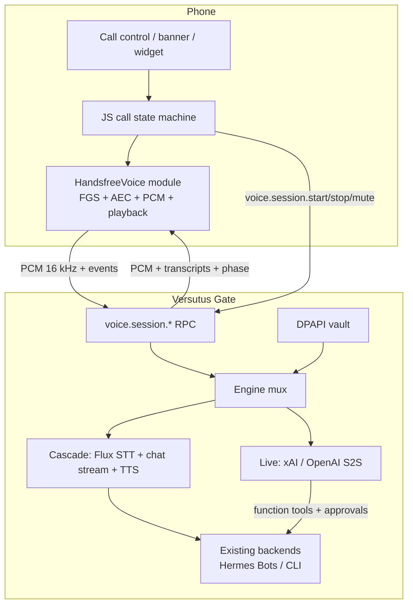

# Enterprise hands-free voice for Versutus

> **For agentic workers:** REQUIRED SUB-SKILL: Use superpowers:subagent-driven-development (recommended) or superpowers:executing-plans to implement this plan task-by-task. Steps use checkbox (`- [ ]`) syntax for tracking.
>
> Diagnosis plus an executable plan. Not code. Every claim is tagged with
> `file:line`, command output, or a cited URL. **UNVERIFIED** means it cannot
> be settled without the physical Samsung phone.

**Goal:** Make the existing Call control reliably discoverable and working on
Samsung in a day or two, then replace the on-device half-duplex cascade with a
Gate-brokered realtime voice path that talks *as* the operator's Bot, with a
fallback ladder down to today's (fixed) on-device path.

**Architecture:** One phone protocol (`voice.session.*` over the paired Gate
channel). The Gate chooses the engine: streaming cascade (Deepgram Flux STT
→ the Bot's own chat stream → streaming TTS) by default so Bot fidelity is
preserved across Hermes / Claude Code / Codex / OpenCode; optional speech-to-
speech (xAI Grok Voice or OpenAI Realtime / GPT-Live) when a realtime
provider is configured and the operator opts that Bot into Live mode. The
device never holds a long-lived provider key. Today's local Expo module stays
as the audio-session owner and as the last rung of the fallback ladder.

**Tech stack:** Expo SDK 57 / React Native 0.86.2 (`package.json` lines 13,
40). Local module `modules/handsfree-voice`. Gate `gate/` on port 8760 with
the existing DPAPI vault. Deepgram Flux (`wss://api.deepgram.com/v2/listen`).
Streaming TTS (Cartesia or xAI TTS). Optional S2S:
`wss://api.x.ai/v1/realtime` or OpenAI `POST /v1/realtime/client_secrets`.

**Do not migrate to SDK 58 for this.** `8a83907` pinned `expo-widgets` back
to `57.0.19` because 58.0.0 does not compile against SDK 57's
`expo-modules-core`. The sdk58-spike worktree still has `"expo": "~57.0.7"`
in its committed `package.json`. Realtime voice does not need a new SDK.

---

## Contents

1. Diagnosis
2. Root-cause ranking
3. Enterprise experience
4. Architecture comparison and recommendation
5. Design
6. Implementation plan
7. Test strategy
8. Risks, cost, rollout, telemetry
9. Open decisions for Ethan

---

## 1. Diagnosis

Operator report, 2026-09-12: the release APK built at 08:46
(`android/app/build/outputs/apk/release/app-release.apk`,
`APK_MTIME=2026-09-12 08:46:47`, 160,440,588 bytes) on a Samsung phone
(One UI) (a) does not show the Call control reliably when it should, and
(b) does not function at all.

The physical-device acceptance gate never ran. Commit `f4bf7f0` says so
outright: "Not marked shipped: the physical-device acceptance gate hasn't
run and iOS cannot be built on this Windows checkout." The continue-exec
log repeats it (`docs/plans/.exec-handsfree-voice-continue.log:2910`).
`FUTURE-ITEMS.md:594-608` keeps the item unshipped for the same reason.

What *did* land is real. The module is autolinked and in the APK Ethan
installed.

| Check | Result | Evidence |
|---|---|---|
| Gradle project | `:handsfree-voice` merged into the release APK | `android/app/build/outputs/logs/manifest-merger-release-report.txt:32` `MERGED from [:handsfree-voice]` |
| Merged manifest service | `com.versutus.handsfreevoice.HandsfreeCallService`, `exported=false`, `foregroundServiceType="microphone\|mediaPlayback"`, `stopWithTask=true` | `android/app/build/intermediates/merged_manifests/release/processReleaseManifest/AndroidManifest.xml:204-208` |
| Permissions | `RECORD_AUDIO`, `POST_NOTIFICATIONS`, `FOREGROUND_SERVICE`, `FOREGROUND_SERVICE_MICROPHONE`, `FOREGROUND_SERVICE_MEDIA_PLAYBACK` | same file `:14-22`; `app.json:19-24`; `modules/handsfree-voice/android/src/main/AndroidManifest.xml:5-9` |
| `RecognitionService` queries | Present (needed for `isRecognitionAvailable` on API 30+) | `android/app/src/main/AndroidManifest.xml:24-29` |
| targetSdk | 36 | merged manifest `:9` |
| Classes in the APK | `HandsfreeCallService`, `HandsfreeVoice`, `com/versutus/handsfreevoice`, `handsfree-call` all present in `classes4.dex` | PowerShell ASCII scan of extracted dex |
| Autolinking | Expo `useExpoModules()` in `android/settings.gradle:32`; local module under `modules/` per Expo Modules local-module layout | [Expo Modules get-started](https://docs.expo.dev/modules/get-started/) |

Autolinking is not the bug. The Call control's JS gates, a JS↔Kotlin
argument mismatch, a service-ready race, and a state machine that cannot
restart a call are.

### 1.a Why the Call control appears inconsistently

The composer draws the phone-shaped control only when `onStartCall` is
set and the call is not already active:

```
src/components/chat/chat-composer.tsx:442-460
onStartCall && !callActive ? <PressableScale accessibilityLabel={HANDSFREE_START_LABEL}>
```

`chat-screen.tsx:2100` is the only caller:

```
onStartCall={canStartHandsfree ? openCallSheet : undefined}
```

`canStartHandsfree` is `useHandsfreeVoice().canStart`
(`chat-screen.tsx:358-363`). That boolean is computed here:

```
src/context/handsfree-voice-provider.tsx:537-546
const canStart =
  session.phase === 'idle' &&
  status === 'connected' &&
  Boolean(activeGateway) &&
  Boolean(availability?.recognition) &&
  Boolean(availability?.synthesis) &&
  (availability?.maxSpeechInputLength ?? 0) > 0 &&
  !isSending &&
  !isCommandRunning &&
  !pendingRunApproval;
```

The composer itself only mounts on a thread surface:

```
chat-screen.tsx:1480  threadSurface = surface.kind === 'configurable' || surface.kind === 'bot'
chat-screen.tsx:2077  {threadSurface ? <ChatComposer .../> : null}
```

Roster and group rooms have no composer, so they have no Call control.
That is intentional for v1 (group send is a different path,
`handsfree-voice-provider.tsx:54` `surfaceKind: 'configurable' | 'bot'`).
It is a discoverability hole for the enterprise path, not a Samsung bug.

#### Gate table

| # | Condition | Where | Flaps in normal use? | Verdict |
|---|---|---|---|---|
| G1 | `phase === 'idle'` | provider `:538` | After *any* completed or failed-after-start call, the reducer lands in `ended` and stays there. `ended` consumes every later event, including `start` (`handsfree-session.ts:167-172`, pinned by `__tests__/handsfree-session-test.ts:275-285`). `start()` itself refuses unless phase is `idle` (`provider.tsx:477`). | **Wrong.** One attempt hides Call for the rest of the process. |
| G2 | `status === 'connected'` | `:539` | Yes. Wi-Fi blip, Tailscale handoff, Gate restart all pass through `reconnecting` (`src/lib/gateway/types.ts:5`). | Strict for *starting*. Wrong as a *visibility* gate. Disable and say why. |
| G3 | `activeGateway` | `:540` | Only on disconnect/switch. | Fine. |
| G4 | `availability?.recognition` | `:541`, probe `:428-444` | Probe runs only when `status === 'connected'`. First paint after connect is `availability === null`, so Call is hidden until `getAvailability()` returns. A failed or slow probe is not retried unless status flips. | Strict, and the probe is the wrong signal (see G5 and §1.b). |
| G5 | `availability?.synthesis` and `maxSpeechInputLength > 0` | `:542-543`, Kotlin `:59-90` | Android `getAvailability` constructs a `TextToSpeech` engine and gives it **1500 ms**. If Samsung TTS is cold (voice download, engine bind), the timeout wins, `synthesis=false`, `maxSpeechInputLength=0`, Call stays hidden. A later reconnect can succeed once TTS is cached. That is a visibility flap that looks random. | **Wrong.** TTS is created lazily at speak time (`HandsfreeCallService.kt:444-453`). Hiding Call because a probe timed out is a false negative. |
| G6 | `!isSending` | `:544`, set true for the whole stream `gateway-provider.tsx:2202` and cleared in `finally :2318` | **Yes, constantly.** Every user send hides Call until the assistant finishes streaming. | **Wrong.** B1's hold-to-talk mic is *explicitly* not hidden during a stream (`src/lib/voice/mic-state.ts:77-83, 93-95`: "a reply arriving must not be the thing that takes the mic away"). Call does the opposite of the established voice control. |
| G7 | `!isCommandRunning` | `:545` | Slash commands, `/run`. | Wrong as visibility. Fine as a start refusal with copy. |
| G8 | `!pendingRunApproval` | `:546`, also `start()` `:482` | Hermes Bots with tools. Approvals are common. | Wrong as visibility. A live approval is a reason to delay a *send*, not to hide the entrance. |
| G9 | `AppState === 'active'` | `start()` `:478` only, **not** in `canStart` | Does not hide the button. | Fine. |
| G10 | Native module load | `handsfree-device.ts:25-31` | A thrown `requireNativeModule('HandsfreeVoice')` returns null, availability never sets, Call never appears. | Not the cause on this APK (classes are in `classes4.dex`). |
| G11 | Surface kind | `chat-screen.tsx:1480, 1045, 1074-1076` | Opening roster or a group hides Call. Returning to a Bot shows it again (until G1). | Expected for v1. Enterprise should add a Bot-row Call and honour the widget deep link. |

Layout is not hiding it. The control is a 44×48 sibling of the mic inside
the composer row (`chat-composer.tsx:660-667`). It is a phone glyph
(`android: 'call'`, `:455`), not a "voice" glyph, and it has no visible
text, only `accessibilityLabel="Start hands-free call"`
(`handsfree-call-copy.ts:19`). Easy to miss, easy to confuse with a
cellular call. Discoverability problem, not a gate.

#### Availability probe, in detail

```
provider.tsx:428-444
useEffect(() => {
  if (status !== 'connected') return undefined;
  void loadHandsfreeModule().then(async (module) => {
    if (!module) return;            // silent: Call never appears
    const read = await module.getAvailability();
    setAvailability(read);
  });
}, [status]);
```

Kotlin `getAvailability` (`HandsfreeVoiceModule.kt:47-94`):

- `appContext.reactContext == null` → `{recognition:false, synthesis:false, max:0}` and **does not retry**.
- `recognition = SpeechRecognizer.isRecognitionAvailable(context)` (the
  default recognizer, not a named Google component).
- Synthesis is a side-effecting TTS engine construct with a 1.5 s timeout.
  Success path never `shutdown()`s the probe engine (leak plus engine
  contention with the later service-owned TTS).

B1 dictation uses a different availability function
(`speechRecognitionAvailable()` → `expo-speech-recognition`,
`speech-recognition.ts:123-131`). That is why the operator can see **Hold
to talk** and not **Call** on the same phone: the two probes can disagree.

Samsung-specific `isRecognitionAvailable` outcome is **UNVERIFIED**. The
manifest already queries `android.speech.RecognitionService` and
`com.google.android.googlequicksearchbox`, which is the documented API-30
fix ([SpeechRecognizer.isRecognitionAvailable](https://developer.android.com/reference/android/speech/SpeechRecognizer#isRecognitionAvailable(android.content.Context)),
[SO 64319117](https://stackoverflow.com/questions/64319117/speechrecognizer-not-available-when-targeting-android-11)).
If Google app is disabled and Samsung Voice Input is the only engine, the
probe can still be true while `createSpeechRecognizer` later fails. On-
device check in §2.

### 1.b Why the call cannot function

Trace from tap to re-listen.

#### Start tap → sheet → `start(target)`

`chat-screen.tsx:1043-1067` opens the sheet, then:

```
const result = await handsfree.start({ gatewayId, sessionId, surfaceKind, botId, label, voice });
```

There is no `try/catch`. The sheet sets `callBusy=true` before the await
and `false` after. `HandsfreeCallSheet` disables **both** Start and Cancel
while `busy` (`handsfree-call-sheet.tsx:68, 78`). If `start()` throws, the
sheet deadlocks: spinner forever, Cancel dead, swipe-down is the only
escape, and `callBusy` stays true on the next open.

#### The JS↔native contract bug (first tap)

TypeScript contract:

```
modules/handsfree-voice/src/HandsfreeVoiceModule.ts:18
startSession(options: { title: string }): Promise<HandsfreeStartOutcome>
```

JS call site:

```
src/context/handsfree-voice-provider.tsx:507
const outcome = await module.startSession({ title: target.label });
```

Kotlin:

```
HandsfreeVoiceModule.kt:96
AsyncFunction("startSession") { title: String, promise: Promise ->
```

Swift:

```
HandsfreeVoiceModule.swift:89
AsyncFunction("startSession") { (title: String, promise: Promise) in
```

Expo Modules converts a `String` parameter with
`it.asString() ?: throw DynamicCastException(String::class)`
(`node_modules/expo-modules-core/.../TypeConverterProvider.kt:226-228`).
`DynamicCastException` is `"Could not cast dynamic value to 'kotlin.String'."`
(`CodedException.kt:297-298`). A JS object `{ title: "Scout" }` is a Map,
not a String.

`speak({ chunks, ... })` is a Map on both sides (`HandsfreeVoiceModule.kt:133`)
and is fine. `startSession` is the mismatch.

The native-contract test only asserts method *names* exist
(`__tests__/handsfree-native-contract-test.ts:89-99`). It would not have
caught this. The continue-exec brief also forbade touching Kotlin
(`EXEC-BRIEF-handsfree-voice-continue.md:69-71`), so JS was written to a
shape the native side does not accept.

On first **Start call** tap the promise rejects. `dispatch({ type: 'start' })`
has already run (`provider.tsx:506`), so phase is `starting`. The rejection
is uncaught. Phase never returns to `idle` (`start-refused` is the only
reset, `:199-201`). G1 then hides Call for the rest of the process.

This single defect explains both operator reports: the control vanishes
after the first attempt, and the attempt itself does not start a call.

**UNVERIFIED on device:** confirm with `adb logcat` (see §2). Confidence
is high from the type converter source.

#### Even if the argument is fixed: service-ready race

Kotlin `startService` (`HandsfreeVoiceModule.kt:158-168`):

```
ContextCompat.startForegroundService(context, intent)
promise.resolve("started")   // does not wait for onCreate / startForeground
```

`HandsfreeCallService.current` is assigned in `onCreate`
(`HandsfreeCallService.kt:91-95`). `startForegroundService` returns as
soon as AMS accepts the request. JS then:

```
dispatch({ type: 'started' })           // → effect start-listening
void module?.startListening()          // provider.tsx:362-364
```

Native `startListening`:

```
HandsfreeVoiceModule.kt:125-127
HandsfreeCallService.current?.startListening() ?: false
```

If `current` is still null, this returns `false`. JS ignores the boolean.
The banner says Listening. Nothing is listening.

`startListening()` returning `true` is also a lie even when `current` is
set: it posts to the main handler and returns before
`startListeningInternal` runs (`HandsfreeCallService.kt:236-239`).

#### Android 14+ while-in-use FGS

The APK targets API 36. A microphone FGS may only be *created* while the
app has a visible activity; otherwise the system throws
`SecurityException` / `ForegroundServiceStartNotAllowedException`
([FGS background-start restrictions](https://developer.android.com/develop/background-work/services/fgs/restrictions-bg-start),
[FGS types: microphone](https://developer.android.com/develop/background-work/services/fgs/service-types#microphone),
[troubleshooting](https://developer.android.com/develop/background-work/services/fgs/troubleshooting)).

The module checks `appContext.currentActivity == null` (`:97-99`), which
is not "activity resumed". `startSession` asks for `RECORD_AUDIO` and
`POST_NOTIFICATIONS` (`:106-122`) and, in the permission callback, starts
the FGS immediately. A system permission dialog can pause the activity.
Samsung One UI is **UNVERIFIED** here. The catch (`:165-167`) swallows
every exception as `"unavailable"`, which the sheet renders as "This
device cannot start a hands-free call." (`chat-screen.tsx:1064-1066`).
Honest-ish, but it does not name FGS or permissions.

`permissions == null || hasGrantedPermissions(...)` (`:111`) starts the
service *without asking* when the Expo permissions helper is missing.

`RECORD_AUDIO` is requested. `FOREGROUND_SERVICE_MICROPHONE` is
install-time, correctly declared. Runtime order is otherwise right:
ask, then start. The resume-after-dialog gap is the hole.

#### POST_NOTIFICATIONS

Asked together with the mic (`:107-108`). Denied → `"permission-denied"`
and the sheet says so (`chat-screen.tsx:1062-1063`). `canStart` does not
check it, so Call still appears. Fine.

The ongoing notification is `IMPORTANCE_LOW` and `setSilent(true)`
(`HandsfreeCallService.kt:163-170, 178-184`). On Samsung, a silent low-
importance FGS notification can be hidden in the "silent notifications"
bucket, which makes One UI more willing to kill the service once the
screen locks. **UNVERIFIED.**

#### SpeechRecognizer on Samsung

Default engine, no component:

```
HandsfreeCallService.kt:245
SpeechRecognizer.createSpeechRecognizer(this)
```

Silence extras 900 / 600 / 300 ms (`:278-289`,
`HandsfreeEndpointing.kt:79-83`). Google's engine is documented to ignore
some of those extras; the service's own tick (`:396-421`) is the real
cutoff. Samsung Voice Input / Bixby as the default is **UNVERIFIED**.

`onError` (`:323-351`):

| Code | Handling |
|---|---|
| `ERROR_NO_MATCH`, `ERROR_SPEECH_TIMEOUT` | `noSpeech`, restart |
| `ERROR_RECOGNIZER_BUSY` | retry in 400 ms |
| `ERROR_CLIENT` | restart |
| **everything else** | `fatalError` → end the call |

That else includes `ERROR_NETWORK` (2), `ERROR_NETWORK_TIMEOUT` (1),
`ERROR_INSUFFICIENT_PERMISSIONS` (9), `ERROR_SERVER` (4). Cloud
recognizers need a network. A first-listen network blip kills the call.
Samsung devices that route recognition through Google's server are
exposed. **UNVERIFIED which engine Ethan has.**

#### Audio focus and `MODE_IN_COMMUNICATION`

On session start (`HandsfreeCallService.kt:189-191`):

```
audioManager.mode = AudioManager.MODE_IN_COMMUNICATION
request AUDIOFOCUS_GAIN with USAGE_VOICE_COMMUNICATION
```

Any focus loss, including transient, ends the call (`:227-231`). A
notification sound, navigation prompt, or Bluetooth SCO state change can
kill it. **UNVERIFIED** how often that fires on One UI.

`MODE_IN_COMMUNICATION` is set for the whole call, including listening.
The barge-in `AudioRecord` uses `VOICE_COMMUNICATION` (`:588`) only while
speaking, which is correct, but the mode stays. SpeechRecognizer plus
this mode is a known OEM failure mode (the recognizer's mic path and the
voice-call path fight). **UNVERIFIED on Samsung.** High prior.

#### One recognizer per turn, restart latency

Plan said "one SpeechRecognizer per listening turn" and "restart
immediately after a silence-triggered final so the grace window can hear
resumed speech." Implementation keeps one recognizer for the session
(`ensureRecognizer`) and calls `startListening` again from `onResults`
(`:367-370`) *and* from JS `start-listening` on `started`. Double start
is a source of `ERROR_RECOGNIZER_BUSY` / `ERROR_CLIENT`. The busy path
retries; the client path restarts. Can loop. **UNVERIFIED.**

The 600 ms JS grace window (`HANDSFREE_GRACE_MS = 600`,
`provider.tsx:45`) only works if the recognizer is already listening
during `confirming`. Native restart is the right idea. Restart clipping
the next utterance is **UNVERIFIED**.

#### TTS speak-before-ready

`speakInternal` (`:469-482`) constructs TTS asynchronously then
immediately `playChunk` → `engine.speak(...)`. `TextToSpeech.speak`
before `onInit` fails. `UtteranceProgressListener.onError` (`:499-506`)
emits `fatalError` and **ends the call**. Samsung TTS init is slow.
First reply can kill the session. Progressive `speak()` also increments
`speechGeneration` and replaces `queuedSpeech` (`:477-481`), so a second
sentence arriving while the first is still playing abandons the first
generation's `onDone`. QUEUE_ADD plus generation ignore can skip or
overlap. **UNVERIFIED** in practice; the race is in the code.

#### Reply correlation

Looks sound. `createMessageId('voice-call')` (`provider.tsx:319`),
`sendChatInput(..., { source: 'handsfree-call', messageId })` (`:330-335`),
`addUserMessage` with that id (`gateway-provider.tsx:2185-2192`),
`handsfreeReplyForTurn` skips running commands and running tool cards
(`handsfree-reply.ts:25-39`). Placeholder appearance moves
`sending → waiting` (`provider.tsx:412-416`). Watchdog 120 s
(`:47-48`). `isFailedReply` treats `interrupted` and `Error:` prefix as
fatal (`handsfree-reply.ts:47-50`).

`decideCallSend` returns `busy` if `isSending || isCommandRunning`
(`chat-input-source.ts:51-61`). A call turn that lands while a previous
text stream is still open dies as `send-failed`. Combined with G6, the
operator is pushed to start a call in the only window the button is
visible: after a stream ends. That window is short if they send again.

Slash commands are forced to plain text for call source
(`chat-input-source.ts:38-39`, `gateway-provider.tsx:2545-2547`). Good.

No backend-name branch. Good.

#### What the user sees on each failure

| Failure | User-visible |
|---|---|
| `startSession` throws (object vs String) | Sheet stuck on busy; Call then disappears (G1). No error copy. |
| `startSession` → `unavailable` (FGS exception) | "This device cannot start a hands-free call." |
| `startSession` → `permission-denied` | "Microphone or speech recognition permission was denied..." |
| `start()` → `refused` (busy, AppState, wrong gateway) | "A hands-free call cannot start right now. Reconnect the chat and try again." (same copy for three different causes) |
| `startListening` returns false | Banner "Listening", silence. No copy. |
| Recognizer fatal | Call ends. Banner unmounts (`active` is false for `ended`). `reason` is on context (`:553`) but the banner only renders while `active` (`handsfree-call-banner.tsx`). The terminal reason is not shown. |
| TTS fatal | Same silent end. |
| Focus loss | Same silent end. |
| `ended` forever | Call control gone until process death. |

The disclosure sheet (`HANDSFREE_DISCLOSURE`,
`handsfree-call-copy.ts:15-16`) is accurate about auto-send and
backgrounding. It cannot fire if Start never succeeds.

#### iOS (written, not built)

Swift `startSession` has the same String-vs-object bug. iOS
`getAvailability` reports `synthesis: true` and
`maxSpeechInputLength: Double.greatestFiniteMagnitude`
(`HandsfreeVoiceModule.swift:77-86`), so G5 would not hide Call on iOS.
iOS was never built on this Windows checkout (`f4bf7f0`, exec log
`:2910`). Out of scope for the Samsung report; still in the contract.

#### What was good and should be kept

- Local Expo module as the audio-session owner, not `expo-audio` as a
  second recorder (SDK 57 `expo-audio` background recording would declare
  *another* microphone FGS: [v57 audio docs](https://docs.expo.dev/versions/v57.0.0/sdk/audio/)).
- Pure reducer in `src/lib/voice/handsfree-session.ts`.
- `source: 'handsfree-call'` send policy (connected-only, no offline
  outbox, no slash dispatch).
- Crash-safe recovery into the composer.
- B1 hold-to-talk and B2/B3 `expo-speech` left alone, with
  `beginHandsfreeCall` / `endHandsfreeCall` so they cannot double-speak
  (`src/lib/voice/speech.ts`).
- No wake word (B5, `FUTURE-ITEMS.md:247-250`).
- No backend-name branching in app code.
- Provider mounted above navigation (`_layout.tsx:563-564`).
- Notification End emits `endRequested` then tears down
  (`HandsfreeCallService.kt:99-104`).

---

## 2. Root-cause ranking

| Rank | Cause | Likelihood | Settled without the phone? | On-device check |
|---|---|---|---|---|
| 1 | `startSession({ title })` vs Kotlin/Swift `title: String`. First tap throws, phase stuck `starting`, Call vanishes, sheet deadlocks. | **Certain from source.** | Yes, as to the mismatch. Device confirms the exception. | `adb logcat -s ReactNativeJS ExpoModules HandsfreeVoice *:E` while tapping Start call. Expect `Could not cast dynamic value to 'kotlin.String'` or `ERR_DYNAMIC_CAST`. |
| 2 | `ended` is terminal forever. `canStart` requires `idle`. After one attempt the control is gone. | **Certain from source.** | Yes. | After any End (or the failed start), Call is absent on a connected Bot Chat until force-stop. |
| 3 | `canStart` hides on `isSending` / `isCommandRunning` / `pendingRunApproval`. Opposite of B1 mic. | **Certain from source.** Explains "inconsistently when it should" even before (1). | Yes. | Open a Bot Chat, send a text, watch Call vanish for the whole stream; watch it return when the bubble completes (until (2) fires). |
| 4 | `getAvailability` TTS 1.5 s timeout hides Call (`synthesis=false`). | High on Samsung cold start. | Partially. | `adb logcat -s TextToSpeech HandsfreeVoice`. Time `getAvailability`. Toggle airplane then reconnect and see Call appear/disappear. |
| 5 | `startForegroundService` resolves before `onCreate`; `startListening` no-ops. | High. | Race is in the code. | After (1) is fixed: `adb logcat -s HandsfreeCallService SpeechRecognizer`. If JS is `listening` with no `onReadyForSpeech`, this is it. |
| 6 | FGS microphone started from the permission callback while the activity is paused. | Medium-high on One UI. | No. | `adb logcat -s ActivityManager AndroidRuntime`. Look for `ForegroundServiceStartNotAllowedException` or `SecurityException: Starting FGS with type microphone`. |
| 7 | `MODE_IN_COMMUNICATION` + default `SpeechRecognizer` on Samsung. | Medium. | No. | After (1)(5)(6): `dumpsys audio` during a call (`MODE_IN_COMMUNICATION`). `dumpsys package com.google.android.googlequicksearchbox`. Log `SpeechRecognizer` error codes. |
| 8 | Default recognizer is Samsung Voice Input, not Google. `ERROR_INSUFFICIENT_PERMISSIONS` / `ERROR_NETWORK` fatal. | Medium. | No. | Settings → Apps → default digital assistant / Voice input. `adb shell dumpsys activity service RecognitionService`. Log `onError` ints. |
| 9 | Silent low-importance FGS notification; One UI sleeps the app once locked. | Medium. | No. | Start a call, lock 10 minutes. `dumpsys activity services HandsfreeCallService`. Check if the notification is in the Silent channel. |
| 10 | TTS `speak` before `onInit` kills the call on first reply. | Medium. | Race is in the code. | After listening works: one turn, log `TextToSpeech` / `tts-error`. |
| 11 | Module missing from APK. | **Ruled out.** | Yes. | `classes4.dex` contains the names. |
| 12 | SDK 58 / widgets pin. | Unrelated to voice. | Yes. | `8a83907` is widgets. |

Anything marked UNVERIFIED in §1 is in ranks 4–10. Rank 1–3 are enough to
make the feature look dead on a phone that otherwise built correctly.

---

## 3. Enterprise experience

Target: ChatGPT Advanced Voice / GPT-Live, Gemini Live, Grok Voice. Not
parity-by-slogan. Numbers and behaviours.

### Conversation quality

| Metric | Target | How |
|---|---|---|
| End of user speech → first reply audio | p50 ≤ 800 ms cascade, ≤ 400 ms S2S. p95 ≤ 1800 ms / 900 ms | Deepgram Flux `EagerEndOfTurn` (~260 ms p50 end-of-turn at defaults, [Flux migration](https://developers.deepgram.com/docs/flux/nova-3-migration)) overlapping the Bot's TTFT; streaming TTS with vendor TTFA in the 40–90 ms range (Cartesia Sonic claims; re-measure). S2S: xAI reports ~0.70 s time-to-first-audio for Think Fast 2.0 in third-party coverage; **confirm against** [xAI Speech to Speech](https://docs.x.ai/developers/model-capabilities/audio/speech-to-speech). |
| Semantic endpointing | Required | Flux `EndOfTurn` / `TurnResumed` / `EagerEndOfTurn`, not 900 ms of silence. Today's 900+600 ms silence plus 600 ms JS grace (`HandsfreeEndpointing.kt:79-81`, `HANDSFREE_GRACE_MS`) is the failure mode that killed early Advanced Voice. Keep the grace window only on the on-device fallback. |
| Barge-in | Playback stops p50 ≤ 150 ms, p95 ≤ 300 ms from voice onset | Cascade: Flux `StartOfTurn` while speaking, plus on-device VAD as a 50 ms local cut. S2S: provider server VAD (`turn_detection.type = server_vad` on xAI; Gemini `START_OF_ACTIVITY_INTERRUPTS` default, [Live API reference](https://ai.google.dev/api/live)). |
| Full-duplex | Near-full-duplex on cascade. True full-duplex on S2S. | Cascade keeps the mic open during TTS with AEC (`MODE_IN_COMMUNICATION` *while speaking*, not while listening). It will not murmur "mmhm" while the user talks unless we add a backchannel later. S2S is actually simultaneous. Justify near-duplex for cascade: Bot fidelity (the Bot's own model and tools) is worth more than backchannel murmurs. GPT-Live exists specifically for "full-duplex with a delegated backend" ([OpenAI Realtime getting started](https://developers.openai.com/api/docs/guides/realtime)). That is milestone M5, not the default. |
| Streaming speech out | First completed sentence, then rest | Already designed in `planHandsfreeSpeech`. Cloud TTS must accept incremental text and be interruptible. |
| Expressive voices | Per-Bot voice, rate, pitch preserved | Reuse `voice-preferences.ts` / `bot-voices.ts`. Map to provider voice ids in the Gate, not in the app. |
| Noise robustness | Works in a car and a kitchen | Cloud STT. On-device fallback degrades honestly ("I am having trouble hearing you") rather than sending garbage. |
| Thinking pauses | `TurnResumed` cancels a premature send | Flux. On-device fallback keeps the grace window. |

### Reliability

Survive, in order:

1. App backgrounded and screen locked for ≥10 minutes (the gate that never
   ran). Microphone FGS with a **visible, non-silent** ongoing
   notification; iOS `UIBackgroundModes=audio` already declared.
2. Bluetooth / wired / car route changes. Do not treat SCO connect as
   fatal focus loss. Rebind the input device. Only a phone/VoIP call
   should end us (`AUDIOFOCUS_LOSS`, not `LOSS_TRANSIENT_CAN_DUCK`).
3. Wi-Fi ↔ cellular ↔ Tailscale. The voice WebSocket is a separate
   session with resume (`conversation_id` on xAI
   [session resumption](https://docs.x.ai/developers/model-capabilities/audio/speech-to-speech);
   cascade: Gate holds the turn state and reconnects STT/TTS).
4. Gateway reconnect. A voice session is not the chat SSE. Park
   listening, reconnect, resume. Never put auto-sent speech in the
   offline outbox (today's `decideCallSend` rule stays).
5. Honest recovery when it cannot: banner names the reason, unsent text
   lands in the composer, Call remains offered.

### Discoverability and entry points

| Entry | In / out | Why |
|---|---|---|
| In-chat Call control | **In, Phase 0** | Already built. Fix gates. Keep beside Hold to talk. Change the glyph/label so it does not look like a cellular call. |
| Disclosure sheet | **In, Phase 0** | Consent. Once per install, then a one-line "speech auto-sends" on Start. |
| In-call banner + notification | **In, Phase 0** | Mute / Skip / End. Notification gains Mute. Raise channel importance. |
| Home-screen widget "Start voice call" | **In, M4.** Contract in **§5.4** | Parallel widget plan consumes this. |
| Android launcher shortcut per recent Bot | **In, M4** | Same URL as the widget. Item 8 in `FUTURE-ITEMS.md` already wants shortcuts on the deep-link vocabulary. |
| Headset / Bluetooth hook button | **In during an active call only** (mute/end). **Out as a start.** | Starting from a pocket would be a wake word by another name (B5). |
| Quick-settings tile | **Out of v1, in later** | Useful. Extra native surface. After widget. |
| Lock-screen full-screen incoming-call UI | **Out** | We are not a `phoneCall` FGS and not CallKit. Ongoing notification + banner is the lock-screen presence. |
| Assistant / "Hey Siri talk to Scout" | **Out of this plan** | Item 8, separate. The URL in §5.4 is what it should open. |
| Always-listening wake word | **Out, forever in this plan** | B5. `rpc-routes.ts:115-116` still says host-side voice REST does not exist. |

### Relationship to Bots

A Versutus Bot is a Hermes profile with soul, memory, tools, model pin,
routines (`CONTEXT.md`, ADR 0004, ADR 0012, ADR 0014). Claude Code,
Codex, and OpenCode are CLI backends, not Bots. The voice path must talk
*as* the thing the operator opened.

That is the central design question. Comparison in §4.

---

## 4. Architecture comparison and recommendation

Four options. The app never branches on `hermes` / `opencode` / `codex` /
`claude-code`. The Gate may.

### A. Speech-to-speech front-end that delegates to the Bot

The phone streams audio to a realtime speech model (xAI Grok Voice,
OpenAI Realtime / GPT-Live, Gemini Live). That model is the mouth. It
calls tools. Tools are how it reaches the Bot.

| | |
|---|---|
| Latency | Best. xAI server VAD, OpenAI WebRTC, Gemini native barge-in. |
| Voice quality | Best. Expressive, full-duplex, backchannel possible. |
| Cost / min | xAI lists Speech to Speech "starting at" a per-minute audio rate plus per `conversation.item.create` text events ([docs](https://docs.x.ai/developers/models/speech-to-speech), [pricing](https://docs.x.ai/developers/pricing#voice-api-pricing)). Marketing page [x.ai/api/voice](https://x.ai/api/voice) shows **$0.05 / min**. Third-party trackers list Think Fast 2.0 at **$0.08 / min**. **Confirm in the xAI console before budgeting.** OpenAI Realtime is token-priced (audio in/out); use [Voice latency and cost](https://developers.openai.com/api/docs/guides/voice-latency-cost?api=realtime), do not copy third-party GPT-Live-1 $0.05/min figures without the official table. Gemini Live is token-priced on the Live API. |
| Privacy | Audio leaves the phone to the provider. Gate can mint ephemeral tokens so the device never sees the long-lived key (xAI [ephemeral tokens](https://docs.x.ai/developers/model-capabilities/audio/ephemeral-tokens); OpenAI `POST /v1/realtime/client_secrets`, [GA migration](https://developers.openai.com/api/docs/guides/realtime)). |
| Credential posture | Fits ADR 0002: vault stays on the Gate. |
| Bot fidelity | **The weak point.** The voice model *is* a second agent. Soul can be injected as `instructions`. Memory and tools only exist if we proxy them as function calls (`response.function_call_arguments.done` → Gate → Bot run/approval → `function_call_output`). The Bot's pinned model (Claude, GPT, Grok text, Codex) is bypassed unless every turn is forced through a `consult_bot` tool, which adds a hop and kills the latency win. OpenAI's GPT-Live is explicitly "full-duplex with a separate delegated backend" ([guide](https://developers.openai.com/api/docs/guides/realtime)). That is this option done properly, and it is still a second brain in front of the Bot. |
| Hermes / Claude Code / Codex / OpenCode | Natural for Hermes Bots (soul + tools). Forced and lossy for CLI backends that are not speech models. |
| Failure | Provider outage takes voice down unless we fall back to cascade. |

xAI official wire: `wss://api.x.ai/v1/realtime?model=grok-voice-think-fast-2.0`
(or `grok-voice-latest`), `session.update` with `voice`, `instructions`,
`tools`, `turn_detection: { type: "server_vad" }`, optional
`resumption.enabled`, PCM 24 kHz default, binary transport, function
tools, `force_message` for a verbatim disclosure
([Speech to Speech guide](https://docs.x.ai/developers/model-capabilities/audio/speech-to-speech)).
Gate already has an `xai` provider profile
(`gate/core/providers/profiles/xai.mjs`) talking `openai_chat` to
`https://api.x.ai/v1`. Voice is a different endpoint on the same key.

OpenAI official wire (GA): mint
`POST https://api.openai.com/v1/realtime/client_secrets`, connect WebRTC
to `/v1/realtime/calls` or server WebSocket, model `gpt-realtime` /
`gpt-realtime-2.1` ([Realtime guide](https://developers.openai.com/api/docs/guides/realtime)).
Do not use the beta `POST /v1/realtime/sessions` in new work.

Gemini Live: WebSocket
`wss://generativelanguage.googleapis.com/ws/google.ai.generativelanguage.v1beta.GenerativeService.BidiGenerateContent`,
PCM 16 kHz in / 24 kHz out, `START_OF_ACTIVITY_INTERRUPTS` default
([Live API](https://ai.google.dev/api/live),
[get started](https://ai.google.dev/gemini-api/docs/live-api/get-started-websocket)).
No first-party ephemeral-token story comparable to xAI/OpenAI. Gate must
relay. The Gate has no Gemini provider profile today.

### B. Cascaded streaming pipeline (recommended default)

Phone PCM → Gate → streaming STT → the Bot's existing `sendChatInput` /
`streamChat` path → streaming TTS → phone.

| | |
|---|---|
| Latency | Worse than S2S, in budget if Flux EagerEndOfTurn overlaps LLM TTFT and TTS starts on the first sentence. Target p50 800 ms. |
| Voice quality | As good as the TTS. Not full-duplex. Near-duplex with open mic + AEC + barge-in. |
| Cost / min | Deepgram Flux PAYG **$0.0077 / min** English ([deepgram.com/pricing](https://deepgram.com/pricing)). TTS is per character; Cartesia and ElevenLabs publish plan-based rates that move. Recheck [Cartesia pricing](https://cartesia.ai/pricing) and [ElevenLabs pricing](https://elevenlabs.io/pricing) at implement time. xAI TTS is listed at **$15 / 1M characters** on [x.ai/api/voice](https://x.ai/api/voice). Plus the Bot's ordinary token cost, which the operator already pays. A 10-minute call is cents of STT, not dollars of S2S. |
| Privacy | Audio goes to STT and TTS providers, not to a second LLM, unless those providers train on it. Default: opt out of training where the API allows. Transcript is the same chat log as typing. |
| Credential posture | Keys in the Gate vault. Device sees PCM and a session id. |
| Bot fidelity | **The strong point.** The voice *is* the Bot. Same soul, memory, tools, approvals, model pin. Works for configurable chat against Claude Code / Codex / OpenCode without pretending they are Bots. |
| Failure | Degrade STT or TTS independently. Last rung is on-device. |

Flux events we will actually use
([migration guide](https://developers.deepgram.com/docs/flux/nova-3-migration)):

- `StartOfTurn` while speaking → barge-in
- `EagerEndOfTurn` → start the Bot turn speculatively
- `TurnResumed` → cancel that turn
- `EndOfTurn` → commit the transcript

`wss://api.deepgram.com/v2/listen?model=flux-general-en&encoding=linear16&sample_rate=16000`.

### C. Hybrid chosen at the Gate, per Bot / per session

App protocol is identical. Gate picks B or A.

- Default: B (cascade) for every backend.
- Opt-in Live mode on a Hermes Bot when a realtime provider is configured:
  A, with soul as `instructions`, Bot tools as `function` tools routed
  through the existing approval machinery, memory via a `read_memory`
  tool, `force_message` for the recording disclosure.

No app-side backend-name branch. The manifest advertises
`voice: { engines: ['cascade','live'], default: 'cascade' }`.

### D. On-device (today, after Phase 0)

Kept as the last fallback and as the only mode when the Gate has no
voice providers, or the kill switch is on, or the network is gone.
Phase 0 makes it actually work on Samsung. It will never feel like
GPT-Live. That is acceptable as a fallback, not as the product.

### Recommendation

**Ship C, with B as the default engine and A as opt-in Live mode.**

Why B is the default: Versutus's product is Bots, not a generic voice
agent. A Grok Voice session that roleplays the soul without the Bot's
memory and tools is a different character. The operator already picked a
model pin per Bot (ADR 0014). Replacing it with a speech model because
they tapped Call would be a silent backend switch, the same class of bug
`f4bf7f0` just fixed for the model picker.

Why A exists: when the operator *wants* Grok Voice (or GPT-Live) as that
Bot's mouth, the Gate can do it without a new app protocol. xAI is the
first Live provider because the vault already holds xAI keys, ephemeral
tokens are documented, session resumption is documented, and
`force_message` gives us a verbatim consent line.

Fallback ladder, top to bottom:

1. Gate Live (S2S) if the session asked for it and the provider is healthy.
2. Gate cascade (Flux + Bot stream + streaming TTS).
3. Gate STT + Bot stream + on-device TTS.
4. On-device STT + Bot stream + on-device TTS (Phase 0 path).
5. B1 hold-to-talk. Always there.

Kill switch: Gate `voice.enabled=false` (or missing `realtime-voice`
capability) → ladder starts at 4.

SDK 58 is not required. SDK 57 Expo Modules plus this local module can
own PCM capture. `expo-audio`'s `useAudioStream` exists in v57 but would
introduce a second microphone FGS if background recording is enabled.
Do not add it beside `HandsfreeCallService`.

---

## 5. Design

### 5.1 Architecture



Component responsibilities:

| Piece | Owns | Does not own |
|---|---|---|
| `modules/handsfree-voice` | Mic, speaker, AEC, FGS, notification, route changes, PCM frames, on-device STT/TTS fallback | Provider keys, Bot identity, turn policy |
| `src/lib/voice/handsfree-session.ts` | Call phase reducer | Native I/O, Gate I/O |
| `src/context/handsfree-voice-provider.tsx` | Orchestration, entry from UI and deep links | Backend names |
| `src/lib/voice/handsfree-protocol.ts` (new) | App↔Gate message types | Transport |
| `gate/core/capabilities/realtime-voice/` | Capability kind, engine mux, ephemeral mint, audit, caps | App UI |
| `gate/core/voice-cascade.mjs` (new) | Flux + TTS around existing chat | Soul files |
| `gate/core/voice-live.mjs` (new) | S2S session, tool proxy into approvals | PCM capture |
| Existing `sendChatInput` | Cascade user turns | Audio |

### 5.2 App ↔ Gate ↔ provider protocol

Paired-device RPC, same grant as `notifications.register`
(`gate/core/push-rpc.mjs:75-77`, `requireDevice`). Audio frames ride a
WebSocket the Gate opens after `voice.session.start` returns a
`sessionId` and a `mediaUrl` (same origin, device token in the
subprotocol, not a provider URL).

#### RPC

`voice.session.start`

```
params: {
  gatewayId: string,          // app's active gateway; Gate ignores if it is itself
  thread: {
    kind: 'bot' | 'configurable',
    botId?: string,
    sessionId: string
  },
  engine?: 'auto' | 'cascade' | 'live' | 'device',
  disclosureAcceptedAt: string // ISO time, required
}
returns: {
  voiceSessionId: string,
  engine: 'cascade' | 'live' | 'device',
  mediaUrl: string,            // wss://gate/.../voice/{id}
  expiresAt: string
}
```

`voice.session.stop` `{ voiceSessionId, reason }`
`voice.session.mute` `{ voiceSessionId, muted: boolean }`
`voice.session.pong` `{ voiceSessionId }` (keepalive)
`voice.capabilities` `{}` → `{ enabled, engines, defaultEngine, killSwitch }`

Mint (Live only, if we ever put WebRTC on the device; v1 relays through
Gate so this stays server-side):

`voice.ephemeral.mint` `{ providerId, model, sessionConfig }` →
`{ token, expiresAt }` using the vault key. Never returned to JS in v1
if the engine is Gate-relayed.

#### Media WebSocket (app ↔ Gate)

Client → Gate, binary: PCM16 LE mono 16 kHz, 80 ms frames (Flux
recommendation).

Client → Gate, JSON:

```
{ "type": "event", "event": "barge-in" | "skip" | "mute" | "unmute" | "end" }
```

Gate → app, binary: PCM16 LE mono 16 kHz (or 24 kHz downsampled on the
Gate).

Gate → app, JSON:

```
{ "type": "partial", "text": "..." }
{ "type": "final", "text": "...", "turnId": "voice-call-..." }
{ "type": "phase", "phase": "listening" | "thinking" | "speaking" }
{ "type": "error", "code": "stt-down" | "tts-down" | "backend-down" | "cap" | "denied", "message": "..." }
{ "type": "engine", "engine": "cascade" | "live" | "device" }
```

On `engine: device` the app never opens `mediaUrl` and uses the Phase 0
native path.

#### Gate ↔ providers (not visible to the app)

Cascade: Flux listen v2; existing backend chat stream (the same path
`relayOpenAiStream` already uses in `gate/core/server.mjs`); TTS
WebSocket or chunked HTTP.

Live: xAI `wss://api.x.ai/v1/realtime?model=...` with
`Authorization: Bearer` from the vault, or OpenAI server WebSocket with
the standard key. Function calls become Gate-side Bot tool runs.

### 5.3 State machines

Call (JS reducer, extended from today):

```
idle → starting → listening ⇄ confirming → sending → waiting → speaking
                      ↑                                         │
                      └──────── barge-in / speechFinished ──────┘
any live → ending → idle     // Phase 0 fix: ended is not sticky
```

`ended` remains a reason code on the way through `ending`, then the
provider dispatches a reset to `idle` once teardown finishes.

Audio session (native):

```
idle → permission → foreground → focused → capturing
capturing: listen-mode (SpeechRecognizer or PCM uplink)
         | speak-mode  (TTS or PCM downlink + AEC + barge-in tap)
route-change: rebind, do not end
focus LOSS: end
focus LOSS_TRANSIENT: pause capturing, resume on GAIN
```

### 5.4 Entry-point contract

Owned by this plan. The Android widget plan must adopt it rather than
invent a second URL.

#### URL

Scheme is already `versutus` (`app.json:8`, intent filter
`android/app/src/main/AndroidManifest.xml:40-45`).

```
versutus://call
versutus://call?bot=<botId>
versutus://call?bot=<botId>&engine=live
```

| Param | Required | Meaning |
|---|---|---|
| `bot` | No | Hermes Bot id. Absent: configurable chat currently selected, else the last Bot Chat, else the roster with copy "Open a Bot or chat first." |
| `engine` | No | `live` asks the Gate for S2S. Ignored if the Gate cannot. Default `auto`. |
| `autoStart` | No | `1` skips the disclosure if this install has already accepted it. Widget uses `autoStart=1`. In-chat Call does not. |

Add `{ kind: 'call'; botId?: string; engine?: 'auto' | 'live' | 'cascade'; autoStart: boolean }`
to `DeepLinkTarget` in `src/lib/gateway/deep-link.ts:27-30`.
`GatewayDeepLinkRouter` (`src/app/_layout.tsx:402`) already waits for
bootstrap. A `call` target navigates to `/chat`, `requestSurface` /
`openBot` as today, then `requestCall({ ... })`.

Do not add a second router. Item 8 (`FUTURE-ITEMS.md:90-114`) already
requires one vocabulary.

#### Android intent (widget / shortcut)

The widget's PendingIntent should fire the same URL via `ACTION_VIEW`,
not a custom action. That keeps iOS widgets, shortcuts, notifications,
and the Android widget on one parser.

```
action: android.intent.action.VIEW
data:   versutus://call?bot=<id>&autoStart=1
package: com.versutus.app
```

Optional explicit extra, ignored if the URL is present:

```
com.versutus.app.extra.BOT_ID
com.versutus.app.extra.AUTO_START   // boolean
```

Do not introduce `com.versutus.app.action.START_VOICE_CALL` unless the
widget host cannot send `ACTION_VIEW`. Prefer the URL.

#### Cold, locked, disconnected

| App state | What happens |
|---|---|
| Cold start, connected after bootstrap | Open Bot Chat (ADR 0012). If `autoStart=1` and disclosure previously accepted, start the call. Else show the disclosure sheet on that thread. |
| Cold start, not yet connected | Navigate to Chat, hold the call request (same pattern as compose links waiting on `status === 'connected'`, `_layout.tsx:436`). Banner: "Waiting to connect before starting the call." Timeout 30 s, then copy "Could not reach the gateway." Do not start native capture while disconnected. |
| App lock on (`AppLockGate`) | The lock already holds arriving routes (`app-lock-gate.tsx:18-32`). Hold the call request with the route. After unlock, proceed as cold start. Never start the mic under the lock cover. |
| Already in a call with the same Bot | Bring the app to foreground. No second session. |
| Already in a call with a different Bot | End the current call (reason `thread-changed`), then start the new one after a one-line confirm in-app. Widget `autoStart` still confirms when switching Bots. |
| Process death during a call | No resume of capture (B5, `START_NOT_STICKY`). Recovery text in the composer. A new widget tap is a new call. |
| Live engine requested, Gate on cascade only | Start cascade. Do not fail the tap. |

#### Headset button

While a call is active, `KEYCODE_MEDIA_PLAY_PAUSE` / headset hook toggles
mute. It does not start a call. Documented in README so it is not
mistaken for a wake word.

---

## 6. Implementation plan

Global constraints (every task inherits these):

- `npm run verify` is the gate.
- FEATURE / FIX / OPT by user-visible outcome. Commit messages state how
  the world now behaves.
- Unit-testable logic in `src/lib`.
- No backend-name branching in app code.
- No wake word, no boot receiver, no `phoneCall` FGS, no long-lived
  provider key on the device.
- B1–B3 keep working. Regression: hold-to-talk still never auto-sends.
- Do not add `expo-audio` as a second recorder.

### Phase 0 hotfix (ship in a day or two)

Make the existing call show up and work on Samsung. No Gate audio yet.
Track every task below with the checkboxes on its steps.

#### Task 0.1: The call can start twice, and a thrown start does not deadlock the sheet

**Files:**
- Modify: `src/lib/voice/handsfree-session.ts`
- Modify: `src/context/handsfree-voice-provider.tsx`
- Modify: `src/components/chat/handsfree-call-sheet.tsx`
- Modify: `src/components/chat/chat-screen.tsx`
- Test: `__tests__/handsfree-session-test.ts`
- Test: `__tests__/handsfree-provider-contract-test.ts`
- Test: `__tests__/handsfree-call-ui-contract-test.ts`

**Change:**
- [ ] After `stopped`, the reducer goes to `idle` (or the provider dispatches
  a `reset` that does). `ended` may remain as a reason on a one-shot
  banner, not as a phase that eats `start`.
- [ ] `start()` wraps `startSession` in try/catch, maps a throw to
  `unavailable`, dispatches `start-refused`.
- [ ] `handleStartCall` has try/finally so `callBusy` always clears.
- [ ] Cancel is never disabled by `busy`. Start may be.

**Tests:**
- [ ] `reduce(listening(), [{type:'end'},{type:'stopped'}]).phase === 'idle'`
  (replace the "every event is inert once ended" pin that currently
  forbids restart).
- [ ] A synthetic `startSession` rejection returns `'unavailable'` and phase
  `idle`.
- [ ] Sheet source still disables Start when busy, not Cancel.

**Acceptance:** After End, Call is offered again on the same Bot Chat
without relaunching the app.

**Device:**
- [ ] Start, End, Start again. Three times.

#### Task 0.2: `startSession` accepts the JS options object

**Files:**
- Modify: `modules/handsfree-voice/android/.../HandsfreeVoiceModule.kt`
- Modify: `modules/handsfree-voice/ios/HandsfreeVoiceModule.swift`
- Modify: `__tests__/handsfree-native-contract-test.ts`

**Change:**
- [ ] Kotlin/Swift take a record/map with `title: String`, matching
  `HandsfreeVoiceModule.ts:18`. Do not change the JS call site the other
  way (the TS contract is the one the rest of the app compiled against).

Kotlin sketch:

```
data class StartSessionOptions(val title: String = "")
AsyncFunction("startSession") { options: Map<String, Any?>, promise: Promise ->
  val title = options["title"] as? String ?: ""
  ...
}
```

(Expo `Record` is also fine if it compiles against this SDK's
`expo-modules-core`.)

**Tests:**
- [ ] Contract test asserts Kotlin/Swift read `options["title"]` or
  a Record field `title`, not a bare `title: String` parameter. Add a
  Kotlin unit test that a map with `title=Scout` starts.

**Acceptance:** Start call no longer throws `DynamicCastException`.

**Device:**
- [ ] `adb logcat` on Start call shows `ACTION_START` on
  `HandsfreeCallService`, no `ERR_DYNAMIC_CAST`.

#### Task 0.3: Do not claim started until the service is up, and do not ignore a failed listen

**Files:**
- Modify: `HandsfreeVoiceModule.kt`, `HandsfreeCallService.kt`
- Modify: `src/context/handsfree-voice-provider.tsx`
- Test: Kotlin `HandsfreeCallStateTest` plus a new
  `HandsfreeVoiceModule` test if we can fake the service; otherwise a
  source-contract test that `startSession` waits on a ready callback.

**Change:**
- [ ] Service emits a ready signal (module Completer / `CountDownLatch` /
  `onStartCommand` after `startForeground` succeeds) before
  `promise.resolve("started")`.
- [ ] If `startForeground` throws, resolve `"unavailable"` and `stopSelf`.
- [ ] `startListening` returning false dispatches `fatalError` /
  `recognition-failed` rather than leaving the banner on Listening.
- [ ] Do not call `startListening` from both `onResults` restart *and* JS
  `started` in a way that overlaps. Native owns auto-restart during
  `listening`/`confirming`. JS calls `startListening` only on entering
  `listening` from `starting`, `speaking`, or `muted`.

**Acceptance:** Banner Listening implies `onReadyForSpeech` has fired
once.

**Device:**
- [ ] `adb logcat -s SpeechRecognizer HandsfreeCallService` on
  Start. Speak immediately. Partials appear.

#### Task 0.4: Call stays visible while a text stream is in flight

**Files:**
- Modify: `src/context/handsfree-voice-provider.tsx`
- Modify: `src/components/chat/chat-screen.tsx` (optional reason line)
- Modify: `src/lib/voice/handsfree-call-copy.ts`
- Test: `__tests__/handsfree-provider-contract-test.ts`
- Test: `__tests__/handsfree-call-ui-contract-test.ts`

**Change:**
- [ ] `canStart` drops `!isSending`, `!isCommandRunning`,
  `!pendingRunApproval`. Keep connected + native availability + idle.
- [ ] `start()` may still refuse those with distinct copy:
  busy stream: "Wait for this reply to finish, or stop it, then start the call."
  pending approval: "Finish the approval first."
  command running: "A command is still running."
- [ ] Offer Call on configurable and Bot threads whenever the native module
  loaded, even if the last TTS probe failed (Task 0.5).

**Acceptance:** During a streaming reply, Call is visible. Tapping it
shows the busy copy rather than hiding. Phase 0 does not overlap a live
text stream with a call send.

**Device:**
- [ ] Send a long prompt, confirm Call remains, tap it, read the
  copy, Stop the stream, Start call works.

#### Task 0.5: Availability probe does not require a 1.5 s TTS init

**Files:**
- Modify: `HandsfreeVoiceModule.kt` `getAvailability`
- Modify: `src/context/handsfree-voice-provider.tsx` probe effect
- Test: contract test that `canStart` does not require
  `availability.synthesis` if `recognition` is true; TTS failure is a
  speak-time problem.

**Change:**
- [ ] `getAvailability` uses `SpeechRecognizer.isRecognitionAvailable` (and
  logs `isOnDeviceRecognitionAvailable` on API 31+) and reports
  `synthesis=true` if `TextToSpeech.getMaxSpeechInputLength() > 0`
  without constructing an engine. Construct TTS only in the service.
- [ ] Probe retries three times on `reactContext == null` or
  `recognition=false`, 500 ms apart, and again on AppState `active`.
- [ ] Prefer Google's recognition service when present:

```
createSpeechRecognizer(context, ComponentName(
  "com.google.android.googlequicksearchbox",
  "com.google.android.voicesearch.serviceapi.GoogleRecognitionService"
))
```

  fall back to default. Log which component bound.

**Acceptance:** Call appears within a second of becoming connected on a
phone where Hold to talk is already offered.

**Device:**
- [ ] Cold start Versutus, connect, open a Bot. Call is there
  before sending any text. `logcat` names the recognizer component.

#### Task 0.6: Samsung listen/speak robustness

**Files:**
- Modify: `HandsfreeCallService.kt` recognition errors, TTS queue, audio
  focus, notification channel
- Test: `HandsfreeEndpointingTest.kt` unchanged; new tests for error
  classification (pure function extracted to `HandsfreeRecognizerErrors.kt`)

**Change:**
- [ ] Extract `fun isRecoverableRecognizerError(code: Int): Boolean`.
  Recoverable: `NO_MATCH`, `SPEECH_TIMEOUT`, `CLIENT`, `BUSY`,
  `NETWORK`, `NETWORK_TIMEOUT`, `SERVER`, `SERVER_DISCONNECTED`.
  Fatal: `INSUFFICIENT_PERMISSIONS`, `AUDIO`, unknown after 3 retries.
- [ ] Queue `speak` until `ttsReady`. Never `fatalError` on a pre-init speak.
- [ ] Progressive `speak` **appends** to `queuedSpeech` without bumping
  `speechGeneration` unless `stopSpeaking` ran.
- [ ] `MODE_IN_COMMUNICATION` only while speaking or while the barge-in
  `AudioRecord` is open. Listening uses `MODE_NORMAL` (or
  `MODE_IN_COMMUNICATION` only if Google recognizer still works; make
  this a native flag flipped by the device matrix).
- [ ] Focus: `LOSS` ends. `LOSS_TRANSIENT` pauses. `GAIN` resumes.
- [ ] Notification channel `IMPORTANCE_DEFAULT`, not silent. Content text
  "Versutus is in a hands-free call. End from here."
- [ ] `startForeground` only after `Activity` resumed: module waits on
  `onHostResume` if the permission callback ran while paused.

**Acceptance:** One full turn, foreground, on Samsung: listen, auto-send,
spoken reply, re-listen. Notification visible in the shade.

**Device:**
- [ ] Covered by Task 0.8.

#### Task 0.7: Honest copy and a visible reason after a failed call

**Files:**
- Modify: `src/lib/voice/handsfree-call-copy.ts`
- Modify: `src/components/voice/handsfree-call-banner.tsx`
- Modify: `src/components/chat/chat-screen.tsx`
- Test: `__tests__/handsfree-call-ui-contract-test.ts`

**Change:**
- [ ] Map `HandsfreeTerminalReason` and start results to distinct
  sentences. After a call ends with a non-user reason, keep a one-line
  error on the composer for 8 seconds (not a hidden banner).

**Tests:**
- [ ] Copy strings pinned in `__tests__/handsfree-call-ui-contract-test.ts`.

**Acceptance:** A failed start names the actual cause, not "this device
cannot start a hands-free call" for everything.

**Device:**
- [ ] Deny mic permission; read the copy. Force-stop Google app
  (if safe) and read the recognition copy.

#### Task 0.8: Rebuild the APK and run the physical gate

**Files:** none in git (android/ is generated). Rebuild with the
existing prebuild.

**Change:**
- [ ] Assemble release, install on the Samsung, run §7 device
  matrix rows P0-1 to P0-6.

**Acceptance:** Operator can start a call from a Bot Chat, speak three
turns in foreground, background, and 10 minutes locked, End from the
notification, and start again. B1 hold-to-talk still does not auto-send.

**Device:**
- [ ] The matrix in §7. Blocking.

Commit shape: `fix: a hands-free call starts on this phone, and the Call
control stays offered after it ends`.

### Enterprise path (behind a Gate flag)

Flag: Gate capability `realtime-voice` plus `voice.enabled` in Gate
config. App reads `voice.capabilities`. Missing → ladder rung 4
(device). No app compile-time flag.

#### Milestone 1: Gate cascade, one Bot turn in the foreground

Independently shippable. Device still uses the FGS. Uplink is PCM
instead of on-device STT when the Gate advertises cascade.

- [ ] **Task 1.1** Capability kind `gate/core/capabilities/realtime-voice/kind.mjs`
mirroring `provider/kind.mjs` (validate config, no literal apiKey,
`apiKeyEnv` secret-ref). Config: `{ sttProvider, ttsProvider, liveProvider?, enabled }`.
Tests: `gate/__tests__/realtime-voice-kind.test.mjs`.

- [ ] **Task 1.2** Vault-backed provider clients. STT/TTS keys in
`gate/core/credentials/vault.mjs`. Never log them
(`gate/core/credentials/redaction.mjs`). Tests: redaction + missing key
fails closed.

- [ ] **Task 1.3** RPC `voice.capabilities` / `voice.session.start/stop`
registered next to `notificationMethods` in `gate/core/server.mjs:541`.
Paired device required (`push-rpc.mjs` `requireDevice`). Tests:
`gate/__tests__/voice-rpc.test.mjs`.

- [ ] **Task 1.4** Flux client `gate/core/voice-stt-flux.mjs`. WebSocket
`wss://api.deepgram.com/v2/listen?model=flux-general-en&encoding=linear16&sample_rate=16000&eager_eot_threshold=0.6&eot_threshold=0.8`.
Maps TurnInfo events to protocol JSON. Tests with a fake WS.

- [ ] **Task 1.5** TTS client `gate/core/voice-tts.mjs`. Start with xAI TTS if
an xAI key exists (same vault), else Cartesia if configured. Incremental
text in, PCM out. Tests: fake HTTP/WS.

- [ ] **Task 1.6** `gate/core/voice-cascade.mjs` stitches Flux `EndOfTurn` →
existing backend chat stream (reuse `lastUserText` / stream relay in
`server.mjs`) → TTS. User message id `voice-call-*` so the app
transcript matches today's correlation. Approvals still block the run,
not the call. Tests: one fake turn.

- [ ] **Task 1.7** Native PCM uplink/downlink on `HandsfreeCallService` when
the session's engine is `cascade`. Reuse the FGS. Do not run
`SpeechRecognizer` in cascade mode. JS opens `mediaUrl` after
`voice.session.start`. Tests: protocol types in
`src/lib/voice/handsfree-protocol.ts` + Jest.

**Acceptance:** Foreground three turns on a Hermes Bot through the Gate
with Deepgram + TTS. Transcript in chat matches what was spoken.
`adb` shows no SpeechRecognizer in cascade mode.

**Device:** Samsung, Pixel if available.

#### Milestone 2: Near-duplex quality

- [ ] **Task 2.1** Flux `StartOfTurn` during speaking → stop TTS, abort the
in-flight backend stream (`POST /v1/runs/{id}/stop` already exists per
`rpc-routes.ts:111`), start a new user turn.

- [ ] **Task 2.2** `EagerEndOfTurn` starts the Bot turn; `TurnResumed` cancels
it. Replace the 600 ms silence grace on the cascade path.

- [ ] **Task 2.3** AEC: `MODE_IN_COMMUNICATION` + `VOICE_COMMUNICATION`
`AudioRecord` for uplink while TTS plays. Measure echo on Samsung
speaker.

- [ ] **Task 2.4** Latency harness (see §7). Fail the milestone if p50
end-of-speech → first audio > 1200 ms on LAN/Tailscale.

**Acceptance:** Interrupt a long reply by talking. Thinking pause of ~1 s
does not send. First audio of a short reply feels immediate.

#### Milestone 3: Reliability

- [ ] **Task 3.1** Focus policy from Task 0.6 applied to PCM mode. Bluetooth
SCO reconnect does not end the call.

- [ ] **Task 3.2** Gate media WS resume: 5 s buffered PCM, exponential backoff
3 times, then `error: backend-down` and drop to device engine for the
next turn (not mid-utterance).

- [ ] **Task 3.3** Screen lock 10 minutes, 30-minute soak.

- [ ] **Task 3.4** App lock: mic never starts under the cover. Widget tap
waits (§5.4).

#### Milestone 4: Entry points

- [ ] **Task 4.1** `deepLinkTarget` grows `call`. Jest for parse cases,
including junk query params.

- [ ] **Task 4.2** `requestCall` on the gateway/handsfree context. Router
wires it. Widget PendingIntent uses `versutus://call?bot=&autoStart=1`.

- [ ] **Task 4.3** Notification actions: Mute, End (End already exists).

- [ ] **Task 4.4** Android shortcuts.xml via a small config plugin, three
recent Bots, same URL. No new router.

**Acceptance:** Widget button starts a call to Scout after unlock and
connect, with disclosure skipped if previously accepted.

#### Milestone 5: Optional Live (S2S)

- [ ] **Task 5.1** `gate/core/voice-live.mjs` xAI WebSocket with vault key,
`session.update` instructions = Bot soul excerpt + "you are this Bot;
tools are how you act", `server_vad`, `force_message` for the recording
line.

- [ ] **Task 5.2** Function tools: each Bot tool and a `consult_bot` tool.
Calls go through existing approval. Do not auto-approve destructive
classes (ADR 0008).

- [ ] **Task 5.3** Session resumption: store `conversation.id`, pass
`conversation_id` on Gate reconnect.

- [ ] **Task 5.4** Engine mux: `engine=live` on start, else cascade. App UI: a
per-Bot "Live voice" toggle in thread config, default off.

**Acceptance:** A Hermes Bot with an xAI key in the vault can opt into
Live. Tools still hit approvals. A Codex-only Gate stays on cascade.
Killing Live mid-call falls back to cascade on the next turn.

OpenAI GPT-Live / Realtime is the second Live provider, same mux,
ephemeral mint via `POST /v1/realtime/client_secrets`. Implement when an
OpenAI key is the one the operator has. Do not block xAI on it.

Gemini Live is third: Gate-relayed WebSocket, no device-side Google key.

#### Milestone 6: Enterprise controls

- [ ] **Task 6.1** Consent: first-call sheet adds "Audio is sent to the Gate
and to the speech provider the Gate is configured to use. It is not
stored as a recording. The transcript is kept as chat." Persist
acceptance. `force_message` on Live; earcon + banner on cascade.

- [ ] **Task 6.2** Retention: no audio files on device (already true). Gate
does not write PCM. Transcript is ordinary chat, same export as
`gateway/transcript-share.ts`.

- [ ] **Task 6.3** Audit: `gate/core/voice-audit.mjs` append-only JSONL under
Gate home: `{ ts, deviceId, botId, engine, turnMs, sttMs, llmMs, ttsMs, error, charsIn, charsOut }`.
No transcript body in the audit line (PII). Tests for redaction.

- [ ] **Task 6.4** Cost cap: reuse spend dashboard (P5) plus a per-day voice
minute cap in Gate config. Exceeding it drops to device engine and
notifies.

- [ ] **Task 6.5** Kill switch: `voice.enabled=false` or missing capability.
App hides Live toggle, keeps Phase 0 device call.

- [ ] **Task 6.6** Feature flag in the Gate manifest, not app code.

- [ ] **Task 6.7** Observability: the audit JSONL is the telemetry. Optional
Axiom later; not required. Dashboard is a Gate doctor page or a JSON
dump in Settings.

---

## 7. Test strategy

### Automated (every PR that touches voice)

- Jest: reducer, protocol, deep-link `call`, send policy, reply
  correlation, copy.
- Kotlin unit: call state, endpointing, recognizer error classification,
  TTS queue.
- Swift XCTest: endpointing (on macOS/EAS).
- Gate `node:test`: kind validate, RPC pairing, Flux event map, cascade
  one-turn fake, live tool-proxy fake, audit redaction, kill switch.
- `npm run verify` green. Do not weaken the coverage ratchet.

### Device matrix

| Id | Device | When |
|---|---|---|
| P0-1 | Samsung One UI, the operator's phone, Android 14/15/16 as installed | Phase 0 |
| P0-2 | Pixel (or emulator only as a supplement, not a substitute) | Phase 0 |
| P0-3 | Current iPhone, EAS/macOS build | Before calling iOS shipped |
| M1+ | Samsung + Pixel on cascade | Milestone 1 |
| M2+ | Same, with Bluetooth buds and a car unit if available | Milestone 2–3 |

Phase 0 script (the one `f4bf7f0` skipped):

1. Fresh process. Connect. Open a Bot Chat. Call is visible before any
   text send.
2. Start call. Grant mic/notifications if asked. Notification appears
   and is not in the Silent bucket.
3. Three turns foreground. Each user turn appears once. Reply is spoken.
   Mic reopens.
4. Same with Versutus backgrounded.
5. Same with screen locked 10 minutes.
6. Notification End while backgrounded; app shows idle, Call offered.
7. Incoming phone call during listen and during speak; Versutus ends,
   does not auto-resume.
8. B1 hold-to-talk still drafts and does not send.
9. After End, Start works again without killing the app.

Logcat recipe (Phase 0):

```
adb logcat -s HandsfreeVoice:V HandsfreeCallService:V SpeechRecognizer:V TextToSpeech:V ActivityManager:I AndroidRuntime:E ExpoModules:W ReactNativeJS:V
adb shell dumpsys activity services com.versutus.handsfreevoice
adb shell dumpsys audio
adb shell dumpsys notification --noredact | findstr handsfree
```

Settle UNVERIFIED items:

| Question | Command / tap |
|---|---|
| Default recognizer | `adb shell settings get secure voice_recognition_service` and the SpeechRecognizer bind line in logcat |
| FGS denied | `ActivityManager` / `ForegroundServiceStartNotAllowedException` on Start |
| TTS timeout | timestamp `getAvailability` vs Call appearing |
| One UI killing silent FGS | lock 10 min, `dumpsys activity services` |

### Latency harness (M2)

A debug-only recorder in the Gate audit log: `t_eot`, `t_first_llm`,
`t_first_pcm`, `t_first_speaker`. 20 turns scripted ("what's two plus
two", a two-sentence ask, a pause-then-continue). Report p50/p95.

### Soak and chaos

- 30-minute call, 10+ minutes locked.
- Airplane toggle 10 s, restore.
- Wi-Fi → cellular.
- Bluetooth connect/disconnect twice.
- Tailscale bounce if that is how the Gate is reached.

---

## 8. Risks, cost, rollout, telemetry

### Risks

| Risk | Mitigation |
|---|---|
| Samsung OEM recognizer / FGS quirks survive Phase 0 | Device gate is blocking. Prefer Google recognizer. Visible notification. |
| Tailscale RTT blows the cascade budget | Measure. If p50 > 1200 ms, offer Live on LAN or move STT to the phone (rung 3). |
| S2S steals the Bot's brain | Default cascade. Live is opt-in per Bot. |
| Audio PII | No PCM persistence. Audit without transcript body. Consent copy names the provider class. |
| Cost runaway | Per-day minute cap. Kill switch. Cascade is cheap; Live is not. |
| `expo-audio` second FGS | Do not add it. |
| SDK 58 temptation | Not needed. Widgets already got burned (`8a83907`). |

### Cost model (order of magnitude, re-verify at implement)

Assume 50% duty cycle speech on a 10-minute call.

| Engine | STT | TTS / S2S | Bot tokens | 10 min ballpark |
|---|---|---|---|---|
| Device (Phase 0) | $0 | $0 | ordinary chat | chat only |
| Cascade Flux + xAI TTS | Flux $0.0077/min × 10 ≈ $0.08 ([Deepgram](https://deepgram.com/pricing)) | $15/1M chars ([x.ai/api/voice](https://x.ai/api/voice)); ~150 wpm × 5 min spoken ≈ 3–4k chars ≈ $0.06 | ordinary chat | **~$0.15 + tokens** |
| Live xAI S2S | included | **$0.05/min** marketing / **$0.08/min** 2.0 third-party. **Confirm** [official pricing](https://docs.x.ai/developers/pricing#voice-api-pricing). Plus $0.004 per text `conversation.item.create` ([model card](https://docs.x.ai/developers/models/speech-to-speech)) | none if the speech model answers; tokens if `consult_bot` | **~$0.50–$0.80 / 10 min** |
| OpenAI Realtime | token-priced audio | token-priced audio | tools extra | **UNCONFIRMED here.** Read [cost guide](https://developers.openai.com/api/docs/guides/voice-latency-cost?api=realtime) before enabling. |

Caps: default 60 Live minutes / day / device, 180 cascade minutes.
Operator-editable in Gate config.

### Rollout

1. Phase 0 APK to Ethan only. Device gate.
2. M1 cascade behind Gate config `voice.enabled=true` on his Gate.
3. M2–M3 quality/reliability on the same flag.
4. M4 widget URL once the widget plan is ready to consume §5.4.
5. M5 Live opt-in per Bot.
6. README / FUTURE-ITEMS: mark B4 closed only when M1+M2 pass the
   device matrix. Phase 0 alone does **not** close B4.

### Telemetry dashboard

v1 is the Gate audit JSONL plus `voice.capabilities` in Settings
(engine in use, last error, minutes today). No third-party requirement.
If Axiom is later wired, the same events ship.

Error taxonomy: `cast` (gone after 0.2), `fgs-denied`, `perm-mic`,
`perm-notify`, `recog-unavailable`, `recog-error:<code>`, `tts-init`,
`stt-down`, `tts-down`, `backend-down`, `cap`, `disconnect`,
`focus-loss`, `route-loss`.

---

## 9. Open decisions for Ethan

1. **Default engine: cascade vs Live.**
   **Recommendation: cascade.** Live is a per-Bot opt-in. Keeps the Bot's
   model pin, tools, and memory as the source of answers.

2. **First Live provider: xAI Grok Voice vs OpenAI Realtime / GPT-Live vs Gemini Live.**
   **Recommendation: xAI first.** Vault already has the profile. Ephemeral
   tokens, session resumption, `force_message`, and function tools are
   documented. OpenAI second when that key is the one in the vault.
   Gemini third (relay only).

3. **May Live replace the Bot's pinned model, or must every Live turn
   call `consult_bot`?**
   **Recommendation: Live is the mouth and the mind for that session,
   with Bot tools and a `read_memory` tool attached.** Forcing every turn
   through `consult_bot` throws away the latency that is the point of
   Live. The toggle's copy should say so: "Live voice uses Grok Voice as
   this Bot, with its tools. It does not use the Bot's text model pin."

4. **STT vendor for cascade: Deepgram Flux vs OpenAI realtime
   transcription vs Gemini transcribe.**
   **Recommendation: Deepgram Flux.** Turn events are the product
   (`EagerEndOfTurn` / `TurnResumed`). Price is cents per hour.

5. **TTS vendor for cascade: xAI TTS vs Cartesia vs ElevenLabs.**
   **Recommendation: xAI TTS if an xAI key exists, Cartesia if we need
   lower TTFA and a dedicated TTS key.** Re-measure. Do not pay
   ElevenLabs rates unless a Bot's voice clone requires it.

6. **Recordings.**
   **Recommendation: never persist PCM.** Transcript is the chat log.
   Consent copy must say that.

7. **Widget auto-start.**
   **Recommendation: `autoStart=1` after disclosure has been accepted
   once on that device.** First-ever call from the widget still shows
   the sheet.

8. **Quick-settings tile and lock-screen CallKit.**
   **Recommendation: out of v1.** Notification + widget + in-chat.

9. **SDK 58.**
   **Recommendation: no.** Not required; the last 58 bump broke the
   widget compile.

10. **Cost cap numbers.**
    **Recommendation: 60 Live minutes / day, 180 cascade minutes / day,
    operator-editable.** Confirm xAI $0.05 vs $0.08 before locking the
    Live cap copy.

---

## Self-review

- Spec coverage: diagnosis (a)(b), ranking, enterprise quality /
  reliability / entry points / Bot relationship, four architectures,
  mermaid, protocol, state machines, **§5.4 entry-point contract**,
  Phase 0 tasks, enterprise milestones, tests, risks, cost, rollout,
  telemetry, open decisions.
- No `TBD` left as a task. Prices that could not be confirmed against a
  live official table are marked UNCONFIRMED and named by URL.
- GPT-Live API request shapes were not copied from memory; the GA
  Realtime mint path is cited, and GPT-Live is cited as the delegated-
  backend product to read at M5 implement time
  ([guide](https://developers.openai.com/api/docs/guides/realtime)).
- Types: `DeepLinkTarget.kind = 'call'`, `voice.session.start` params,
  `HandsfreeCallTarget` unchanged, reducer reset to `idle`.
