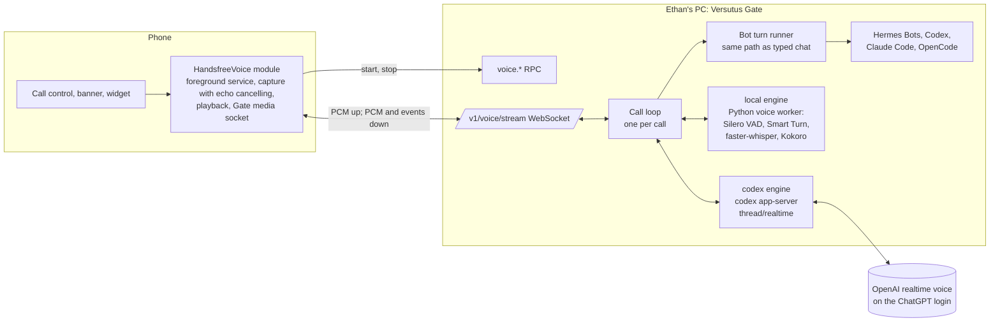

# Hands-free Voice for Versutus — Audited Implementation Plan

> **For agentic workers:** REQUIRED SUB-SKILL: Use superpowers:subagent-driven-development (recommended) or superpowers:executing-plans to implement this plan task-by-task. Steps use checkbox (`- [ ]`) syntax for tracking.

**Goal:** First, ship a hands-free call that is reliably offered and actually works on Ethan's Samsung phone, within one to two days (Phase 0). Then make the Versutus Gate the voice provider (Milestones 1–9):
- The phone streams audio to the Gate on Ethan's PC.
- The operator chooses whether hands-free runs on voice models on that PC or on a subscription already signed in there.
- No purchased API credits.

**Architecture:** Phase 0 repairs the existing local Expo module (`modules/handsfree-voice`) and the pure call reducer, with no Gate changes. The Gate-provider path keeps that call surface and adds:
- **The phone as the audio terminal:** capture with echo cancelling, playback and the foreground service. For Gate engines it runs no speech model and holds no provider credential.
- **The Gate as the voice provider:** one media WebSocket and one call loop per call, with engines behind one interface:
  - `local`: Silero VAD, Smart Turn, faster-whisper and Kokoro, running on the PC;
  - `codex`: the ChatGPT plan's realtime voice, through `codex app-server`;
  - `phone`: the Phase 0 engine, as fallback.
- **Bot turns on the Gate:** through the same backend path typed chat uses, so the Bot's soul, memory, tools and model pin stay authoritative.

**Tech Stack:**
- **App:** Expo SDK 57 / React Native 0.86.2 (`package.json:13,40`); Expo Modules API (Kotlin, Swift); Android `AudioRecord`, `AudioTrack` and the microphone foreground service; OkHttp WebSocket; Jest; JUnit 4.
- **Gate:** `node:test`; `ws` 8.21.3.
- **Local voice worker:** Python 3.12 via `uv`; faster-whisper, kokoro-onnx, onnxruntime, Silero VAD v6, Smart Turn v3; pytest.
- **Codex:** codex-cli 0.147.0 app-server (experimental realtime API).

**Where this sits:** branch `sprint/features-functions-ui` (worktree `C:\Users\ethan\.codex\worktrees\bee6\Versutus`, HEAD `8a83907`), the build installed on Ethan's phone. Plans live in `docs/plans/` on this branch, following its own convention (the older `docs/superpowers/plans/` location belongs to `master`).

**Provenance:** Grok 4.6 wrote the diagnosis and first plan (`docs/plans/2026-09-12-realtime-voice-grok-draft.md`, brief `PLAN-BRIEF-realtime-voice-grok.md`). Claude audited it against the source and current vendor docs, corrected it, and rewrote Phase 0 as executable TDD tasks. Grok's draft stays in the tree as the evidence record.


> **Revision 2026-09-13 — the Gate is the voice provider.**
>
> Ethan's direction: no purchased API credits for hands-free.
> - The fastest success is subscriptions already signed in on the PC.
> - The greatest success is a universal feature where the Gate is the provider and the PC runs the audio models.
> - The operator chooses between them.
>
> What changed:
> - **§0–§3 stand.** The audit of the phone's call and Phase 0 are unchanged, and every engine uses that call.
> - **§4–§10 are rewritten.** The engines are now `local` (PC models; the flagship), `codex` (the ChatGPT plan through Codex app-server realtime; the fast path) and `phone` (Phase 0; the fallback). The Deepgram, xAI API, OpenAI Realtime API and Gemini Live engines are removed.
> - **Grok cannot carry voice today** (dictation only, no headless interface) — §4.8.
> - **Audit notes in §0 about paid APIs (M5, C6–C8) stay** as the record of what was checked.

---

## 0. Audit of the Grok draft

### 0.1 Verified against the source (all hold)

| # | Finding | Evidence |
|---|---|---|
| V1 | **The first Start call throws.** JS passes an object, both native sides take a bare `String`, so Expo's converter raises `DynamicCastException` and the promise rejects. | JS `src/context/handsfree-voice-provider.tsx:507` `module.startSession({ title: target.label })`; TS contract `modules/handsfree-voice/src/HandsfreeVoiceModule.ts:18` `startSession(options: { title: string })`; Kotlin `modules/handsfree-voice/android/src/main/java/com/versutus/handsfreevoice/HandsfreeVoiceModule.kt:96` `AsyncFunction("startSession") { title: String, promise: Promise ->`; Swift `modules/handsfree-voice/ios/HandsfreeVoiceModule.swift:89` `{ (title: String, promise: Promise) in` |
| V2 | **A call that ended can never be restarted.** `ended` swallows every event including `start`, and both the Call control and `start()` require `idle`. | `src/lib/voice/handsfree-session.ts:167`; `handsfree-voice-provider.tsx:477`, `:537-538`; pinned by `__tests__/handsfree-session-test.ts:275-288` |
| V3 | **A thrown start strands the reducer in `starting`.** `dispatch({ type: 'start' })` runs before the await, and only `start-refused` resets. | `handsfree-voice-provider.tsx:506-517`; `handsfree-session.ts:199-201` |
| V4 | **The sheet deadlocks.** `handleStartCall` has no `try/finally`, and Cancel is disabled while busy. | `src/components/chat/chat-screen.tsx:1043-1067`; `src/components/chat/handsfree-call-sheet.tsx:68` |
| V5 | **The Call control hides for the whole reply stream**, the opposite of the rule the hold-to-talk mic is built on. | `handsfree-voice-provider.tsx:544-546`; `src/lib/voice/mic-state.ts:77-80` ("a reply arriving must not be the thing that takes the mic away") |
| V6 | **`startSession` resolves before the service exists**, `startListening` then answers `false`, and JS drops the boolean. | `HandsfreeVoiceModule.kt:158-165`; `HandsfreeCallService.kt:91-95`; `HandsfreeVoiceModule.kt:125-127`; `handsfree-voice-provider.tsx:363` |
| V7 | **A cold TTS engine hides the Call control.** The availability probe gives it a hard 1.5 s timeout, and the probe runs only when `status` changes. | `HandsfreeVoiceModule.kt:59-93`; `handsfree-voice-provider.tsx:428-444` |
| V8 | **The module is in the APK;** autolinking is not the bug. | Grok's merged-manifest and `classes4.dex` evidence, §1 of the draft |

### 0.2 Defects Grok missed

| # | Finding | Evidence |
|---|---|---|
| M1 | **Early native events are lost.** Listeners attach only *after* `startSession` resolves, so a `fatalError` or `interruption` emitted during start is dropped. | `handsfree-voice-provider.tsx:507` then `:515` `subscribe(module)` |
| M2 | **A denied notification permission refuses the whole call.** It shouldn't: Android says *"Apps don't need to request the POST_NOTIFICATIONS permission in order to launch a foreground service"*; the notice still shows in Task Manager. | `HandsfreeVoiceModule.kt:106-121` treats it as required; [notification permission](https://developer.android.com/develop/ui/views/notifications/notification-permission) |
| M3 | **`startForeground` is not guarded.** On Android 14+ a microphone foreground service created without eligibility throws; uncaught in `onStartCommand`, that crashes the app process. | `HandsfreeCallService.kt:141-152`; [FGS types: microphone](https://developer.android.com/develop/background-work/services/fgs/service-types) |
| M4 | **`versutus://call?...&autoStart=1` would let any app or web page start the microphone.** Grok's entry-point contract (draft §5.4) has no origin check. Security defect in the design, fixed in §4.4 below. | draft §5.4 |
| M5 | **All audio would relay through the home PC.** The draft's media path is phone → Tailscale → home PC → provider → PC → phone. That doubles WAN hops, makes the PC's uplink, sleep state and Gate restarts part of every syllable, and conflicts with the latency targets the same draft sets. Replaced in §4. | draft §5.2 "Media WebSocket (app ↔ Gate)" |


> **Revision 2026-09-13.** M5 argued against sending audio through the PC because every engine then was a paid cloud API.
> - With the Gate as the provider and the models on the PC, the PC is the shortest path for the `local` engine.
> - M5 still applies to the `codex` engine, whose audio goes phone → PC → OpenAI. M1 and M6 measure that.

### 0.3 Corrections to the draft

| # | Draft claim | Correction |
|---|---|---|
| C1 | "Success path never `shutdown()`s the probe engine (leak)". | False. The delayed runnable calls `engine.shutdown()` unconditionally after 1.5 s (`HandsfreeVoiceModule.kt:79-90`). The defect is the timeout (V7), not a leak. |
| C2 | Gemini Live has "no first-party ephemeral-token story". | False. `POST https://generativelanguage.googleapis.com/v1beta/auth_tokens`; `expire_time` defaults to 30 min and `new_session_expire_time` to 1 min; tokens can be locked with `live_connect_constraints`; v1beta only ([Gemini ephemeral tokens](https://ai.google.dev/gemini-api/docs/live-api/ephemeral-tokens)). |
| C3 | Task 0.5: report `synthesis=true` when `TextToSpeech.getMaxSpeechInputLength() > 0`. | That is a static constant, not an availability signal. Query installed engines with `packageManager.queryIntentServices(Intent(TextToSpeech.Engine.INTENT_ACTION_TTS_SERVICE), 0)`. The merged manifest already declares that `<queries>` intent (`android/app/build/intermediates/merged_manifests/release/processReleaseManifest/AndroidManifest.xml:53`), so package visibility is satisfied. |
| C4 | Task 0.5: hard-code `com.google.android.voicesearch.serviceapi.GoogleRecognitionService`. | Brittle across Google app versions and OEMs. Discover recognition services with `queryIntentServices(Intent(RecognitionService.SERVICE_INTERFACE), 0)` (query already declared, merged manifest `:62-66`). Prefer `SpeechRecognizer.createOnDeviceSpeechRecognizer` on API 31+ when `isOnDeviceRecognitionAvailable`; otherwise the default. Log which one bound. |
| C5 | Task 0.6: raise the `handsfree-call` channel to `IMPORTANCE_DEFAULT`. | Android never lets an app raise the importance of an existing channel, and every phone that ran the build already has `handsfree-call` at LOW (`HandsfreeCallService.kt:174-185`). Create `handsfree-call-v2` and delete the old id. |
| C6 | OpenAI Live: mint an ephemeral key and attach a server sideband. | Developers reported from 2026-09-09 that calls created with ephemeral keys return `call_id_not_found` on the sideband; the reports are unconfirmed by OpenAI staff. The working flow is the unified interface: the Gate posts multipart `sdp` + `session` to `POST /v1/realtime/calls` with its API key, reads `call_id` from `Location`, and attaches `wss://api.openai.com/v1/realtime?call_id=…` ([thread](https://community.openai.com/t/realtime-webrtc-with-a-server-side-sideband-websocket-should-the-call-be-created-with-the-api-key-unified-interface-instead-of-an-ephemeral-key-ephemeral-key-calls-returned-404-call-id-not-found-on-the-sideband-2026-09-09/1396002)). The device never holds an OpenAI credential of any kind. |
| C7 | OpenAI cost "UNCONFIRMED". | `gpt-realtime-2.1`: audio input $32 / 1M tokens, audio output $64 / 1M, text $4 in / $24 out, 128K context ([model page](https://developers.openai.com/api/docs/models/gpt-realtime-2.1)). |
| C8 | Deepgram Flux $0.0077/min. | Regular price $0.0077/min; current price $0.0065/min. Aura-2 TTS is $0.030 / 1K characters ([pricing](https://deepgram.com/pricing)). |
| C9 | Phase 0 tasks as prose sketches. | Rewritten below as bite-sized TDD steps with the code, per the writing-plans standard. |


> **Revision 2026-09-13:** C6–C8 concern paid APIs that are now out of scope. They stay as the record of what was checked.

### 0.4 Kept from the draft

Kept: the gate table (draft §1.a), the root-cause ranking, the recommendation (cascade by default for Bot fidelity, Live as a per-Bot opt-in), the `versutus://call` vocabulary, the fallback ladder, the device matrix and logcat recipe, the error taxonomy, and the decisions list.

---

## 1. Root causes, final ranking

| Rank | Cause | Certainty | Fixed by |
|---|---|---|---|
| 1 | `startSession` object vs `String` (V1), stranding `starting` (V3) and deadlocking the sheet (V4) | Certain from source | Tasks 0.1, 0.3, 0.4 |
| 2 | `ended` is permanent and hides Call for the rest of the process (V2) | Certain from source | Task 0.2 |
| 3 | Call hidden while a reply streams, a command runs, or an approval waits (V5) | Certain from source | Task 0.5 |
| 4 | Early native events lost (M1); FGS start not guarded (M3); started-before-ready race (V6) | Certain from source; device confirms impact | Tasks 0.3, 0.7 |
| 5 | TTS probe timeout hides Call (V7) | High on Samsung cold start | Task 0.6 |
| 6 | Notification permission refusal ends the call (M2) | Certain from source | Task 0.7 |
| 7 | Recognizer errors (network, server) treated as fatal; TTS spoken before init; progressive speech abandons chunks; silent low-importance channel | High / medium, UNVERIFIED on device | Task 0.8 |
| 8 | `MODE_IN_COMMUNICATION` while listening on Samsung's recognizer | Medium, UNVERIFIED | Task 0.8 (device flag) |

---

## 2. File structure

### Phase 0 (no new files except one Kotlin helper and its test)

- Modify `modules/handsfree-voice/android/src/main/java/com/versutus/handsfreevoice/HandsfreeVoiceModule.kt`: options-map `startSession`, engine-free availability, start handshake, optional notification permission.
- Modify `modules/handsfree-voice/android/src/main/java/com/versutus/handsfreevoice/HandsfreeCallService.kt`: guarded foreground start with ready callback, recognizer discovery, TTS queue-until-ready, append-only progressive speech, `handsfree-call-v2` channel, focus policy.
- Create `modules/handsfree-voice/android/src/main/java/com/versutus/handsfreevoice/HandsfreeRecognizerErrors.kt`: pure error classification.
- Create `modules/handsfree-voice/android/src/test/java/com/versutus/handsfreevoice/HandsfreeRecognizerErrorsTest.kt`.
- Modify `modules/handsfree-voice/ios/HandsfreeVoiceModule.swift`: options-dictionary `startSession`.
- Modify `src/lib/voice/handsfree-session.ts`: `stopped` returns to `idle` and keeps `lastEndReason`.
- Modify `src/context/handsfree-voice-provider.tsx`: subscribe before start, guarded start, listen retry, visibility decoupled from busy, re-probe.
- Create `src/lib/voice/handsfree-start-policy.ts`: pure "why can't I start right now" decision and copy.
- Modify `src/lib/voice/handsfree-call-copy.ts`: terminal-reason and refusal copy.
- Modify `src/components/chat/handsfree-call-sheet.tsx` and `src/components/chat/chat-screen.tsx`: Cancel always live, `try/finally`, refusal copy.
- Tests: `__tests__/handsfree-session-test.ts`, `__tests__/handsfree-native-contract-test.ts`, `__tests__/handsfree-provider-contract-test.ts`, `__tests__/handsfree-call-ui-contract-test.ts`, new `__tests__/handsfree-start-policy-test.ts`.

### Gate-provider path (Milestones 1–9)

- **Spikes:** `scripts/voice-spikes/s1-codex-realtime.mjs`, `scripts/voice-spikes/s2-local-pipeline.py` and `scripts/voice-spikes/latency-harness.mjs`, with captures and `DECISIONS.md` in `docs/plans/voice-spikes/`.
- **Gate:**
  - `gate/core/voice/`: `protocol.mjs`, `media-socket.mjs`, `voice-rpc.mjs`, `voice-session.mjs`, `turn-runner.mjs`, `sentences.mjs`, `resample.mjs`, `runtime.mjs`, `audit.mjs`.
  - `gate/core/voice/engines/`: `scripted-engine.mjs`, `local-engine.mjs`, `codex-engine.mjs`.
  - Tests in `gate/__tests__/voice-*.test.mjs`; shared fixture `gate/__tests__/fixtures/voice-protocol.json`.
  - `gate/core/server.mjs`: the WebSocket upgrade handler, and `streamBackendTurn` rebuilt over `runBackendTurn`.
- **Local voice worker:** `gate/voice-worker/versutus_voice/*.py`, `gate/voice-worker/requirements.lock`, `gate/voice-worker/models.lock.json`, `gate/voice-worker/tests/`.
- **App:**
  - `src/lib/voice/`: `voice-stream-protocol.ts`, `gate-call.ts`, `voice-engine-choice.ts`.
  - `src/lib/settings/app-settings.ts` gains `voiceEngine`.
  - A Voice section in `src/app/gateway/settings.tsx`.
  - A Gate-engine branch in `src/context/handsfree-voice-provider.tsx`.
  - An engine line in `src/components/chat/handsfree-call-sheet.tsx`.
  - A `call` target in `src/lib/gateway/deep-link.ts`.
- **Native:** in `modules/handsfree-voice/android/…/`: `HandsfreeGateMedia.kt`, the pure `GateFrameCodec.kt` and `JitterBuffer.kt`, and `HandsfreeLaunchKey.kt`.
- **Dependencies:** root `package.json` adds `ws` 8.21.3, already in the lockfile transitively. The worker's Python dependencies live only in its own venv.

---

## 3. Phase 0 — the existing call works on Samsung

> **Still first after the 2026-09-13 revision.** Every engine uses this call: the sheet, the banner, the reducer, the foreground service and the phone's audio path.
> - Tasks 0.1–0.5, 0.7, 0.9 and 0.10 are prerequisites for the Gate engines.
> - Tasks 0.6 and 0.8 harden the `phone` engine, which remains the fallback.

Rules for every Phase 0 task:
- Run `npm run verify` before each commit; it must exit 0.
- After any Kotlin change, compile it: `cd android; .\gradlew :handsfree-voice:compileReleaseKotlin`. `android/` is generated by prebuild and git-ignored; build from the existing tree.
- No Gate change.
- Leave B1 hold-to-talk and B2/B3 read-aloud untouched.
- Commit messages state how the world now behaves.

### Task 0.1: Start call opens a session instead of throwing on the options object

**Files:**
- Modify: `modules/handsfree-voice/android/src/main/java/com/versutus/handsfreevoice/HandsfreeVoiceModule.kt:96-97`
- Modify: `modules/handsfree-voice/ios/HandsfreeVoiceModule.swift:89`
- Test: `__tests__/handsfree-native-contract-test.ts`

- [ ] **Step 1: Write the failing test.** Append inside `describe('hands-free native contract', …)`:

```ts
  it('takes startSession options as a map on both platforms, matching the TS contract', () => {
    expect(tsModule).toContain('startSession(options: { title: string })');
    expect(kotlin).toMatch(/AsyncFunction\("startSession"\)\s*\{\s*options: Map<String, Any\?>, promise: Promise ->/);
    expect(kotlin).not.toMatch(/AsyncFunction\("startSession"\)\s*\{\s*title: String/);
    expect(swift).toMatch(/AsyncFunction\("startSession"\)\s*\{\s*\(options: \[String: Any\?\], promise: Promise\) in/);
    expect(swift).not.toMatch(/AsyncFunction\("startSession"\)\s*\{\s*\(title: String/);
  });
```

- [ ] **Step 2: Run it to confirm it fails.**
Run: `npx jest __tests__/handsfree-native-contract-test.ts -t "startSession options"`
Expected: FAIL. The Kotlin source still declares `title: String`.

- [ ] **Step 3: Change the Kotlin signature.** Replace line 96 and read the title from the map:

```kotlin
    AsyncFunction("startSession") { options: Map<String, Any?>, promise: Promise ->
      val title = (options["title"] as? String)?.trim().orEmpty()
```

The rest of the body is unchanged in this task; Task 0.7 rewrites it.

- [ ] **Step 4: Change the Swift signature.** Replace line 89. iOS has no ongoing notification, so the title is read but not used yet:

```swift
    AsyncFunction("startSession") { (options: [String: Any?], promise: Promise) in
      _ = options["title"] as? String
```

- [ ] **Step 5: Run the test and the Kotlin compile.**
Run: `npx jest __tests__/handsfree-native-contract-test.ts`
Expected: PASS, all cases.
Run: `cd android; .\gradlew :handsfree-voice:compileReleaseKotlin`
Expected: `BUILD SUCCESSFUL`.

- [ ] **Step 6: Commit.**

```bash
git add modules/handsfree-voice/android/src/main/java/com/versutus/handsfreevoice/HandsfreeVoiceModule.kt modules/handsfree-voice/ios/HandsfreeVoiceModule.swift __tests__/handsfree-native-contract-test.ts
git commit -m "fix(voice): tapping Start call opens a session instead of throwing on its options"
```

### Task 0.2: A finished call returns to idle, remembers why it ended, and can start again

**Files:**
- Modify: `src/lib/voice/handsfree-session.ts` (state type `:88-100`, reducer head `:163-190`)
- Modify: `src/context/handsfree-voice-provider.tsx` (context type `:63-80`, value `:548-560`)
- Test: `__tests__/handsfree-session-test.ts` (replace `:275-288`, `:422`, `:425-431`)
- Test: `__tests__/handsfree-provider-contract-test.ts:36-48`

- [ ] **Step 1: Write the failing tests.** In `__tests__/handsfree-session-test.ts`, replace the test named `every event is inert once ended` (`:275-288`) with:

```ts
  test('a finished call returns to idle, remembers why it ended, and can start again', () => {
    const over = reduce(listening(), [{ type: 'end' }, { type: 'stopped' }]).state;
    expect(over.phase).toBe('idle');
    expect(over.lastEndReason).toBe('user');
    const again = step(over, { type: 'start' });
    expect(again.state.phase).toBe('starting');
    expect(again.state.lastEndReason).toBeUndefined();
  });

  test('late native events after a call finished change nothing', () => {
    const over = reduce(listening(), [{ type: 'fatalError', reason: 'recognition-failed' }, { type: 'stopped' }]).state;
    expect(over.lastEndReason).toBe('recognition-failed');
    for (const event of [
      { type: 'partial', text: 'x' } as const,
      { type: 'reply-appeared' } as const,
      { type: 'endRequested' } as const,
      { type: 'speechFinished' } as const,
      { type: 'disconnect' } as const,
    ]) {
      const out = step(over, event);
      expect(out.state).toBe(over);
      expect(out.effects).toEqual([]);
    }
  });
```

Change `:422` to `expect(step(ending.state, { type: 'stopped' }).state.phase).toBe('idle');`. Replace the test at `:425-431` with:

```ts
  test('the notification End finishes the call exactly as the UI End does', () => {
    const viaUi = reduce(listening(), [{ type: 'end' }, { type: 'stopped' }]);
    const viaNotification = reduce(listening(), [{ type: 'endRequested' }, { type: 'stopped' }]);
    expect(viaNotification.state).toEqual(viaUi.state);
    expect(viaNotification.state.phase).toBe('idle');
    expect(viaNotification.state.lastEndReason).toBe('user');
  });
```

In `__tests__/handsfree-provider-contract-test.ts:36-48`, add `'lastEndReason',` to the key list.

- [ ] **Step 2: Run to confirm they fail.**
Run: `npx jest __tests__/handsfree-session-test.ts __tests__/handsfree-provider-contract-test.ts`
Expected: FAIL. `lastEndReason` is undefined, and the phase is `ended`.

- [ ] **Step 3: Implement.** In `handsfree-session.ts`, add to `HandsfreeSessionState`:

```ts
  /** Why the previous call ended, kept after it returns to idle so the screen can say so. */
  lastEndReason?: HandsfreeTerminalReason;
```

Replace the start of `reduceHandsfreeSession` (from `const { phase } = state;` through the `ending` block), and delete the `case 'idle':` block from the `switch`:

```ts
  const { phase } = state;

  // Idle answers only a Start. A late End, fatal error or transcript from a call
  // that already finished must not open a second teardown.
  if (phase === 'idle') {
    if (event.type === 'start') {
      return { state: { ...state, phase: 'starting', lastEndReason: undefined }, effects: [] };
    }
    return stay(state);
  }

  // `ended` is no longer produced: a stopped call returns to idle. A state held
  // over from an older build still consumes everything.
  if (phase === 'ended') return stay(state);
  if (phase === 'ending') {
    if (event.type === 'stopped') {
      return { state: { ...INITIAL_HANDSFREE_SESSION, lastEndReason: state.reason }, effects: [] };
    }
    return stay(state);
  }
```

In `handsfree-voice-provider.tsx`:
- Add `type HandsfreeTerminalReason` to the import from `@/lib/voice/handsfree-session`.
- Add `lastEndReason?: HandsfreeTerminalReason;` to `HandsfreeVoiceContextValue`.
- Add `lastEndReason: session.lastEndReason,` to `value`.

- [ ] **Step 4: Run to confirm they pass.**
Run: `npx jest __tests__/handsfree-session-test.ts __tests__/handsfree-provider-contract-test.ts`
Expected: PASS.

- [ ] **Step 5: Commit.**

```bash
git add src/lib/voice/handsfree-session.ts src/context/handsfree-voice-provider.tsx __tests__/handsfree-session-test.ts __tests__/handsfree-provider-contract-test.ts
git commit -m "fix(voice): a call that ends leaves Call offered again and remembers why it ended"
```

### Task 0.3: Listeners attach before start, a throwing start is refused, and a listen that did not start is retried

**Files:**
- Modify: `src/context/handsfree-voice-provider.tsx` (`start` `:475-521`, `runEffect` `:359-395`)
- Test: `__tests__/handsfree-provider-contract-test.ts`

- [ ] **Step 1: Write the failing tests.** Append to `__tests__/handsfree-provider-contract-test.ts`:

```ts
describe('starting a call cannot strand the provider', () => {
  const start = between(provider, 'const start = useCallback(', 'const mute = useCallback(');

  test('listeners attach before the native session starts, so early events land', () => {
    const subscribeAt = start.indexOf('subscribe(module)');
    const startAt = start.indexOf('module.startSession(');
    expect(subscribeAt).toBeGreaterThan(-1);
    expect(startAt).toBeGreaterThan(subscribeAt);
  });

  test('a native start that throws is refused, never left in starting', () => {
    expect(start).toMatch(/try\s*\{\s*outcome = await module\.startSession\(\{ title: target\.label \}\);\s*\}\s*catch/);
    expect(start).toContain("dispatch({ type: 'start-refused' })");
    expect(start).toContain('unsubscribe()');
  });

  test('a session that a fatal event already ended is not reported as started', () => {
    expect(start).toContain("sessionRef.current.phase !== 'starting'");
  });
});

describe('a listen that could not start is retried, then named', () => {
  test('the start-listening effect awaits the boolean and fails the call only after retries', () => {
    const listen = between(provider, 'const startListeningWithRetry = useCallback(', '}, [dispatch]);');
    expect(listen).toContain('await module.startListening()');
    expect(listen).toContain('HANDSFREE_LISTEN_RETRY_LIMIT');
    expect(listen).toContain("dispatch({ type: 'fatalError', reason: 'recognition-failed' })");
  });
});
```

Existing pin to update in the same change: `'every reducer effect has a native destination'` expects `runEffect` to contain `'startListening()'`. Change that line to `expect(runEffect).toContain('startListeningWithRetry()');`.

- [ ] **Step 2: Run to confirm they fail.**
Run: `npx jest __tests__/handsfree-provider-contract-test.ts`
Expected: FAIL on the four new cases.

- [ ] **Step 3: Implement.** Near the other constants at the top of the provider:

```ts
/** How many times a listen that did not start is asked again before the call ends. */
const HANDSFREE_LISTEN_RETRY_LIMIT = 8;
const HANDSFREE_LISTEN_RETRY_MS = 150;
```

Add above `runEffect`:

```ts
  // The native service may still be starting when the reducer first asks it to
  // listen; a `false` is "not yet", not silence to ignore. Only a listen that
  // never starts ends the call, with a reason the screen can name.
  const startListeningWithRetry = useCallback(async () => {
    for (let attempt = 0; attempt < HANDSFREE_LISTEN_RETRY_LIMIT; attempt += 1) {
      const module = moduleRef.current;
      const phase = sessionRef.current.phase;
      if (!module || (phase !== 'listening' && phase !== 'confirming')) return;
      if (await module.startListening()) return;
      await new Promise((resolve) => setTimeout(resolve, HANDSFREE_LISTEN_RETRY_MS));
    }
    dispatch({ type: 'fatalError', reason: 'recognition-failed' });
  }, [dispatch]);
```

In `runEffect`, replace the `'start-listening'` case:

```ts
      case 'start-listening':
        void startListeningWithRetry();
        return;
```

Replace everything in `start` from `moduleRef.current = module;` to the end of the callback:

```ts
      moduleRef.current = module;
      availabilityRef.current = read;
      setAvailability(read);
      targetRef.current = target;
      threadRef.current = callDraftThread(target);
      setLabel(target.label);
      endingRef.current = false;

      // Listen first: a fatalError or interruption the native side emits while
      // the session is opening must reach the reducer, not vanish.
      subscribe(module);
      dispatch({ type: 'start' });
      let outcome: HandsfreeStartOutcome;
      try {
        outcome = await module.startSession({ title: target.label });
      } catch {
        outcome = 'unavailable';
      }
      if (outcome !== 'started') {
        unsubscribe();
        moduleRef.current = null;
        targetRef.current = null;
        threadRef.current = undefined;
        dispatch({ type: 'start-refused' });
        return outcome;
      }
      if (sessionRef.current.phase !== 'starting') {
        // A fatal event arrived while the session was opening and has already
        // torn it down; reporting "started" would contradict the screen.
        return 'unavailable';
      }
      beginHandsfreeCall();
      dispatch({ type: 'started' });
      return 'started';
    },
    [dispatch, subscribe, unsubscribe],
  );
```

If the file does not already import `HandsfreeStartOutcome`, import it as a type from `../../modules/handsfree-voice`, the same place `HandsfreeAvailability` comes from.

- [ ] **Step 4: Run to confirm they pass.**
Run: `npx jest __tests__/handsfree-provider-contract-test.ts __tests__/handsfree-session-test.ts`
Expected: PASS.

- [ ] **Step 5: Commit.**

```bash
git add src/context/handsfree-voice-provider.tsx __tests__/handsfree-provider-contract-test.ts
git commit -m "fix(voice): a call that cannot open says so, and a listen that did not start is retried before the call ends"
```

### Task 0.4: The call sheet can always be cancelled, and a failed start never leaves it busy

**Files:**
- Modify: `src/components/chat/handsfree-call-sheet.tsx:61-70`
- Modify: `src/components/chat/chat-screen.tsx:1043-1068`
- Test: `__tests__/handsfree-call-ui-contract-test.ts`

- [ ] **Step 1: Write the failing tests.** Append to `__tests__/handsfree-call-ui-contract-test.ts`, which already defines `sheet` and `screen`:

```ts
describe('the call sheet can always be dismissed', () => {
  test('Cancel is never disabled by a start in flight', () => {
    const cancel = sheet.slice(sheet.indexOf('label="Cancel"'), sheet.indexOf('label="Start call"'));
    expect(cancel).not.toContain('disabled={busy}');
  });

  test('a start that throws still clears busy', () => {
    const at = screen.indexOf('const handleStartCall = useCallback(');
    const handler = screen.slice(at, screen.indexOf('}, [activeGateway, botVoice', at));
    expect(handler).toMatch(/try\s*\{[\s\S]*await handsfree\.start\(/);
    expect(handler).toMatch(/finally\s*\{\s*setCallBusy\(false\);\s*\}/);
  });
});
```

- [ ] **Step 2: Run to confirm they fail.**
Run: `npx jest __tests__/handsfree-call-ui-contract-test.ts -t "always be dismissed"`
Expected: FAIL.

- [ ] **Step 3: Implement.** In `handsfree-call-sheet.tsx`, delete `disabled={busy}` from the Cancel `Button` (line 68). In `chat-screen.tsx`, replace `handleStartCall`:

```ts
  const handleStartCall = useCallback(async () => {
    if (!activeGateway || !draftThread) return;
    if (surface.kind !== 'configurable' && surface.kind !== 'bot') return;
    setCallBusy(true);
    setCallError(undefined);
    try {
      const result = await handsfree.start({
        gatewayId: activeGateway.id,
        sessionId: draftThread.sessionId,
        surfaceKind: surface.kind,
        botId: surface.kind === 'bot' ? surface.botId : undefined,
        label: callTargetLabel,
        voice: botVoice ?? {},
      });
      if (result === 'started') {
        setCallSheetVisible(false);
        return;
      }
      setCallError(
        result === 'permission-denied'
          ? 'Microphone or speech recognition permission was denied. Allow it in Settings and try again.'
          : result === 'unavailable'
            ? 'This device cannot start a hands-free call.'
            : 'A hands-free call cannot start right now. Reconnect the chat and try again.',
      );
    } catch {
      setCallError('This device cannot start a hands-free call.');
    } finally {
      setCallBusy(false);
    }
  }, [activeGateway, botVoice, callTargetLabel, draftThread, handsfree, surface]);
```

Task 0.9 replaces these strings with reason-specific copy.

- [ ] **Step 4: Run to confirm they pass.**
Run: `npx jest __tests__/handsfree-call-ui-contract-test.ts`
Expected: PASS, including the existing `label="Cancel"` pin.

- [ ] **Step 5: Commit.**

```bash
git add src/components/chat/handsfree-call-sheet.tsx src/components/chat/chat-screen.tsx __tests__/handsfree-call-ui-contract-test.ts
git commit -m "fix(voice): the call sheet can always be cancelled, and a failed start never leaves it spinning"
```

### Task 0.5: Call stays offered while a reply streams, and a blocked start says why

**Files:**
- Create: `src/lib/voice/handsfree-start-policy.ts`
- Create: `__tests__/handsfree-start-policy-test.ts`
- Modify: `src/context/handsfree-voice-provider.tsx` (`canStart` `:537-546`; context type and value)
- Modify: `src/components/chat/chat-screen.tsx` (`handleStartCall`)
- Test: `__tests__/handsfree-provider-contract-test.ts`

- [ ] **Step 1: Write the failing tests.** Create `__tests__/handsfree-start-policy-test.ts`:

```ts
import { handsfreeStartBlocker, handsfreeStartBlockerCopy } from '@/lib/voice/handsfree-start-policy';

const clear = { status: 'connected', isSending: false, isCommandRunning: false, pendingApproval: false };

describe('handsfreeStartBlocker', () => {
  test('nothing blocks a connected, idle thread', () => {
    expect(handsfreeStartBlocker(clear)).toBeNull();
  });

  test('names the one thing in the way, disconnection first', () => {
    expect(handsfreeStartBlocker({ ...clear, status: 'reconnecting', isSending: true })).toBe('disconnected');
    expect(handsfreeStartBlocker({ ...clear, pendingApproval: true, isSending: true })).toBe('approval');
    expect(handsfreeStartBlocker({ ...clear, isCommandRunning: true })).toBe('command');
    expect(handsfreeStartBlocker({ ...clear, isSending: true })).toBe('streaming');
  });

  test('every blocker has its own sentence', () => {
    const copy = (['disconnected', 'approval', 'command', 'streaming'] as const).map(handsfreeStartBlockerCopy);
    expect(new Set(copy).size).toBe(4);
    expect(handsfreeStartBlockerCopy('streaming')).toBe('Wait for this reply to finish, or stop it, then start the call.');
  });
});
```

Append to `__tests__/handsfree-provider-contract-test.ts`:

```ts
describe('the Call control is not hidden by ordinary chat activity', () => {
  test('canStart no longer depends on a stream, a command or an approval', () => {
    const canStart = between(provider, 'const canStart =', ';');
    expect(canStart).not.toContain('isSending');
    expect(canStart).not.toContain('isCommandRunning');
    expect(canStart).not.toContain('pendingRunApproval');
  });

  test('the provider reports what blocks a start instead', () => {
    expect(provider).toContain('startBlocker: handsfreeStartBlocker(');
  });
});
```

- [ ] **Step 2: Run to confirm they fail.**
Run: `npx jest __tests__/handsfree-start-policy-test.ts __tests__/handsfree-provider-contract-test.ts`
Expected: FAIL. The module does not exist, and `canStart` still reads `isSending`.

- [ ] **Step 3: Implement the pure policy.** Create `src/lib/voice/handsfree-start-policy.ts`:

```ts
// ─── What stands between the operator and a hands-free call ──────────────
// The Call control used to vanish whenever a reply streamed, a command ran or
// an approval waited — the opposite of the hold-to-talk mic, which stays put so
// a reply arriving is never what takes voice away (mic-state.ts). The control
// now stays offered; a start that cannot proceed yet names the reason.

export type HandsfreeStartBlocker = 'disconnected' | 'approval' | 'command' | 'streaming';

export type HandsfreeStartInputs = {
  status: string;
  isSending: boolean;
  isCommandRunning: boolean;
  pendingApproval: boolean;
};

/** The single most important reason a call cannot start now, or null. */
export function handsfreeStartBlocker(inputs: HandsfreeStartInputs): HandsfreeStartBlocker | null {
  if (inputs.status !== 'connected') return 'disconnected';
  if (inputs.pendingApproval) return 'approval';
  if (inputs.isCommandRunning) return 'command';
  if (inputs.isSending) return 'streaming';
  return null;
}

const COPY: Record<HandsfreeStartBlocker, string> = {
  disconnected: 'Versutus is not connected to the gateway yet. The call can start once it reconnects.',
  approval: 'A run is waiting for your approval. Decide it first, then start the call.',
  command: 'A command is still running. Start the call when it finishes.',
  streaming: 'Wait for this reply to finish, or stop it, then start the call.',
};

export function handsfreeStartBlockerCopy(blocker: HandsfreeStartBlocker): string {
  return COPY[blocker];
}
```

- [ ] **Step 4: Wire the provider.**
- Import `handsfreeStartBlocker` and `type HandsfreeStartBlocker` from `@/lib/voice/handsfree-start-policy`.
- Replace `canStart` (`:537-546`):

```ts
  // Offered whenever a call could run on this device; what blocks it *right now*
  // is reported separately so the control never flickers with chat activity.
  const canStart =
    session.phase === 'idle' &&
    status === 'connected' &&
    Boolean(activeGateway) &&
    Boolean(availability?.recognition) &&
    Boolean(availability?.synthesis) &&
    (availability?.maxSpeechInputLength ?? 0) > 0;
  const startBlocker = handsfreeStartBlocker({
    status,
    isSending,
    isCommandRunning,
    pendingApproval: Boolean(pendingRunApproval),
  });
```

- Add `startBlocker: HandsfreeStartBlocker | null;` to `HandsfreeVoiceContextValue`, and `startBlocker,` to `value`.
- `start()` keeps its refusal at `:482-484` unchanged; it is the last line of defence.

- [ ] **Step 5: Name the blocker on tap.** In `chat-screen.tsx`, import `handsfreeStartBlockerCopy`. At the top of `handleStartCall`, after the two guard `return`s, add:

```ts
    if (handsfree.startBlocker) {
      setCallError(handsfreeStartBlockerCopy(handsfree.startBlocker));
      return;
    }
```

- [ ] **Step 6: Run the tests.**
Run: `npx jest __tests__/handsfree-start-policy-test.ts __tests__/handsfree-provider-contract-test.ts __tests__/handsfree-call-ui-contract-test.ts`
Expected: PASS.

- [ ] **Step 7: Commit.**

```bash
git add src/lib/voice/handsfree-start-policy.ts __tests__/handsfree-start-policy-test.ts src/context/handsfree-voice-provider.tsx src/components/chat/chat-screen.tsx __tests__/handsfree-provider-contract-test.ts
git commit -m "fix(voice): the Call control stays offered while a reply streams, and a start that must wait says why"
```

### Task 0.6: Call appears as soon as the device can take a call, not when a TTS engine happens to warm up in 1.5 s

**Files:**
- Modify: `modules/handsfree-voice/android/src/main/java/com/versutus/handsfreevoice/HandsfreeVoiceModule.kt` (`getAvailability` `:47-94`)
- Modify: `src/context/handsfree-voice-provider.tsx` (probe effect `:426-444`)
- Test: `__tests__/handsfree-native-contract-test.ts`, `__tests__/handsfree-provider-contract-test.ts`

- [ ] **Step 1: Write the failing tests.** In `handsfree-native-contract-test.ts`:

```ts
  it('answers availability from installed services, without constructing a TTS engine', () => {
    const availability = kotlin.slice(kotlin.indexOf('AsyncFunction("getAvailability")'), kotlin.indexOf('AsyncFunction("startSession")'));
    expect(availability).toContain('TextToSpeech.Engine.INTENT_ACTION_TTS_SERVICE');
    expect(availability).toContain('SpeechRecognizer.isRecognitionAvailable(');
    expect(availability).not.toContain('TextToSpeech(context)');
    expect(availability).not.toContain('postDelayed');
  });
```

In `handsfree-provider-contract-test.ts`:

```ts
describe('the availability probe recovers on its own', () => {
  const probe = between(provider, '// Read the device\'s call capability', '// A call is bound to the gateway');

  test('re-probes when the app returns to the foreground', () => {
    expect(probe).toContain("AppState.addEventListener('change'");
  });

  test('retries a probe that answered no recognition or threw', () => {
    expect(probe).toContain('HANDSFREE_PROBE_RETRIES');
  });
});
```

- [ ] **Step 2: Run to confirm they fail.**
Run: `npx jest __tests__/handsfree-native-contract-test.ts __tests__/handsfree-provider-contract-test.ts`
Expected: FAIL.

- [ ] **Step 3: Replace the Kotlin probe.** Replace the whole `AsyncFunction("getAvailability")` block:

```kotlin
    // What this device can do, read from installed services. Constructing a
    // TextToSpeech engine here raced a cold Samsung TTS against a 1.5 s timeout
    // and hid Call; the service creates its engine when it first speaks.
    AsyncFunction("getAvailability") {
      val context = appContext.reactContext
      if (context == null) {
        mapOf("recognition" to false, "synthesis" to false, "maxSpeechInputLength" to 0)
      } else {
        val recognition = SpeechRecognizer.isRecognitionAvailable(context)
        val ttsEngines = context.packageManager.queryIntentServices(
          Intent(TextToSpeech.Engine.INTENT_ACTION_TTS_SERVICE),
          0,
        )
        val synthesis = ttsEngines.isNotEmpty()
        mapOf(
          "recognition" to recognition,
          "synthesis" to synthesis,
          "maxSpeechInputLength" to if (synthesis) TextToSpeech.getMaxSpeechInputLength() else 0,
        )
      }
    }
```

Delete `TTS_PROBE_TIMEOUT_MS` from the companion object. The `TTS_SERVICE` `<queries>` entry this relies on is already in the merged manifest (`:53`).

- [ ] **Step 4: Replace the provider probe effect** (`:426-444`). Add `AppState` to the `react-native` import if it is not already there.

```ts
  // Read the device's call capability while connected, so the Call control is
  // only offered where a tap can actually start a session.
  useEffect(() => {
    if (status !== 'connected') return undefined;
    let cancelled = false;
    const probe = async () => {
      for (let attempt = 0; attempt < HANDSFREE_PROBE_RETRIES; attempt += 1) {
        const module = await loadHandsfreeModule();
        if (cancelled || !module) return;
        try {
          const read = await module.getAvailability();
          if (cancelled) return;
          setAvailability(read);
          if (read.recognition) return;
        } catch {
          if (!cancelled) setAvailability(null);
        }
        await new Promise((resolve) => setTimeout(resolve, HANDSFREE_PROBE_RETRY_MS));
      }
    };
    void probe();
    const subscription = AppState.addEventListener('change', (next) => {
      if (next === 'active') void probe();
    });
    return () => {
      cancelled = true;
      subscription.remove();
    };
  }, [status]);
```

With the other constants:

```ts
/** A probe that finds no recognizer is asked again; Samsung binds its recognition service lazily. */
const HANDSFREE_PROBE_RETRIES = 3;
const HANDSFREE_PROBE_RETRY_MS = 500;
```

- [ ] **Step 5: Run the tests and compile.**
Run: `npx jest __tests__/handsfree-native-contract-test.ts __tests__/handsfree-provider-contract-test.ts`
Expected: PASS.
Run: `cd android; .\gradlew :handsfree-voice:compileReleaseKotlin`
Expected: `BUILD SUCCESSFUL`.

- [ ] **Step 6: Commit.**

```bash
git add modules/handsfree-voice/android/src/main/java/com/versutus/handsfreevoice/HandsfreeVoiceModule.kt src/context/handsfree-voice-provider.tsx __tests__/handsfree-native-contract-test.ts __tests__/handsfree-provider-contract-test.ts
git commit -m "fix(voice): Call appears as soon as the phone can take a call, not when its speech engine warms up in time"
```

### Task 0.7: "Started" means the service is really up; a refused foreground start is reported, not a crash; the notification permission is asked, not required

**Files:**
- Modify: `modules/handsfree-voice/android/src/main/java/com/versutus/handsfreevoice/HandsfreeVoiceModule.kt` (`startSession` `:96-123`, `startService` `:158-168`)
- Modify: `modules/handsfree-voice/android/src/main/java/com/versutus/handsfreevoice/HandsfreeCallService.kt` (`startSession` `:131-152`, companion)
- Test: `__tests__/handsfree-native-contract-test.ts`

- [ ] **Step 1: Write the failing tests.**

```ts
  it('resolves startSession only when the service reports its foreground start, with a timeout', () => {
    expect(kotlin).toContain('HandsfreeCallService.pendingStartCallback =');
    expect(kotlin).toContain('START_TIMEOUT_MS');
    expect(kotlin).not.toMatch(/startForegroundService\(context, intent\)\s*\n\s*promise\.resolve\("started"\)/);
    expect(service).toMatch(/try\s*\{\s*startForegroundWithNotification\(title\)/);
    expect(service).toContain('deliverStart("unavailable")');
  });

  it('requires the microphone permission only; notifications are asked, not required', () => {
    const start = kotlin.slice(kotlin.indexOf('AsyncFunction("startSession")'), kotlin.indexOf('AsyncFunction("startListening")'));
    expect(start).toMatch(/val required = arrayOf\(Manifest\.permission\.RECORD_AUDIO\)/);
    expect(start).not.toMatch(/required[^\n]*POST_NOTIFICATIONS/);
  });
```

- [ ] **Step 2: Run to confirm they fail.**
Run: `npx jest __tests__/handsfree-native-contract-test.ts`
Expected: FAIL.

- [ ] **Step 3: Service side.** In `HandsfreeCallService.kt`, add `import android.util.Log`, then replace `startSession`:

```kotlin
  /** Opens the session and reports the outcome to the pending start. */
  fun startSession(title: String): Boolean {
    if (!state.start()) {
      deliverStart(if (state.isActive) "started" else "unavailable")
      return false
    }
    try {
      startForegroundWithNotification(title)
      foregroundStarted = true
    } catch (error: Exception) {
      // Android 14+ refuses a microphone service the app is not eligible for
      // (ForegroundServiceStartNotAllowedException / SecurityException). An
      // uncaught throw here would kill the process; it is reported instead.
      Log.w(TAG, "foreground start refused", error)
      state.requestEnd("start-refused")
      deliverStart("unavailable")
      stopSelf()
      return false
    }
    requestAudioFocus()
    deliverStart("started")
    return true
  }

  private fun deliverStart(outcome: String) {
    val callback = pendingStartCallback
    pendingStartCallback = null
    callback?.invoke(outcome)
  }
```

In the companion object:

```kotlin
    private const val TAG = "HandsfreeCallService"

    /** Set by the module just before it starts the service; answered exactly once. */
    @Volatile
    var pendingStartCallback: ((String) -> Unit)? = null
```

- [ ] **Step 4: Module side.** Add `import java.util.concurrent.atomic.AtomicBoolean` if missing. Replace the permission block inside `startSession` (everything after `val title = …` from Task 0.1):

```kotlin
      if (appContext.currentActivity == null) {
        promise.resolve("unavailable")
        return@AsyncFunction
      }
      val context = appContext.reactContext
      val permissions = appContext.permissions
      if (context == null || permissions == null) {
        promise.resolve("unavailable")
        return@AsyncFunction
      }
      // Only the microphone is required. Android does not need POST_NOTIFICATIONS
      // to run a foreground service; without it the call still shows in Task
      // Manager, so a refusal must not refuse the call.
      val required = arrayOf(Manifest.permission.RECORD_AUDIO)
      val asked = if (Build.VERSION.SDK_INT >= Build.VERSION_CODES.TIRAMISU) {
        required + Manifest.permission.POST_NOTIFICATIONS
      } else {
        required
      }
      if (permissions.hasGrantedPermissions(*required)) {
        startService(context, title, promise)
      } else {
        permissions.askForPermissions({ result ->
          val micGranted = result[Manifest.permission.RECORD_AUDIO]?.status == PermissionsStatus.GRANTED
          if (!micGranted) {
            promise.resolve("permission-denied")
          } else {
            // Let the activity resume from the permission dialog before the
            // while-in-use microphone service is created.
            Handler(Looper.getMainLooper()).postDelayed({ startService(context, title, promise) }, RESUME_SETTLE_MS)
          }
        }, *asked)
      }
    }
```

Replace `startService`:

```kotlin
  private fun startService(context: Context, title: String, promise: Promise) {
    val settled = AtomicBoolean(false)
    fun settle(outcome: String) {
      if (settled.compareAndSet(false, true)) promise.resolve(outcome)
    }
    HandsfreeCallService.pendingStartCallback = { outcome -> settle(outcome) }
    Handler(Looper.getMainLooper()).postDelayed({
      if (!settled.get()) {
        HandsfreeCallService.pendingStartCallback = null
        // A service that comes up after JS has been told "unavailable" would
        // hold the microphone with nobody driving it; stop it.
        context.stopService(Intent(context, HandsfreeCallService::class.java))
        settle("unavailable")
      }
    }, START_TIMEOUT_MS)
    try {
      val intent = Intent(context, HandsfreeCallService::class.java)
        .setAction(HandsfreeCallService.ACTION_START)
        .putExtra(HandsfreeCallService.EXTRA_TITLE, title)
      ContextCompat.startForegroundService(context, intent)
    } catch (_: Exception) {
      HandsfreeCallService.pendingStartCallback = null
      settle("unavailable")
    }
  }
```

Companion:

```kotlin
  companion object {
    private const val START_TIMEOUT_MS = 4000L
    private const val RESUME_SETTLE_MS = 250L
  }
```

- [ ] **Step 5: Run the tests and compile.**
Run: `npx jest __tests__/handsfree-native-contract-test.ts`
Expected: PASS.
Run: `cd android; .\gradlew :handsfree-voice:compileReleaseKotlin :handsfree-voice:testDebugUnitTest`
Expected: `BUILD SUCCESSFUL`. The existing `HandsfreeCallStateTest` still passes.

- [ ] **Step 6: Commit.**

```bash
git add modules/handsfree-voice/android/src/main/java/com/versutus/handsfreevoice/HandsfreeVoiceModule.kt modules/handsfree-voice/android/src/main/java/com/versutus/handsfreevoice/HandsfreeCallService.kt __tests__/handsfree-native-contract-test.ts
git commit -m "fix(voice): a call reports started only once its service is really up, and a refused start is named instead of crashing"
```

**UNVERIFIED until the device gate:** whether One UI treats the 250 ms post-dialog start as foreground-eligible. Settle it with `adb logcat -s HandsfreeCallService:W ActivityManager:I` while granting the microphone for the first time.

### Task 0.8: The call survives Samsung's recognizer, a slow speech engine, a notification chime and a network blip

**Files:**
- Create: `modules/handsfree-voice/android/src/main/java/com/versutus/handsfreevoice/HandsfreeRecognizerErrors.kt`
- Create: `modules/handsfree-voice/android/src/test/java/com/versutus/handsfreevoice/HandsfreeRecognizerErrorsTest.kt`
- Modify: `modules/handsfree-voice/android/src/main/java/com/versutus/handsfreevoice/HandsfreeCallService.kt` (focus listener `:83-89`; notification `:154-185`; recognizer `:242-249`, `:323-351`; TTS `:444-495`)
- Test: `__tests__/handsfree-native-contract-test.ts`

- [ ] **Step 1: Write the failing JVM test.** `HandsfreeRecognizerErrorsTest.kt`:

```kotlin
package com.versutus.handsfreevoice

import android.speech.SpeechRecognizer
import com.versutus.handsfreevoice.HandsfreeRecognizerErrors.Action
import org.junit.Assert.assertEquals
import org.junit.Test

class HandsfreeRecognizerErrorsTest {
  @Test fun silenceRestartsWithoutCountingAsAFailure() {
    assertEquals(Action.RESTART, HandsfreeRecognizerErrors.classify(SpeechRecognizer.ERROR_NO_MATCH, 99))
    assertEquals(Action.RESTART, HandsfreeRecognizerErrors.classify(SpeechRecognizer.ERROR_SPEECH_TIMEOUT, 99))
  }

  @Test fun aNetworkBlipIsRetriedThreeTimesBeforeTheCallEnds() {
    assertEquals(Action.RETRY_LATER, HandsfreeRecognizerErrors.classify(SpeechRecognizer.ERROR_NETWORK, 0))
    assertEquals(Action.RETRY_LATER, HandsfreeRecognizerErrors.classify(SpeechRecognizer.ERROR_SERVER, 2))
    assertEquals(Action.FATAL, HandsfreeRecognizerErrors.classify(SpeechRecognizer.ERROR_NETWORK_TIMEOUT, 3))
  }

  @Test fun aBusyOrCancelledRecognizerIsRetried() {
    assertEquals(Action.RETRY_LATER, HandsfreeRecognizerErrors.classify(SpeechRecognizer.ERROR_RECOGNIZER_BUSY, 5))
    assertEquals(Action.RETRY_LATER, HandsfreeRecognizerErrors.classify(SpeechRecognizer.ERROR_CLIENT, 5))
  }

  @Test fun noMicrophoneAccessOrNoLanguageEndsTheCallAtOnce() {
    assertEquals(Action.FATAL, HandsfreeRecognizerErrors.classify(SpeechRecognizer.ERROR_INSUFFICIENT_PERMISSIONS, 0))
    assertEquals(Action.FATAL, HandsfreeRecognizerErrors.classify(SpeechRecognizer.ERROR_AUDIO, 0))
    assertEquals(Action.FATAL, HandsfreeRecognizerErrors.classify(SpeechRecognizer.ERROR_LANGUAGE_UNAVAILABLE, 0))
  }
}
```

- [ ] **Step 2: Run to confirm it fails.**
Run: `cd android; .\gradlew :handsfree-voice:testDebugUnitTest --tests "*HandsfreeRecognizerErrorsTest*"`
Expected: FAIL. `HandsfreeRecognizerErrors` is unresolved.

- [ ] **Step 3: Implement the classifier.** `HandsfreeRecognizerErrors.kt` (the `SpeechRecognizer.ERROR_*` values are compile-time constants, inlined, so this runs on the JVM exactly like `HandsfreeCallState`):

```kotlin
package com.versutus.handsfreevoice

import android.speech.SpeechRecognizer

/** What a call does about one recognizer error. Pure, so it is JVM-tested. */
object HandsfreeRecognizerErrors {
  enum class Action { RESTART, RETRY_LATER, FATAL }

  const val MAX_TRANSIENT_FAILURES = 3

  fun classify(code: Int, consecutiveFailures: Int): Action = when (code) {
    SpeechRecognizer.ERROR_NO_MATCH,
    SpeechRecognizer.ERROR_SPEECH_TIMEOUT -> Action.RESTART

    SpeechRecognizer.ERROR_CLIENT,
    SpeechRecognizer.ERROR_RECOGNIZER_BUSY -> Action.RETRY_LATER

    SpeechRecognizer.ERROR_NETWORK,
    SpeechRecognizer.ERROR_NETWORK_TIMEOUT,
    SpeechRecognizer.ERROR_SERVER,
    SpeechRecognizer.ERROR_SERVER_DISCONNECTED,
    SpeechRecognizer.ERROR_TOO_MANY_REQUESTS ->
      if (consecutiveFailures < MAX_TRANSIENT_FAILURES) Action.RETRY_LATER else Action.FATAL

    SpeechRecognizer.ERROR_AUDIO,
    SpeechRecognizer.ERROR_INSUFFICIENT_PERMISSIONS,
    SpeechRecognizer.ERROR_LANGUAGE_NOT_SUPPORTED,
    SpeechRecognizer.ERROR_LANGUAGE_UNAVAILABLE -> Action.FATAL

    else -> if (consecutiveFailures < MAX_TRANSIENT_FAILURES) Action.RETRY_LATER else Action.FATAL
  }
}
```

- [ ] **Step 4: Write the failing source pins.** Append to `__tests__/handsfree-native-contract-test.ts`:

```ts
  it('retires the silent notification channel for a visible one', () => {
    expect(service).toContain('private const val CHANNEL_ID = "handsfree-call-v2"');
    expect(service).toContain('deleteNotificationChannel(LEGACY_CHANNEL_ID)');
    expect(service).toContain('NotificationManager.IMPORTANCE_DEFAULT');
  });

  it('does not end a call when another sound merely ducks it', () => {
    expect(service).toMatch(/AudioManager\.AUDIOFOCUS_LOSS_TRANSIENT_CAN_DUCK -> Unit/);
  });

  it('classifies recognizer errors through the tested helper and speaks progressively without dropping sentences', () => {
    expect(service).toContain('HandsfreeRecognizerErrors.classify(');
    expect(service).toContain('queuedSpeech.addAll(chunks)');
    expect(service).toMatch(/if \(speaking && nextChunkIndex < queuedSpeech\.size\) playChunk/);
  });
```

Run: `npx jest __tests__/handsfree-native-contract-test.ts`
Expected: FAIL on the three new cases.

- [ ] **Step 5: Change the service.** Replace the focus listener:

```kotlin
  private val focusListener = AudioManager.OnAudioFocusChangeListener { change ->
    when (change) {
      AudioManager.AUDIOFOCUS_LOSS,
      AudioManager.AUDIOFOCUS_LOSS_TRANSIENT -> handleFocusLoss()
      // A notification chime or a navigation prompt ducks the call; it is not a
      // reason to end it. A phone call still ends it (the product contract says
      // a call never resumes itself after a system call).
      AudioManager.AUDIOFOCUS_LOSS_TRANSIENT_CAN_DUCK -> Unit
    }
  }
```

Replace `createNotificationChannel()` and the priority line in `buildNotification`:

```kotlin
  private fun createNotificationChannel() {
    if (Build.VERSION.SDK_INT < Build.VERSION_CODES.O) return
    val manager = getSystemService(Context.NOTIFICATION_SERVICE) as NotificationManager
    // An app cannot raise an existing channel's importance. The LOW channel the
    // first build created lands in One UI's silent section, so it is retired.
    manager.deleteNotificationChannel(LEGACY_CHANNEL_ID)
    if (manager.getNotificationChannel(CHANNEL_ID) != null) return
    val channel = NotificationChannel(CHANNEL_ID, "Hands-free call", NotificationManager.IMPORTANCE_DEFAULT)
    channel.description = "Shown while a hands-free call is active."
    channel.setSound(null, null)
    channel.enableVibration(false)
    manager.createNotificationChannel(channel)
  }
```

In `buildNotification`, change `.setPriority(NotificationCompat.PRIORITY_LOW)` to `.setPriority(NotificationCompat.PRIORITY_DEFAULT)`.

Add fields near the recognizer fields:

```kotlin
  private var consecutiveRecognizerFailures = 0
  private var nextChunkIndex = 0
```

Replace `ensureRecognizer()` and add `destroyRecognizer()`:

```kotlin
  private fun ensureRecognizer(): SpeechRecognizer? {
    recognizer?.let { return it }
    val onDevice = PREFER_ON_DEVICE_RECOGNIZER &&
      Build.VERSION.SDK_INT >= Build.VERSION_CODES.S &&
      SpeechRecognizer.isOnDeviceRecognitionAvailable(this)
    val created = when {
      onDevice -> SpeechRecognizer.createOnDeviceSpeechRecognizer(this)
      SpeechRecognizer.isRecognitionAvailable(this) -> SpeechRecognizer.createSpeechRecognizer(this)
      else -> null
    } ?: return null
    Log.i(TAG, "recognizer bound (onDevice=$onDevice)")
    created.setRecognitionListener(recognitionListener)
    recognizer = created
    return created
  }

  private fun destroyRecognizer() {
    try {
      recognizer?.destroy()
    } catch (_: Exception) {
    }
    recognizer = null
  }
```

In `recognitionListener`, add `consecutiveRecognizerFailures = 0` as the first line of `onResults` and of `onPartialResults`, and replace `onError`:

```kotlin
    override fun onError(error: Int) {
      listening = false
      cancelTick()
      if (stopRequested) {
        stopRequested = false
        return
      }
      val action = HandsfreeRecognizerErrors.classify(error, consecutiveRecognizerFailures)
      Log.i(TAG, "recognizer error $error -> $action (failures=$consecutiveRecognizerFailures)")
      when (action) {
        HandsfreeRecognizerErrors.Action.RESTART -> {
          emit("noSpeech", mapOf("reason" to "silence"))
          restartIfActive()
        }
        HandsfreeRecognizerErrors.Action.RETRY_LATER -> {
          consecutiveRecognizerFailures += 1
          // A recognizer that lost its network is rebuilt rather than reused.
          if (error != SpeechRecognizer.ERROR_RECOGNIZER_BUSY) destroyRecognizer()
          mainHandler.postDelayed({ restartIfActive() }, BUSY_RETRY_MS * consecutiveRecognizerFailures)
        }
        HandsfreeRecognizerErrors.Action.FATAL -> {
          emit("fatalError", mapOf("reason" to "recognition-failed", "message" to "recognizer-error-$error"))
          end("recognition-failed")
        }
      }
    }
```

Replace `ensureTts()`, `speakInternal()` and the first two lines of `playChunk()`:

```kotlin
  private fun ensureTts(): TextToSpeech {
    tts?.let { return it }
    val created = TextToSpeech(this) { status ->
      mainHandler.post {
        ttsReady = status == TextToSpeech.SUCCESS
        if (!ttsReady) {
          if (speaking) {
            speaking = false
            stopBargeIn()
            emit("fatalError", mapOf("reason" to "speech-failed", "message" to "tts-init-$status"))
            end("speech-failed")
          }
          return@post
        }
        configureTts()
        val engine = tts ?: return@post
        // Sentences queued while a cold engine was still binding play now,
        // instead of failing against an unbound engine.
        if (speaking && nextChunkIndex < queuedSpeech.size) playChunk(engine, speechGeneration, nextChunkIndex)
      }
    }
    created.setOnUtteranceProgressListener(utteranceListener)
    tts = created
    return created
  }

  private fun speakInternal(chunks: List<String>, voiceIdentifier: String?, rate: Double?, pitch: Double?) {
    // Recognition must be off before speech so the reply is not heard back.
    if (listening) stopListening()
    pendingVoiceIdentifier = voiceIdentifier
    pendingRate = rate
    pendingPitch = pitch
    val engine = ensureTts()
    if (speaking) {
      // Progressive speech: later sentences of the same reply join the queue
      // rather than starting a new generation that abandons the earlier ones.
      queuedSpeech.addAll(chunks)
      return
    }
    speechGeneration += 1
    speaking = true
    queuedSpeech = chunks.toMutableList()
    nextChunkIndex = 0
    startBargeIn()
    if (ttsReady) {
      configureTts()
      playChunk(engine, speechGeneration, 0)
    }
  }

  private fun playChunk(engine: TextToSpeech, generation: Long, index: Int) {
    if (generation != speechGeneration) return
    nextChunkIndex = index
```

The remainder of `playChunk` is unchanged. In the companion object, replace `private const val CHANNEL_ID = "handsfree-call"` with:

```kotlin
    private const val CHANNEL_ID = "handsfree-call-v2"
    private const val LEGACY_CHANNEL_ID = "handsfree-call"
    /** Flip after the device matrix if Samsung's default recognizer misbehaves. */
    private const val PREFER_ON_DEVICE_RECOGNIZER = false
```

- [ ] **Step 6: Run everything.**
Run: `cd android; .\gradlew :handsfree-voice:testDebugUnitTest :handsfree-voice:compileReleaseKotlin`
Expected: `BUILD SUCCESSFUL`. `HandsfreeRecognizerErrorsTest`, `HandsfreeCallStateTest` and `HandsfreeEndpointingTest` pass.
Run: `npx jest __tests__/handsfree-native-contract-test.ts`
Expected: PASS.

- [ ] **Step 7: Commit.**

```bash
git add modules/handsfree-voice/android __tests__/handsfree-native-contract-test.ts
git commit -m "fix(voice): a call rides out a network blip, a slow speech engine and a notification chime, and its notification is visible"
```

### Task 0.9: A call that ends on its own says why, and a failed start names the real cause

**Files:**
- Modify: `src/lib/voice/handsfree-session.ts` (add `callsEnded`)
- Modify: `src/lib/voice/handsfree-call-copy.ts`
- Modify: `src/context/handsfree-voice-provider.tsx` (expose `callsEnded`)
- Modify: `src/components/chat/chat-screen.tsx`
- Test: `__tests__/handsfree-session-test.ts`, `__tests__/handsfree-call-ui-contract-test.ts`

- [ ] **Step 1: Write the failing tests.** In `__tests__/handsfree-session-test.ts`:

```ts
  test('every finished call is counted, so the screen can react to two failures in a row', () => {
    const first = reduce(listening(), [{ type: 'fatalError', reason: 'recognition-failed' }, { type: 'stopped' }]).state;
    const second = reduce(first, [{ type: 'start' }, { type: 'started' }, { type: 'fatalError', reason: 'recognition-failed' }, { type: 'stopped' }]).state;
    expect(first.callsEnded).toBe(1);
    expect(second.callsEnded).toBe(2);
    expect(step(second, { type: 'start' }).state.callsEnded).toBe(2);
  });
```

In `__tests__/handsfree-call-ui-contract-test.ts` (add `handsfreeEndReasonCopy` and `handsfreeStartResultCopy` to its import from `@/lib/voice/handsfree-call-copy`):

```ts
describe('an ended or refused call explains itself', () => {
  test('the operator ending a call is not reported as a failure', () => {
    expect(handsfreeEndReasonCopy('user')).toBeNull();
    expect(handsfreeEndReasonCopy('thread-changed')).toBeNull();
  });

  test('every failure reason and start result has its own sentence', () => {
    const reasons = ['disconnect', 'system-interruption', 'app-killed', 'recognition-failed', 'send-failed', 'speech-failed'] as const;
    const copy = reasons.map(handsfreeEndReasonCopy);
    expect(copy.every((line) => typeof line === 'string' && line.length > 0)).toBe(true);
    expect(new Set(copy).size).toBe(reasons.length);
    expect(new Set([handsfreeStartResultCopy('permission-denied'), handsfreeStartResultCopy('unavailable'), handsfreeStartResultCopy('refused')]).size).toBe(3);
  });

  test('the chat screen reopens the sheet with the reason when a call ends on its own', () => {
    expect(screen).toContain('handsfreeEndReasonCopy(handsfreeLastEndReason)');
    expect(screen).toMatch(/\[handsfreeCallsEnded, handsfreeLastEndReason\]/);
    expect(screen).toContain('setCallError(handsfreeStartResultCopy(result))');
  });
});
```

- [ ] **Step 2: Run to confirm they fail.**
Run: `npx jest __tests__/handsfree-session-test.ts __tests__/handsfree-call-ui-contract-test.ts`
Expected: FAIL.

- [ ] **Step 3: Implement the reducer count.** In `handsfree-session.ts`:
- Add `callsEnded: number;` to `HandsfreeSessionState` and `callsEnded: 0,` to `INITIAL_HANDSFREE_SESSION`.
- In the `ending` block: `return { state: { ...INITIAL_HANDSFREE_SESSION, lastEndReason: state.reason, callsEnded: state.callsEnded + 1 }, effects: [] };`
- In `starting`'s `start-refused`: `return { state: { ...INITIAL_HANDSFREE_SESSION, callsEnded: state.callsEnded }, effects: [] };`

- [ ] **Step 4: Implement the copy.** Append to `handsfree-call-copy.ts`:

```ts
import type { HandsfreeTerminalReason } from '@/lib/voice/handsfree-session';

/** Why a call the operator did not end, ended. Null when they ended it or moved on. */
export function handsfreeEndReasonCopy(reason: HandsfreeTerminalReason): string | null {
  switch (reason) {
    case 'user':
    case 'thread-changed':
      return null;
    case 'disconnect':
      return 'The call ended because the gateway connection dropped.';
    case 'system-interruption':
      return 'The call ended because another app or a phone call took the audio.';
    case 'app-killed':
      return 'The call ended when Versutus was closed.';
    case 'recognition-failed':
      return 'The call ended because speech recognition stopped working on this phone.';
    case 'send-failed':
      return 'The call ended because a turn could not be sent or no reply arrived. What you said is back in the composer.';
    case 'speech-failed':
      return 'The call ended because this phone could not speak the reply.';
  }
}

/** Why a start did not open a call. */
export function handsfreeStartResultCopy(result: 'permission-denied' | 'unavailable' | 'refused'): string {
  switch (result) {
    case 'permission-denied':
      return 'Versutus needs the microphone for a call. Allow it in Settings, then start again.';
    case 'unavailable':
      return 'This phone would not open a call session. Try again; if it keeps failing, check that a speech recognition service is installed and enabled.';
    case 'refused':
      return 'A call cannot start right now. Reconnect the chat and try again.';
  }
}
```

Merge the new `import type` line with the existing `import type { HandsfreePhase }` at the top of the file.

- [ ] **Step 5: Wire the provider and screen.**
- Provider: add `callsEnded: number;` to `HandsfreeVoiceContextValue` and `callsEnded: session.callsEnded,` to `value`.
- `chat-screen.tsx`: import both copy functions. Replace the `setCallError(result === 'permission-denied' ? … )` expression from Task 0.4 with `setCallError(handsfreeStartResultCopy(result));`, and the `catch` body with `setCallError(handsfreeStartResultCopy('unavailable'));`.
- `chat-screen.tsx`: below `handleStartCall`, add:

```ts
  const { callsEnded: handsfreeCallsEnded, lastEndReason: handsfreeLastEndReason } = handsfree;
  // A call that ended without the operator ending it reopens the sheet with the
  // reason, so a failure is never a banner that silently disappears.
  useEffect(() => {
    if (!handsfreeLastEndReason) return;
    const copy = handsfreeEndReasonCopy(handsfreeLastEndReason);
    if (!copy) return;
    setCallError(copy);
    setCallSheetVisible(true);
  }, [handsfreeCallsEnded, handsfreeLastEndReason]);
```

- [ ] **Step 6: Run the tests.**
Run: `npx jest __tests__/handsfree-session-test.ts __tests__/handsfree-call-ui-contract-test.ts __tests__/handsfree-provider-contract-test.ts`
Expected: PASS.
Run: `npm run verify`
Expected: exit 0.

- [ ] **Step 7: Commit.**

```bash
git add src/lib/voice/handsfree-session.ts src/lib/voice/handsfree-call-copy.ts src/context/handsfree-voice-provider.tsx src/components/chat/chat-screen.tsx __tests__/handsfree-session-test.ts __tests__/handsfree-call-ui-contract-test.ts
git commit -m "fix(voice): a call that ends on its own says why, and a start that fails names the real cause"
```

### Task 0.10: Rebuild, install, and run the physical-device gate that never ran

**Files:**
- Create: `docs/plans/2026-09-12-realtime-voice-device-log.md` (results record)

- [ ] **Step 1: Build.**
Run: `npm run verify`
Expected: exit 0.
Run: `cd android; .\gradlew :handsfree-voice:testDebugUnitTest assembleRelease`
Expected: `BUILD SUCCESSFUL` (~13 min). The APK is `android\app\build\outputs\apk\release\app-release.apk`. If Task 0.5 of the widget plan already ran `expo prebuild --clean`, this reuses that tree.

- [ ] **Step 2: Install on the Samsung.**
Run: `adb install -r android\app\build\outputs\apk\release\app-release.apk`
Expected: `Success`.

- [ ] **Step 3: Start logging** in a second terminal:

```bash
adb logcat -s HandsfreeCallService:V SpeechRecognizer:V TextToSpeech:V ActivityManager:I AndroidRuntime:E ExpoModulesCore:W ReactNativeJS:V
```

- [ ] **Step 4: Run the matrix.** Record each row as pass/fail with notes in the device log:

| Row | Script | Pass when |
|---|---|---|
| P0-1 | Fresh process, connect, open a Bot Chat | Call is visible before any message is sent |
| P0-2 | Send a long prompt | Call stays visible during the stream; tapping it shows "Wait for this reply to finish…" |
| P0-3 | Start call, grant microphone, deny notifications | The call starts anyway; logcat shows `recognizer bound` |
| P0-4 | Three turns in the foreground | Each turn appears once in chat, the reply is spoken, and the mic reopens |
| P0-5 | The same three turns backgrounded, then with the screen locked for 10 minutes | Same as P0-4; the notification sits in the shade, not in the silent section |
| P0-6 | End from the notification while backgrounded, reopen the app | Banner gone; Call offered again; Start works without killing the app |
| P0-7 | Receive a phone call while listening, then while speaking | Versutus ends, releases audio, does not resume; the sheet reopens with the interruption reason |
| P0-8 | Toggle airplane mode for 5 s while listening | The call rides out the blip (retry), or ends with the recognition reason after 3 failures |
| P0-9 | Hold to talk | Still drafts into the composer and never sends |

- [ ] **Step 5: If P0-4 fails with repeated `recognizer error 5/8/11` on this phone,** set `PREFER_ON_DEVICE_RECOGNIZER = true`, rebuild (Step 1), reinstall (Step 2), and rerun P0-3 to P0-5. Record which recognizer passed.

- [ ] **Step 6: Commit the record.**

```bash
git add docs/plans/2026-09-12-realtime-voice-device-log.md
git commit -m "docs(voice): record the hands-free call's first physical-device gate on Samsung"
```

Phase 0 is done when P0-1 to P0-9 pass. Only then may `FUTURE-ITEMS.md` move the item toward shipped. Phase 0 does not close B4.


---

## 4. The Gate as the voice provider

### 4.1 Architecture: the phone is the microphone and speaker, the Gate is the voice provider



Five rules shape every milestone:

1. **The phone is the audio terminal.** It captures with echo cancelling, plays audio, runs the foreground service and draws the call UI. For Gate engines it runs no speech model and holds no provider credential.
2. **The Gate is the voice provider.** Each call gets one WebSocket and one call loop. Engines plug into a single interface (§4.5).
3. **The Bot turn runs on the Gate, through the path typed chat already uses.** That is `streamBackendTurn` (`gate/core/server.mjs:113`), reached from `POST /v1/chat/completions` (`server.mjs:1932`). Bot scope, model pin, soul, memory and tools are therefore identical to typing. Spoken turns land in the same session history.
4. **No purchased API credits, anywhere.** `local` costs nothing. `codex` spends the voice allowance of the ChatGPT plan already signed in on the PC. Nothing else is called.
5. **The operator chooses the engine** (§4.2). The Gate reports what each engine can do right now, and a fallback is always named, never silent.

**Why the Gate owns the call loop, not the phone:**
- The loop keeps running while the phone's JavaScript is throttled in the background. The foreground service keeps native audio alive, and nothing in the loop needs JS.
- One loop serves both a speech-to-speech engine (`codex`) and a cascade (`local`).
- The Bot turn starts the moment the PC detects the end of a turn, with no phone round trip for text in and text out.

The Phase 0 `phone` engine stays phone-orchestrated as the fallback.

**The latency cost, stated plainly.** Audio now travels phone → PC. On LAN, or on a direct Tailscale connection, that adds tens of milliseconds each way. A relayed Tailscale (DERP) path can add 100 ms or more. M1 and M6 measure it.

### 4.2 Engines, and who chooses

| Engine | What powers it | Money | Where audio goes | How it feels | Whose answers |
|---|---|---|---|---|---|
| `local` | Models on the PC: Silero VAD v6 and Smart Turn v3 find the end of a turn, faster-whisper transcribes, Kokoro-82M speaks | $0 | Phone → PC, nowhere else | Turn-based with barge-in; first audio ≈ the Bot's first token plus ~0.5–0.8 s (S2 measures) | The Bot, every turn |
| `codex` | `codex app-server` realtime on the PC, signed in with ChatGPT | $0 beyond the plan; spends its voice allowance | Phone → PC → OpenAI | Speech to speech: natural turn-taking, interruptible | The Bot, if spike S1 proves the relay (§4.7); otherwise not shipped as a Bot voice |
| `phone` | On-device recognizer and TTS (Phase 0) | $0 | Stays on the phone | Basic | The Bot, every turn |
| `grok` | Not available (§4.8) | — | — | — | — |

**How the operator chooses:**
- **Settings → Voice → "Power hands-free with":**
  - **Automatic** (the default): uses `local` when it is ready, else `codex` when it is ready, else `phone`.
  - **This PC — local voice**
  - **ChatGPT subscription (via Codex on this PC)**
  - **This phone only**
  - **Grok subscription:** shown, disabled, with the reason from §4.8.
- **The start sheet** shows "Using: *engine* · Change", so a one-call override is a single tap. It also shows that engine's disclosure (§4.9).
- **Where the choice lives:** `AppSettings.voiceEngine`: `'auto' | 'local' | 'codex' | 'phone'` (`src/lib/settings/app-settings.ts:5-11` today). It is sent with `voice.session.start`.
- **What the Gate answers:** the engine it actually used, plus `fellBackFrom` and a reason whenever that differs from the request. The banner says so, e.g. "Using this phone — PC voice isn't installed."
- **Per-Bot overrides** come in M9.

### 4.3 Protocol (phone ↔ Gate)

**RPC.** Every method needs a paired-device grant. Handlers receive `{ deviceId }` exactly as the push RPC does (`server.mjs:2059`; the `requireDevice` pattern at `gate/core/push-rpc.mjs:57-66`). Methods are registered beside `notificationMethods` (`server.mjs:541,570`).

```ts
export type VoiceEngineId = 'local' | 'codex' | 'phone';

export type VoiceEngineStatus = {
  state: 'ready' | 'not-installed' | 'installing' | 'starting' | 'unavailable' | 'over-allowance' | 'disabled';
  /** One sentence the Settings row shows when not ready. */
  reason?: string;
  detail?: { gpu?: string; sttModel?: string; ttsVoice?: string; codexVersion?: string };
};

export type VoiceCapabilities = {
  enabled: boolean;
  engines: { local: VoiceEngineStatus; codex: VoiceEngineStatus };
  limits: { codexMinutesPerDay: number; maxConcurrentCalls: number };
  usedToday: { localMinutes: number; codexMinutes: number };
};

export type VoiceSessionStartParams = {
  engine: 'auto' | 'local' | 'codex';
  /** Built by the phone from the same state it sends typed chat with. */
  thread: { kind: 'bot' | 'configurable'; sessionId: string; botId?: string; backendId?: string; model?: string };
  voice?: { name?: string; rate?: number };
  disclosureAcceptedAt: string;
};

export type VoiceSessionGrant = {
  voiceSessionId: string;
  engine: 'local' | 'codex';
  fellBackFrom?: 'local' | 'codex';
  reason?: string;
  streamPath: '/v1/voice/stream';
  input: { encoding: 'pcm16le'; sampleRate: 16000; channels: 1; frameMs: 20 };
  output: { encoding: 'pcm16le'; sampleRate: 24000; channels: 1 };
};
```

| Method | Params | Result |
|---|---|---|
| `voice.capabilities` | `{}` | `VoiceCapabilities` |
| `voice.session.start` | `VoiceSessionStartParams` | `VoiceSessionGrant`, or an error naming why no Gate engine can run. The phone then offers `phone` |
| `voice.session.stop` | `{ voiceSessionId, reason }` | `{ stopped: true }` |
| `voice.install.start` (M5) | `{ engine: 'local', profile?: 'gpu' \| 'cpu' }` | `{ jobId }` |
| `voice.install.status` (M5) | `{ jobId }` | `{ state, step, progress, logTail }` |

**Media WebSocket: `GET /v1/voice/stream?voiceSessionId=<id>`.**
- **Mounting:** served on the Gate root (the phone uses the root transport, as the RPC does, even for a `/p/{id}` child profile).
- **Authentication:** `Authorization: Bearer <device token>` on the upgrade request, verified with the same `deviceTokens.verify` the HTTP routes use (`server.mjs:880-882`). The voice session must belong to that device.
- **One socket per call.**

**Binary frames:**
- **Phone → Gate:** raw PCM16LE, mono, 16 kHz, 20 ms per frame (640 bytes), captured with `AudioSource.VOICE_COMMUNICATION` plus AEC/NS, so the Bot's own voice is not sent back.
- **Gate → phone:** PCM16LE, mono, 24 kHz, any length. Each belongs to the current speech generation.

**JSON text frames, Gate → phone:**

| Frame | Meaning |
|---|---|
| `{"t":"ready","engine":"local"}` | The engine is live |
| `{"t":"phase","phase":"listening"}` | Phase changed: `listening`, `thinking`, `speaking` or `muted` |
| `{"t":"partial","text":"…"}` | Live transcript of what the operator is saying |
| `{"t":"final","turnId":"…","text":"…"}` | A finished user turn, about to be sent |
| `{"t":"turn","turnId":"…","state":"sent"}` | Bot turn progress: `sent`, `replying`, `done` or `failed` (with `error`) |
| `{"t":"reply","turnId":"…","delta":"…"}` | Reply text for the banner |
| `{"t":"speech","gen":7,"state":"start"}` | Binary frames that follow belong to generation 7. `end` closes it; `cancelled` tells the phone to drop anything left of it |
| `{"t":"level","v":0.42}` | Optional amplitude, at most 10/s |
| `{"t":"approval","turnId":"…","summary":"…"}` | A tool in the turn needs approval; the phone opens its approval flow |
| `{"t":"error","code":"…","message":"…","fatal":false}` | Named failure; `fatal: true` ends the call |
| `{"t":"ended","reason":"…"}` | The call is over |

**JSON text frames, phone → Gate:**

| Frame | Meaning |
|---|---|
| `{"t":"mute","on":true}` | Stop listening, keep speaking |
| `{"t":"skip"}` | Stop the current reply and listen |
| `{"t":"bargein"}` | The phone's own VAD heard speech during playback; cancel speech now |
| `{"t":"end"}` | End the call |

**Why raw binary PCM:**
- No base64 overhead (about a third).
- Trivial on both ends.
- 16 kHz up is what Whisper-family STT wants, and 24 kHz down matches Kokoro and Codex realtime output. The `codex` engine resamples on the Gate if S1 shows it needs a different input rate.

**Keeping the two sides in step.** Types live in `gate/core/voice/protocol.mjs` and `src/lib/voice/voice-stream-protocol.ts`. Both test suites read one fixture, `gate/__tests__/fixtures/voice-protocol.json`, so the two cannot drift.

### 4.4 Entry-point contract (supersedes draft §5.4; adopted by the widget plan)

```
versutus://call
versutus://call?bot=<botId>
versutus://call?bot=<botId>&engine=local
versutus://call?bot=<botId>&autoStart=1&ts=<epochMs>&sig=<base64url>
```

- **Parsing:** `src/lib/gateway/deep-link.ts` gains `{ kind: 'call'; botId?: string; engine: 'auto' | 'local' | 'codex' | 'phone'; autoStart: boolean; signature?: { ts: number; sig: string } }`. An absent or unknown `engine` is `auto`. `autoStart` is `true` only when `autoStart=1` **and** both `ts` and `sig` are present.
- **Signed auto-start.** Any app or web page can fire a `versutus://` link, so an unsigned link must never open the microphone.
  - `modules/handsfree-voice/android/…/HandsfreeLaunchKey.kt` holds an HMAC-SHA256 key generated in the Android Keystore (`KeyGenerator.getInstance(KeyProperties.KEY_ALGORITHM_HMAC_SHA256, "AndroidKeyStore")`, `PURPOSE_SIGN`).
  - It signs `call|<botId>|<engine>|<ts>`. Only the app's own widget and shortcuts, rendered in-process, can produce `sig`.
  - `HandsfreeVoice.verifyLaunch(url)` answers `true` only for a valid signature with `ts` within 30 days.
  - Anything else opens the disclosure/confirm sheet on that thread.
- **App states:**

| App state | Behaviour |
|---|---|
| Cold start, connects | Open the Bot Chat (`openBot`), then the signed auto-start or the confirm sheet |
| Not connected yet | Navigate to Chat and hold the request up to 30 s ("Waiting to connect before starting the call"), then "Could not reach the gateway". Never start capture while disconnected. |
| App lock on | `AppLockGate` holds the route (`src/components/app-lock-gate.tsx:18-32`); after unlock, as cold start. Never start the mic under the lock cover. |
| Same Bot already in a call | Bring the app forward; no second session |
| Different Bot in a call | End the current call (`thread-changed`) after an in-app confirm. A signed widget tap still confirms when it would switch Bots. |
| Process died mid-call | No resume (B5, `START_NOT_STICKY`); recovery text lands in the composer |

- **Headset button:** during a call, `KEYCODE_HEADSETHOOK` / `KEYCODE_MEDIA_PLAY_PAUSE` toggles mute. It never starts a call.

### 4.5 The call loop on the Gate (engine-agnostic)

`gate/core/voice/voice-session.mjs` is a pure state machine with an effects list, the same discipline as the app's `reduceHandsfreeSession`:

- **Phases:** `opening → listening ⇄ thinking → speaking → listening`, plus `muted`, `ending → ended`.
- **Inputs:**
  - from the engine: `partial`, `final`, `handoff`, `speechAudio`, `speechDone`, `userSpeechStart`, `error`;
  - from the turn runner: `replyDelta`, `replyDone`, `replyFailed`, `approvalRequired`;
  - from the phone: `mute`, `skip`, `bargein`, `end`, `socketClosed`.
- **Effects:** `engine.speak`, `engine.cancelSpeech`, `engine.setMuted`, `turn.run`, `turn.cancel`, `send(frame)`, `sendAudio(pcm)`, `audit`.

The engine interface, which both engines and the test engine implement:

```js
/**
 * @typedef {object} VoiceEngine
 * @property {'local'|'codex'|'scripted'} id
 * @property {(call: { voiceSessionId: string, botName?: string, voice?: object }) => Promise<void>} open
 * @property {(frame: Buffer) => void} pushAudio            20 ms PCM16LE mono 16 kHz from the phone
 * @property {(text: string, opts: { gen: number, final: boolean }) => void} speak
 *           cascade engines synthesize it; the codex relay voices it with appendSpeech
 * @property {(gen: number) => void} cancelSpeech
 * @property {(muted: boolean) => void} setMuted
 * @property {() => Promise<void>} close
 * Emits: 'partial' {text} · 'final' {text} · 'handoff' {text} · 'speechAudio' {gen, pcm}
 *        · 'speechDone' {gen} · 'userSpeechStart' · 'error' {code, message, fatal}
 */
```

**A cascade turn (`local`):**
1. `final` → `turn.run(text)`.
2. `replyDelta` → sentence chunker (`gate/core/voice/sentences.mjs`, a port of the app's `speechChunks` rules) → `engine.speak(sentence)`.
3. `speechAudio` → phone.

**A relay turn (`codex`):**
1. The engine emits `handoff` in place of `final` → `turn.run(text)`.
2. The Bot's reply goes back through `engine.speak(sentence)`, which becomes `appendSpeech` (sentence by sentence if S1 Q3 shows progressive appends are voiced in order, otherwise once on `replyDone`).
3. Small talk the realtime model answers itself arrives as `speechAudio` with no turn.

**The Bot turn runner (`gate/core/voice/turn-runner.mjs`):**
- **Refactor:** `streamBackendTurn` (`server.mjs:113`) becomes a thin SSE writer over `runBackendTurn(backend, sessionId, { text, model }, { onDelta, onToolCall, onApproval, signal })`, so typed turns and spoken turns share one implementation. Characterization tests pin today's SSE output before the refactor.
- **Backend resolution** is the chat route's: a Bot thread goes through `resolveConversationBackend(backendId, botId)`, and a configurable thread through its backend. `sessionId`, `botId`, `backendId` and `model` come from the phone at call start. A spoken turn and a typed turn therefore pin the same model (backend-locked selection, `f4bf7f0`).
- **Approvals:** a tool that needs approval mid-turn becomes an `approval` frame plus one spoken line ("*Bot* needs your approval — check Versutus"). The decision goes through the existing session permission route. Its event shape is verified during the M2 characterization step.
- **Keeping chat in sync:** on `turn` `done`, the phone reloads that thread's history (`reloadHistory`), so spoken turns appear as ordinary messages. The banner shows the live partial and the reply text from the socket.

### 4.6 `local` engine — voice models on the PC (the flagship)

**Runtime:**
- **The worker:** the Python package `versutus_voice` in `gate/voice-worker/`, run from its own venv at `%LOCALAPPDATA%\Versutus\Gate\voice\venv` (`resolveGateHome()`, `gate/core/paths.mjs:3`).
- **The Python version:** the venv is created with `uv venv --python 3.12`. `uv` 0.12.13 is on this PC. The system Python is 3.14.3, which `kokoro-onnx` 0.6.1 does not support (`requires_python >=3.10,<3.14`).
- **Supervision:** the Gate runs the worker like a CLI environment. It is spawned with `buildCliEnvironment` (`gate/core/cli-environments/process-environment.mjs:22`) and spoken to in newline-delimited JSON-RPC over stdio through `createStdioJsonRpc` (`jsonrpc-stdio.mjs:8`).
- **Warm models:** one worker serves every call, and models load once and stay warm.
- **Audio over stdio:** base64 chunks shaped like Codex's `ThreadRealtimeAudioChunk` (`{ data, sampleRate, numChannels }`), so both engines share one internal audio type. That is ~70 KB/s at 16 kHz, which is trivial locally.

**Models.** Defaults are chosen for this PC: RTX 4060 8 GB (~1.1 GB in use at idle), i5-14400F, 16 GB RAM.

| Stage | Default | CPU fallback | Evidence |
|---|---|---|---|
| Voice activity | Silero VAD v6 (`silero_vad_v6.onnx`, shipped inside `faster-whisper`) on CPU | same | Present in the Hermes venv's `faster_whisper/assets` |
| End of turn | Smart Turn v3 (8 MB int8 ONNX, BSD-2-Clause, ~12 ms on CPU) | same | [model card](https://huggingface.co/pipecat-ai/smart-turn-v3); input window and rate confirmed in S2 |
| Speech to text | faster-whisper 1.2.x `large-v3-turbo`, `compute_type=int8_float16`, CUDA | `small.en`, int8 | The Hermes venv runs faster-whisper 1.2.1 with ctranslate2 4.8.0 seeing this CUDA GPU |
| Text to speech | Kokoro-82M via `kokoro-onnx` 0.6.1 (MIT code, Apache-2.0 weights), 24 kHz, CPU | same | [PyPI](https://pypi.org/project/kokoro-onnx/): `py3-none-any` wheel, installs on Windows |

**VRAM:**
- **Budget:** at most ~3 GB while a call is live. That covers Whisper large-v3-turbo at `int8_float16` (≈1.5–2 GB, an estimate S2 replaces with a measurement), with Kokoro, Silero and Smart Turn on the CPU.
- **Low headroom:** `voice doctor` reports free VRAM and switches to the CPU fallbacks when the budget does not fit.

**Pipeline per call:**
1. Phone PCM at 16 kHz → Silero VAD on 32 ms windows (512 samples).
2. While speech continues: every ~600 ms, a fast beam-1 pass over the utterance so far (bounded to the last 15 s) → `partial`.
3. On VAD silence ≥ 200 ms, Smart Turn judges the last ≤ 8 s:
   - Complete → a beam-5 final pass → `final`.
   - Incomplete (a thinking pause) → keep listening; judge again at 600 ms of silence, and force completion at 1.6 s. Every threshold is tuned from S2 data.
4. `final` → turn runner → reply deltas → sentence chunker → worker `speak` → Kokoro PCM at 24 kHz → phone.
5. Barge-in: VAD speech for ≥ 250 ms during `speaking`, or the phone's `bargein` frame → cancel the speech generation → `listening`. The Bot's reply stays in history.

**Install and doctor:**
- **`node gate/cli.mjs voice install [--cpu]`:**
  - Creates the uv venv and installs `gate/voice-worker/requirements.lock`.
  - Downloads models into `%LOCALAPPDATA%\Versutus\Gate\voice\models`, verifying the SHA-256 recorded in `gate/voice-worker/models.lock.json` (URLs and hashes captured during S2).
  - Resumes if interrupted.
- **`node gate/cli.mjs voice doctor`:** checks the venv, the CUDA device count, free VRAM, and that every model loads. It then does a two-second round trip (Kokoro says "Voice check", Whisper transcribes it back) and prints timings.
- **From the phone:** Settings → Voice → "Install on this PC (≈2 GB download)" calls `voice.install.start` and shows progress (M5).

### 4.7 `codex` engine — the ChatGPT plan through Codex (the fast path)

**Facts on this PC:**
- `codex-cli` 0.147.0, with `~/.codex/auth.json` `auth_mode: chatgpt`.
- The API surface comes from `codex app-server generate-json-schema --experimental`. Without `--experimental` the request methods are hidden.

**What the experimental realtime API offers:**
- **Initialize:** the client must send `capabilities.experimentalApi: true`. The Gate's Codex environment handshake does not (`gate/core/cli-environments/adapters/codex.mjs:21-24`), so voice runs a **dedicated** `codex app-server` child. That gives its own lifecycle and leaves typed Codex threads untouched.
- **Requests:**
  - `thread/realtime/start` — `threadId`, `outputModality` (`text` | `audio`), `transport` (`{type:'websocket'}` or `{type:'webrtc', sdp}`), `voice`, `version` (v1–v3), `model`, `prompt`, `initialItems` (v3), `realtimeStartInstructions` / `realtimeEndInstructions`, `clientManagedHandoffs`, `codexResponsesAsItems`, `codexResponseHandoffMode`, `delegationAckFiller`, `includeStartupContext`.
  - `thread/realtime/appendAudio` — `{ threadId, audio: { data, numChannels, sampleRate, samplesPerChannel?, itemId? } }`.
  - `thread/realtime/appendText` — `{ threadId, text, role? }`.
  - `thread/realtime/appendSpeech` — `{ threadId, text }`, "append speakable text".
  - `thread/realtime/stop` and `thread/realtime/listVoices`.
- **Notifications:** `started`, `itemAdded`, transcript delta and done, `outputAudio` delta, `sdp`, `error`, `closed`.
- **Voices:** alloy, arbor, ash, ballad, breeze, cedar, coral, cove, echo, ember, juniper, maple, marin, sage, shimmer, sol, spruce, vale, verse.
- **`clientManagedHandoffs`:** documented as "Leaves Codex response handoffs to the client's explicit append calls instead of forwarding them automatically." This is the hook that lets the Gate put the Bot, not Codex, behind the voice.
- **The feature flag:** `codex features list` shows `realtime_conversation  under development  false`. Codex's own desktop app ships realtime voice on Windows ([openai/codex#35252](https://github.com/openai/codex/issues/35252)); whether a third-party app-server client needs the flag is S1 Q1.

**Plan and allowance** ([ChatGPT Learn — Voice](https://learn.chatgpt.com/docs/features/voice)):
- Voice needs Plus, Pro, Business, Edu or Enterprise.
- *"Voice conversations use a separate, plan-dependent allowance measured in rolling five-hour windows. Tasks started through Voice continue to use your Codex usage budget."*
- API-key-only logins cannot use realtime.

**Sub-modes (S1 decides which ship):**
- **relay** — preferred if S1 passes.
  - The realtime model is the ears and the voice, primed by `prompt` with the Bot's name and a short persona.
  - With `clientManagedHandoffs: true`, the Gate intercepts each delegation, runs it as a Bot turn, and voices the Bot's reply with `appendSpeech`.
  - Acknowledgements and small talk come from the realtime model; substance comes from the Bot.
- **speech** — the fallback.
  - Realtime is used only to transcribe (user transcript done → Bot turn), with `appendSpeech` for the reply.
  - Instructions forbid the model from answering on its own.
  - S1 Q4 checks that this holds, or whether Codex's `[realtime] type = "transcription"` setting applies to app-server sessions.
- **Neither holds:** the `codex` engine does not ship as a Bot voice (decision 3, §10).

**Safety:** the voice thread starts with `sandbox: 'read-only'`, `approvalPolicy: 'never'` and `ephemeral: true`. Its `cwd` is an empty `%LOCALAPPDATA%\Versutus\Gate\voice\codex-workspace`, and `developerInstructions` say it runs no tasks. A delegation the Gate fails to intercept therefore cannot touch the operator's files. S1 verifies what executes where.

### 4.8 Why Grok is not an engine today

Grok Build 1.0.30's voice feature is terminal dictation only (`~/.grok/docs/user-guide/26-config-reference.md`):
- `features.voice_mode`, `/voice`, Ctrl+Space or F8;
- `[voice].api_base`, described as the "HTTPS API root for speech-to-text";
- `voice.sample_rate` for the capture rate.

It has no text-to-speech and no realtime conversation. `grok --help` and `grok agent --help` expose no headless voice command.

Bridging it would mean calling xAI speech-to-text with Grok's cached login from outside the Grok client — an unofficial client of a consumer subscription — and this plan will not build that.
- The engine interface (§4.5) makes a `grok` engine a drop-in if xAI ships a headless voice interface.
- Until then the Settings row stays visible, disabled, with this reason.
- Grok models remain available as a Bot's text brain.

### 4.9 Privacy, consent and controls

**Disclosure, shown per engine in the start sheet:**
- **`local`:** "Your voice goes to Versutus on your PC and nowhere else. Nothing is recorded. What you say becomes chat messages."
- **`codex`:** "Your voice goes through your PC to OpenAI and uses your ChatGPT plan's voice allowance. Versutus records nothing. What you say becomes chat messages."
- **`phone`:** the existing Phase 0 disclosure.

**What is never kept:**
- The Gate never writes PCM to disk.
- Audit lines carry no transcript text (M9).

**Gate config block `voice`:**
- `enabled`
- `engines.local.enabled`, `engines.codex.enabled`
- `limits.codexMinutesPerDay`, which protects the allowance the desktop app also uses
- `limits.maxConcurrentCalls`, default 1 for the local engine on this GPU

---

## 5. Milestones

Before starting a milestone, expand its rows into the Phase 0 step format (failing test, run, implement, run, commit) in `docs/plans/<date>-voice-m<N>.md`. The contracts, files and acceptance below are fixed.

### M1 — Feasibility spikes on this PC (1–2 days, no product code)

**S1 — Codex realtime on the ChatGPT login** (`scripts/voice-spikes/s1-codex-realtime.mjs`). The script:
1. Spawns `codex app-server`, once as-is and once with `-c features.realtime_conversation=true`.
2. Talks to it through `createStdioJsonRpc`, and calls `initialize` with `experimentalApi: true`.
3. Calls `thread/realtime/listVoices`.
4. Calls `thread/start` with `{ ephemeral: true, sandbox: 'read-only', approvalPolicy: 'never', cwd: <empty dir> }`.
5. Calls `thread/realtime/start` with `{ outputModality: 'audio', transport: { type: 'websocket' }, clientManagedHandoffs: true, includeStartupContext: false }`.
6. Streams fixture WAVs through `appendAudio`, at 24 kHz and at 16 kHz.
7. Sends `appendSpeech`, then `stop`.
8. Logs every notification with timestamps to `docs/plans/voice-spikes/s1-<timestamp>.jsonl`.

| Q | Question | Pass |
|---|---|---|
| Q1 | Does realtime start on the ChatGPT login from a third-party app-server client on Windows, and is the feature flag required? | `thread/realtime/started` within 5 s in at least one configuration |
| Q2 | Which input rates are accepted, and what rate and format does output use? | The fixture's user transcript matches its text; output `sampleRate` recorded |
| Q3 | With `clientManagedHandoffs: true`, what does a delegation look like, and does `appendSpeech` voice supplied text faithfully and in order? | Delegation content identifiable in the notifications; spoken transcript of `appendSpeech` equals its input over 5 samples |
| Q4 | Can the model be kept from answering on its own (speech sub-mode)? | Over 5 scripted questions, no assistant audio before the Gate's `appendSpeech` |
| Q5 | Latency: fixture end → user transcript done; `appendSpeech` → first audio delta | Recorded (no threshold yet) |
| Q6 | What arrives when voice is unavailable on the plan or over the allowance? | Error recorded, for mapping to `over-allowance` / `unavailable` |

**S2 — Local pipeline on this PC** (`scripts/voice-spikes/s2-local-pipeline.py`, run in a throwaway `uv venv --python 3.12`). The script:
1. Loads faster-whisper `large-v3-turbo` (CUDA, `int8_float16`) and `small.en` (CPU, int8).
2. Loads Kokoro through `kokoro-onnx` (CPU, and GPU where `onnxruntime-gpu` installs), Silero VAD v6 and Smart Turn v3 (its input window and sample rate confirmed from its model card).
3. Runs 20 fixture utterances, 10 of them with a mid-sentence thinking pause.
4. Records:
   - STT latency and word error rate against reference text;
   - Kokoro time to first audio per sentence, on CPU and GPU;
   - Smart Turn decisions against the labels;
   - peak VRAM (`nvidia-smi --query-gpu=memory.used`) and CPU load;
   - pinned versions, model URLs and SHA-256 into a draft `gate/voice-worker/models.lock.json`.

**Pass criteria for S2:**
- Whisper final ≤ 400 ms p50 on utterances ≤ 5 s.
- Kokoro first sentence ≤ 300 ms p50, on CPU or GPU.
- Smart Turn holds at least 8 of 10 thinking pauses without delaying completed turns by more than 400 ms.
- Peak VRAM ≤ 3 GB.

**Fixtures:** 10 utterances Ethan records on the phone (for word error rate) plus 10 synthesized ones (for timing), in `docs/plans/voice-spikes/fixtures/`. The recordings are a manual prerequisite.

**Decision record:** `docs/plans/voice-spikes/DECISIONS.md`:
- Codex: relay, speech, or neither.
- Local: the model defaults and thresholds; whether Kokoro runs on the CPU.

### M2 — Gate voice sessions and the phone's media socket (engine-agnostic)

| Task | Files | Tests | Acceptance |
|---|---|---|---|
| 2.1 Protocol and shared fixture | `gate/core/voice/protocol.mjs`; `src/lib/voice/voice-stream-protocol.ts`; `gate/__tests__/fixtures/voice-protocol.json` | node:test and Jest parse the same fixture: every frame type, and malformed frames rejected | green |
| 2.2 Upgrade with device auth | `gate/core/voice/media-socket.mjs`; an `upgrade` handler in `gate/core/server.mjs`; root `package.json` adds `"ws": "8.21.3"` (already in the lockfile transitively) | node:test: no token → 401; another device's session → 403; unknown session → 404; valid → frames reach a scripted engine; a frame over 64 KB is refused; 30 s without audio closes | green |
| 2.3 Voice RPC | `gate/core/voice/voice-rpc.mjs`, registered beside `notificationMethods` | node:test: pairing required; `auto` resolves by capability; an unavailable explicit engine is answered with `fellBackFrom` and a reason; one live call per device | green |
| 2.4 Turn runner extraction | `gate/core/voice/turn-runner.mjs`; `streamBackendTurn` (`server.mjs:113`) becomes an SSE writer over `runBackendTurn` | Characterization first: pin today's `/v1/chat/completions` SSE bytes for a fake backend (text, tool call, error). Then refactor. Then a voice turn test: text → deltas → done, Bot scope through `resolveConversationBackend`, approval event surfaced | existing gate tests unchanged, new tests green |
| 2.5 Call loop core | `gate/core/voice/voice-session.mjs` (pure); `gate/core/voice/sentences.mjs` | node:test: listening → thinking → speaking → listening; barge-in cancels only the current generation; skip; mute; a failed turn speaks a short error and returns to listening; ends from phone, Gate and engine converge exactly once | green |
| 2.6 Scripted engine | `gate/core/voice/engines/scripted-engine.mjs`: fixture text in as `final`; `speak` answers silence PCM of the right duration | node:test | used by tests and by the phone smoke test when `VERSUTUS_VOICE_SCRIPTED=1` |
| 2.7 Phone media client | `modules/handsfree-voice/android/…/HandsfreeGateMedia.kt`, with pure `GateFrameCodec.kt` and `JitterBuffer.kt`. See the bullets below the table | JVM tests: frame codec, generation flush, jitter buffer under reordering and gaps; `__tests__/handsfree-native-contract-test.ts` pins the new methods and event on all three sides (Swift stubs marked `PENDING-MACOS`) | Kotlin and Jest green |
| 2.8 App remote-call mode | `src/lib/voice/gate-call.ts` (pure: frames → banner state); a Gate-engine branch in `src/context/handsfree-voice-provider.tsx` (`voice.session.start` → `startGateMedia`); history reload on `turn` `done` | Jest: every frame type maps; teardown converges; recovery text never auto-sends | green |

**Task 2.7 in detail — `HandsfreeGateMedia.kt`:**
- **WebSocket:** OkHttp, which React Native already puts on the classpath. Declare it in the module's `build.gradle` at the version React Native resolves.
- **Capture:** `AudioRecord(VOICE_COMMUNICATION, 16000, mono, PCM16)` in 20 ms frames, with `AcousticEchoCanceler` and `NoiseSuppressor` when available.
- **Playback:** `AudioTrack(USAGE_VOICE_COMMUNICATION, 24000)` with a 60 ms jitter buffer.
- **New module surface:** methods `startGateMedia({ url, token, voiceSessionId })`, `sendGateControl(json)` and `stopGateMedia()`, plus a `gate` event carrying each JSON frame.

**M2 acceptance (device, scripted engine):**
- A call shows listening → thinking → speaking.
- The spoken turn appears in chat after the reload.
- Barge-in cuts playback within 300 ms.
- The socket survives 10 minutes with the screen locked.

### M3 — ChatGPT via Codex (the fastest success)

| Task | Files | Tests | Acceptance |
|---|---|---|---|
| 3.1 Dedicated realtime app-server | `gate/core/voice/engines/codex-engine.mjs`: spawn `codex app-server` with the S1 flags; `initialize` with `experimentalApi: true`; ephemeral read-only thread in the empty voice workspace | node:test against a fake JSON-RPC child: handshake, thread params, sandbox | green |
| 3.2 Audio bridge | phone frames → `appendAudio` (resampled by `gate/core/voice/resample.mjs` only if S1 requires it); `outputAudio` deltas → binary frames tagged with generations | node:test: resampler accuracy on a sine sweep; chunk order; cancel drops pending deltas | green |
| 3.3 Relay or speech sub-mode | Per `DECISIONS.md`: delegation interception → turn runner → `appendSpeech`; transcript notifications → `partial` and `final` | node:test replaying the S1 JSONL capture as a fixture | green |
| 3.4 Capability probe | `voice.capabilities.engines.codex`: CLI present, `codex login status` reports ChatGPT (no token read), `listVoices` answers, allowance errors mapped | node:test per state | Settings shows the right state |

**M3 acceptance (device):**
- With "ChatGPT subscription" chosen, Ethan calls a Hermes Bot, asks two questions and interrupts once.
- The answers match what the Bot says to the same questions typed.
- The conversation is interruptible and natural.
- Both turns appear in chat.

### M4 — The engine choice in the app (ships with M3)

| Task | Files | Tests | Acceptance |
|---|---|---|---|
| 4.1 Setting | `src/lib/settings/app-settings.ts` gains `voiceEngine` (default `auto`) | Jest: default, round trip, unknown value reads as `auto` | — |
| 4.2 Pure chooser | `src/lib/voice/voice-engine-choice.ts`: preference × `voice.capabilities` × connection → `{ engine, fellBackFrom?, reason? }`; `auto` order `local` → `codex` → `phone` | Jest table covering every combination | — |
| 4.3 Settings → Voice | A Voice section in `src/app/gateway/settings.tsx`: one row per engine with readiness, one line of cost and privacy, the disabled Grok row with its reason, and the local install entry (M5) | copy contract test; readiness copy per state | Ethan switches engines and sees why one is unavailable |
| 4.4 Start sheet | `src/components/chat/handsfree-call-sheet.tsx` shows "Using: *engine* · Change" and that engine's disclosure (§4.9) | contract test | a one-call change is a single tap |
| 4.5 Banner honesty | a fallback is named in the banner | Jest | never silent |

### M5 — Local voice on this PC (the flagship)

| Task | Files | Tests | Acceptance |
|---|---|---|---|
| 5.1 Worker package | `gate/voice-worker/versutus_voice/{server,vad,turn,stt,tts,audio}.py`; `requirements.lock` and `models.lock.json` from S2 | pytest with synthetic audio: VAD boundaries on silence and tone; Smart Turn threshold wrapper; STT partial window bounding; TTS emits PCM in sentence order and stops mid-sentence on cancel | `npm run test:voice-worker` green |
| 5.2 Install and doctor | `node gate/cli.mjs voice install / doctor / status`; `gate/core/voice/runtime.mjs` (uv venv in the Gate home, pinned install, SHA-256-verified resumable downloads) | node:test with a fake `uv` and fake downloads: a hash mismatch is refused, a partial download resumes | `voice doctor` passes on this PC |
| 5.3 Supervision | `gate/core/voice/engines/local-engine.mjs`: spawn through `buildCliEnvironment` and `createStdioJsonRpc`; restart with backoff; warm models at Gate start when enabled | node:test with a fake worker | killing the worker restarts it without taking the Gate down |
| 5.4 Pipeline wiring | the local engine implements §4.5: frames → VAD and turn detection → `partial`/`final`; `speak` → PCM | node:test with a fake worker; pytest end-to-end on a recorded fixture | — |
| 5.5 Install from the phone | `voice.install.start` / `voice.install.status`; Settings progress | node:test and Jest | Ethan installs from the phone |
| 5.6 CI | `.github/workflows/ci.yml` gains Python 3.12 and `npm run test:voice-worker` (fakes only, no model download); `scripts/verify-config.mts` learns the new script | `npm run verify:config` green | CI green |

**M5 acceptance (device):**
- With "This PC — local voice" chosen, three turns each in the foreground, in the background and with the screen locked for 10 minutes.
- First audio p50 ≤ the Bot's first token + 800 ms on LAN (the M6 harness measures it).
- The Gate audit shows only `local` for the call, with no cloud call in the voice path.

### M6 — Conversation quality

- **Barge-in over the stream:** the phone's `bargein` frame plus Gate VAD confirmation. Gate-side cancel within 150 ms; phone playback flushed within 300 ms.
- **End of turn:** Smart Turn thresholds and the forced-completion time are tuned from S2 data. A 1.5 s thinking pause does not send.
- **Speculative turns (`local`):** start the Bot turn on a high-confidence early end of turn, and cancel it through the turn runner's abort signal if speech resumes within 600 ms.
- **Streaming speech:** the first sentence plays while the Bot is still writing.
- **Latency harness:** `scripts/voice-spikes/latency-harness.mjs` drives a call as a Node WebSocket client sending fixture PCM.
  - It reports p50 and p95 of end of speech → first audio, per engine, on LAN and on cellular Tailscale.
  - It fails against a stored baseline on regression.

### M7 — Reliability

- **Socket resume:** the phone reconnects with its `voiceSessionId` within 20 s. The Gate keeps the call: listening state, the turn in flight continues, up to 5 s of speech buffered. After 20 s the call ends with reason `network`, and the phone recovers the unsent text into the composer.
- **Network changes:** Wi-Fi ↔ cellular; direct vs relayed Tailscale.
- **Gate restart mid-call:** a clean end with a named reason.
- **Worker crash mid-call:** the next turn continues after the restart, or the call falls back to `phone` if the worker will not come up, named in the banner.
- **Codex allowance exhausted mid-call:** named, then a fallback in the operator's order.
- **Soak:** 30-minute calls with 10+ minutes locked; Bluetooth headset connect and disconnect.

### M8 — Entry points

- **Signed auto-start (§4.4):** `HandsfreeLaunchKey.kt`, with JVM tests for HMAC round trip and tamper rejection.
- **Notification Mute action.**
- **Launcher shortcuts** for three recent Bots.
- **Widget "Start voice call":** unblocks widget plan M2 Task 2.3.
- **Acceptance:** a widget tap starts a call to the named Bot after unlock and connect, while `adb shell am start -a android.intent.action.VIEW -d "versutus://call?bot=scout&autoStart=1"` opens the confirm sheet instead of the microphone.

### M9 — Enterprise controls

- **Config and kill switch:** the Gate `voice` config (§4.9). The kill switch leaves only the `phone` engine.
- **Audit:** `%LOCALAPPDATA%\Versutus\Gate\voice\audit.jsonl` lines `{ ts, deviceId, botId, engine, fellBackFrom, turns, secondsListening, secondsSpeaking, p50FirstAudioMs, error }` — no transcript text, with a redaction test.
- **Per-Bot override:** a Bot can prefer `local` for privacy or `codex` for feel.
- **Settings → Voice → Today:** minutes per engine and the last error.

---

## 6. Test strategy

- **Every voice change:**
  - Jest: protocol fixture, `gate-call` mapping, engine chooser, copy, deep link.
  - Kotlin JVM: frame codec, jitter buffer, generation flush, launch key, and the Phase 0 classes.
  - Gate `node:test`: protocol, socket auth, RPC, call loop, turn-runner characterization, engines with fakes, runtime install with fakes, audit.
  - pytest for the worker, with fakes and synthetic audio.
  - `npm run verify` green, plus `.\gradlew :handsfree-voice:testDebugUnitTest` for native changes.
- **Spikes (M1)** leave captures (JSONL, timings) that become test fixtures.
- **Device matrix:** Ethan's Samsung for every milestone; a Pixel from M2; a current iPhone before iOS is called shipped.
- **Latency (M6):** the harness, per engine, on LAN and on cellular Tailscale.
- **Chaos and soak (M7):** as listed.

## 7. Risks

| Risk | Mitigation |
|---|---|
| Codex realtime is experimental: it may change, or be limited to OpenAI's own apps | S1 runs before any product code; `voice doctor` records the Codex version; the engine probes `listVoices` before a call and reports `unavailable` rather than failing mid-call; `local` does not depend on it |
| The Codex relay is not faithful to the Bot (the realtime model answers itself) | S1 Q3 and Q4; the speech sub-mode; if neither holds, no Codex Bot voice ships (decision 3) |
| The ChatGPT voice allowance runs out | `limits.codexMinutesPerDay`; a named error; automatic fallback in the operator's order |
| Python and CUDA packaging on Windows | A uv-pinned 3.12 venv; the Hermes venv already proves faster-whisper with CUDA on this PC; CPU fallbacks; the doctor's round trip |
| GPU contention with other local models or training | Doctor reports free VRAM; CPU fallbacks; `maxConcurrentCalls: 1` |
| Audio latency on relayed Tailscale paths | Measured by the harness; the banner hints when the path is relayed; the 60 ms jitter buffer absorbs variance |
| The phone's JS is throttled in the background | The Gate owns the loop and native code owns the audio; JS only renders |
| Spoken turns diverge from typed turns | One `runBackendTurn` behind both, with characterization tests before the refactor |
| The Bot hears itself | `VOICE_COMMUNICATION` capture with AEC on the phone; Gate VAD ignores the first 150 ms of each speech generation; M6 tuning |
| Privacy expectations differ by engine | A disclosure per engine; audit without transcripts; no PCM on disk |

## 8. Cost — no purchased API credits anywhere

| Engine | Money | What it consumes |
|---|---|---|
| `local` | $0 | PC power; up to ~3 GB VRAM while a call is live (S2 measures) |
| `codex` | $0 beyond the existing ChatGPT plan | The plan's voice allowance (rolling five-hour windows). The voice thread runs no Codex tasks, so the Codex budget is untouched |
| `phone` | $0 | The phone's battery |
| Bot turns | Unchanged | Whatever the Bot's model already costs when typing |

## 9. Rollout

1. The Phase 0 APK and its device gate (unchanged).
2. M1 spikes → `DECISIONS.md`.
3. M2 + M3 + M4 behind the Gate's `voice.enabled`: ChatGPT via Codex becomes selectable (the fastest success).
4. M5, the local engine. Automatic starts preferring it once installed.
5. M6–M7: quality and reliability.
6. M8 entry points, which unblock widget Task 2.3.
7. M9 before a second operator.
8. `FUTURE-ITEMS.md` B4 closes when M3 or M5 passes the device matrix. Rewrite B4's text: the capability no longer depends on a paid provider.

## 10. Decisions for Ethan

1. **Automatic order:** `local` → `codex` → `phone`. *Recommended:* free and private first, with the subscription covering the gap until local voice is installed.
2. **Codex sub-mode, if S1 allows both:** relay (the realtime voice speaking your Bot's answers). *Recommended* for feel, with the speech sub-mode as the fallback.
3. **If Codex cannot relay faithfully:** do not ship a Codex voice that claims to be the Bot. *Recommended.* The alternative is a separately labelled "ChatGPT voice" that answers as ChatGPT.
4. **Local models:** Whisper `large-v3-turbo` on the GPU, Kokoro on the CPU. *Recommended* for this RTX 4060; switch to `small.en` if the GPU is needed for other work.
5. **Installing from the phone:** yes, behind a confirm that states the download size. *Recommended.*
6. **The Grok row:** visible and disabled, with the reason. *Recommended*, so its status is honest.
7. **Codex minutes per day:** 60 by default, editable. *Recommended*, to leave allowance for the desktop app.

---

## Self-review

- **Ethan's direction:**
  - No purchased credits: §4.1 rule 4, §8.
  - The Gate as provider: §4.1.
  - Host-powered local models as the flagship: §4.6, M5.
  - Signed-in subscriptions as the fast path: §4.7, M3.
  - The operator chooses: §4.2, M4.
  - Grok's status stated honestly: §4.8.
- **Phase 0 stays first and unchanged.** Every engine uses its call UI, foreground service and phone audio path.
- **Unverified points are spikes with pass criteria, not assumptions:**
  - Codex realtime for a third-party app-server client, and its feature flag (S1 Q1).
  - Delegation handling and verbatim `appendSpeech` (S1 Q3, Q4).
  - Input rates (S1 Q2).
  - Smart Turn's input window (S2).
  - Local latency and VRAM (S2).
- **Type consistency:**
  - Engine ids `local | codex | phone`, plus `auto`, are the same across `AppSettings.voiceEngine`, the chooser, `voice.session.start`, the deep link (§4.4) and the audit.
  - Frames are defined once in the shared fixture.
  - The engine interface (§4.5) is implemented by the `scripted`, `local` and `codex` engines.
